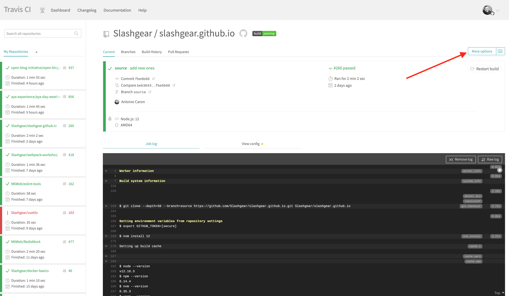
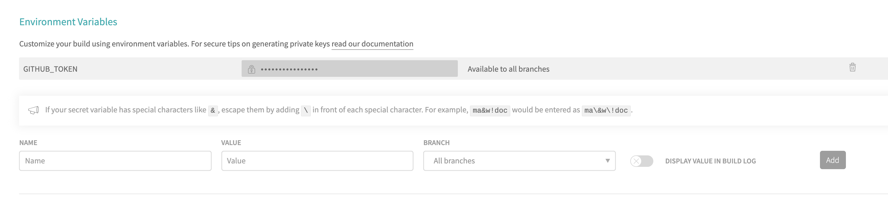
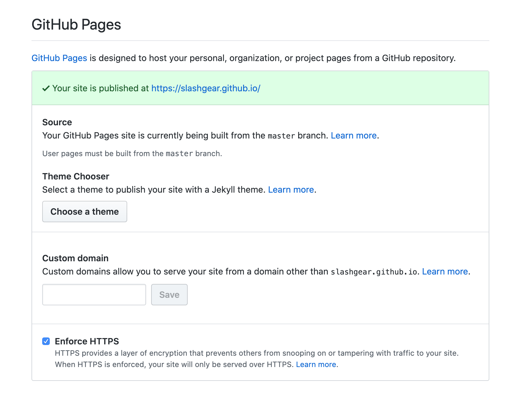

Github Pages est une solution pour héberger des sites web statiques directement dans ton dépôt Github en poussant les fichiers du site vers la branche `gh-pages`.
J'utilise cette fonctionnalité pour héberger [ce blog](https://slashgear.github.io).
C'est gratuit et très utile pour héberger tes sites/blog/documentations de projets open-source.
Voici un tutoriel sur la façon de publier le site web Gatsby avec travis.

**Assurez-toi d'avoir un dépôt public github avec ton site statique et un compte travis-ci.org.**

## 1. Ajouter le fichier de configuration travis

Définissez la configuration de base de travis-ci pour construire et pousser ton site sur des pages "gh" à chaque nouveau commit sur master.
_Ajoutez le fichier `.travis-ci.yml` dans le répertoire racine de ton projet git._

```yaml
# C'est la partie obligatoire contenant l'étape de construction pour gatsby
language: node_js
node_js:
  - '12'
cache:
  yarn: true
  directories:
    - public
    - .cache
script:
  - yarn build # Générer des fichiers HTML statiques

# Voici la partie magique
deploy:
  # Utiliser le processus de déploiement des pages Github
  provider: pages
  skip-cleanup: true
  # Répertoire où se trouvent les fichiers générés
  local_dir: public
  # Github security/auth token
  github-token: $GITHUB_TOKEN
  # Conserve les anciens fichiers/constructions des déploiements précédents
  keep-history: true
  # La branche Git sur laquelle on souhaite déployer (master, gh-pages, foo...)
  target_branch: gh-pages
  on:
    # Quelle branche déclenchera le déploiement
    branch: master
```

_Consultez [tous les fournisseurs de déploiement disponibles avec travis](https://docs.travis-ci.com/user/deployment/)._

## 2. Génère un token Github

Générez un jeton Github sur [cette page](https://github.com/settings/tokens/new) avec l'autorisation du dépôt et conservez-le en lieu sûr.



## 3. Configure ton job travis

Active ton dépôt github dans la liste des projets travis sur [cette page](https://travis-ci.org/account/repositories).
Ensuite, sur la page travis de ton projet, va sur "Plus d'options > Paramètres".


Dans la section "Variables d'environnement", ajoutez une variable nommée "GITHUB_TOKEN" et utilisez le token généré à l'étape précédente.



## 4. Activer la fonction Github Pages

Dans la page des paramètres de ton dépôt github, assure-toi d'activer la fonctionnalité des pages github dans la section "Github Pages".



> c'est fini !
> Ton prochain commit poussé sur la branche master va déclencher le déploiement de ton site.

J'espère que cela t'aidera à configurer le déploiement de travis pour ton projet.

Si cela t'as plu je vais essayer de faire le même tuto avec les _Github Action_.
