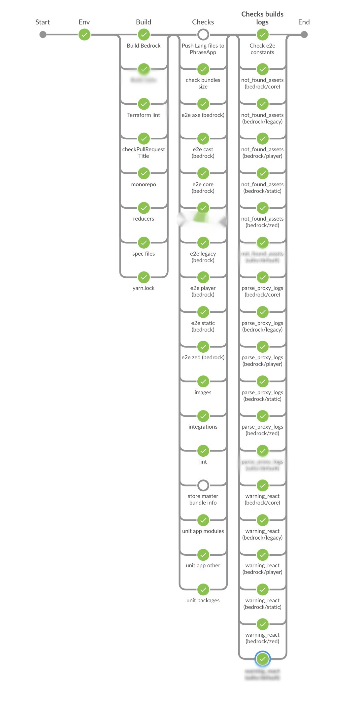

Depuis quelque temps, je joue avec les actions github pour voir si je peux facilement reproduire les comportements que j'applique dans mon outil de CI actuel.
Je voulais mettre en parallèle des jobs en me basant sur les labels associés à une Pull Request.
Dans cet article, je vais vous montrer une façon possible de le faire ! (N'ayant pas trouvé d'article sur internet expliquant comment le faire)

Dans mon travail à [Bedrock](https://www.bedrockstreaming.com/), nous utilisons actuellement Jenkins pour gérer l'intégration et le déploiement de nos applications.
Au-delà de la galère liée à l'utilisation de groovy avec la syntaxe de pipeline 😅, nous devons admettre que nous parvenons à réaliser des workflow assez complexes.



Décidant de voir s'il serait facile pour moi de reproduire les étapes de ces pipelines avec les github actions, j'ai décidé d'essayer ses fonctionnalités.
Entre autres en publiant [une Github Action pour vérifier le titre d'un PR selon une regexp.](https://github.com/Slashgear/action-check-pr-title)

## Une Solution

Vous devez d'abord créer un workflow basé sur des événements `pull_request` et vous pouvez même spécifier les types d'événements.

```yaml
name: Example workflow
on:
  pull_request:
    types: [opened, labeled, unlabeled, synchronize]
```

Ajoutez maintenant un job qui mettra en place une stratégie de parallélisation basée sur les étiquettes de l'événement github.

```yaml
jobs:
  build:
    strategy:
      matrix:
        label: ${{github.event.pull_request.labels.*.name}}
    runs-on: ubuntu-latest
    steps:
      - uses: actions/checkout@v2
      - name: Run a one-line script
        run: echo Hello, world from "${{matrix.label}}"!
```

Les étapes seront automatiquement exécutées en parallèle sur toutes les labels de chaque PR. 🎉
Cependant, `strategy.matrix.label` n'accepte pas un tableau vide comme valeur.😢

Le job doit donc être conditionné pour n'être exécuté que si `${{github.event.pull_request.labels.*.name}}` n'est pas vide.
Il y a un paramètre `if` dans les jobs qui permet de faire cela, mais malheureusement il est interprété après avoir vérifié la valeur de `strategy.matrix.label`.

La solution que j'ai trouvée est de faire cette vérification dans un job précédent.
Voici un exemple de workflow qui lance dynamiquement des actions sur toutes les étiquettes de chaque RP.

```yaml
name: Example workflow

on:
  pull_request:
    types: [opened, labeled, unlabeled, synchronize]

jobs:
  checkLabels:
    runs-on: ubuntu-latest
    if: ${{github.event.pull_request.labels.*.name[0]}}
    steps:
      - run: echo Check labels is not empty
  build:
    needs: [checkLabels]
    strategy:
      matrix:
        label: ${{github.event.pull_request.labels.*.name}}
    runs-on: ubuntu-latest
    steps:
      - uses: actions/checkout@v2
      - name: Run a one-line script
        run: echo Hello, world from "${{matrix.label}}"!
```

À vous de l'adapter à vos besoins !
