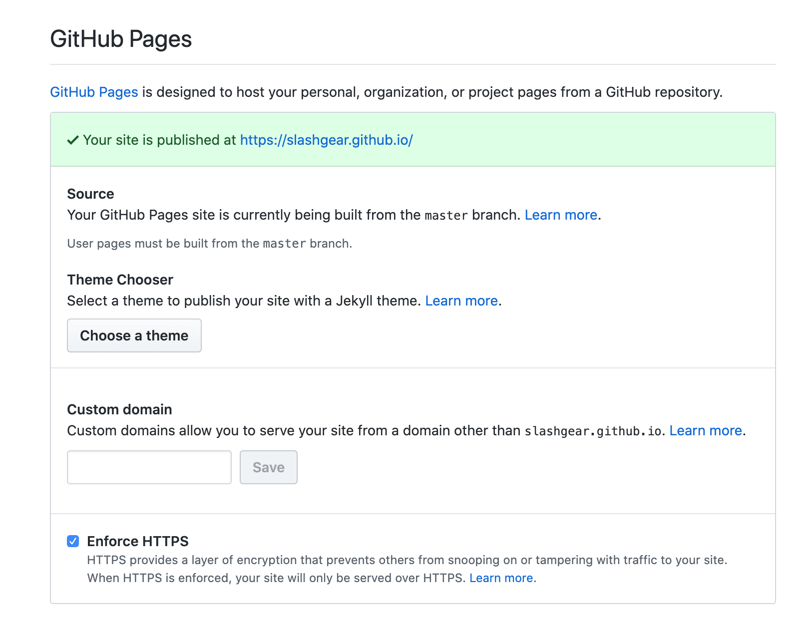

Github Pages is a solution to host static websites directly in your Github repository by pushing site files to `gh-pages` branch.
I use this feature to host [this blog](https://blog.slashgear.dev).
It is free and very useful for your own site or open source documentation.
Here is a tutorial of how to publish Gatsby website with travis.

**Make sure to have a public github repository with your static site and a travis-ci.org account.**

## 1. Add travis file to your project

Define basic travis-ci configuration to build and push you site on `gh-pages` page on each new commit on master.
_Add `.travis-ci.yml` file in the root directory of your git project._

Edit this file with your build configuration.

```yaml
# This is the required part containing the build step for gatsby
language: node_js
node_js:
  - '12'
cache:
  yarn: true
  directories:
    - public
    - .cache
script:
  - yarn build # Generate static HTML files

# Here is the magic part
deploy:
  # Use Github pages deploy process
  provider: pages
  # Keep builded pages
  skip-cleanup: true
  # Directory where your generated files are located
  local_dir: public
  # Github security/auth token
  github-token: $GITHUB_TOKEN
  # Incremental commit to keep old build/files from previous deployments
  keep-history: true
  # Git branch on which it should deploy (master, gh-pages, foo...)
  target_branch: gh-pages
  on:
    # Which branch on commit/push will trigger deployment
    branch: master
```

_Take a look at [all deploy providers available with travis](https://docs.travis-ci.com/user/deployment/)._

## 2. Generate Github personal token

Generate a Github token on [this page](https://github.com/settings/tokens/new) with repository permission and keep it safe.


## 3. Configure your travis job

Toggle your github repository to travis listed project on [this page](https://travis-ci.org/account/repositories).
Then on your project travis page, go to `More options > Settings`.


In the `Environment Variables` section, add variable named `GITHUB_TOKEN` and use generated token from previous step.


## 4. Activate Github Pages feature for your repository

In your github repository settings page, be sure to activate github pages feature in `Github Pages` section.



> Save it, and now it is done !
> You are good to go, your next commit pushed on master branch will trigger deployment of your site.

Hope this will help you configure travis deployment for your project.

If you liked it, I'll try to do the same tutorial with _Github Action_.
