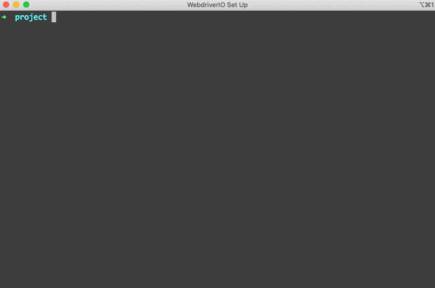
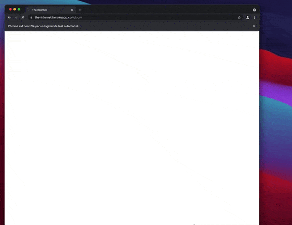
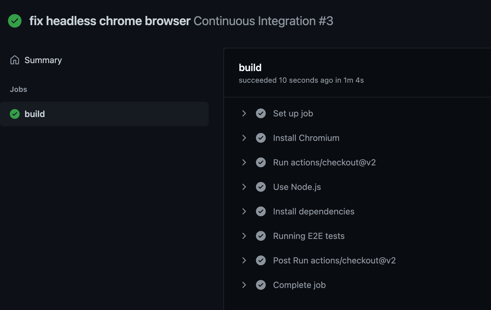

I recently set up an end-to-end testing stack to make sure I wasn't going to introduce any functional regressions to my blog.
With several years of experience using E2E (End to End) testing technologies, I still encountered some difficulties in setting it up.

In order to save you time I give you a step by step tutorial for the installation of the tools necessary to have an efficient test stack in a few minutes.

## Make it run locally first

You need to install some dependencies to your project first.
For me the project was a quite simple Gatsby site, but you could settle it on whatever website you develop that have a `package.json` file.
In this case I will start from a just initialised `npm` package.
**Make sure you have a Chromium or Chrome browser installed locally.**
We are really lucky because [WebdriverIo](https://webdriver.io/) teams have developed a CLI topic that does this job for you.

```shell
yarn add -D @wdio/cli
```

Then all you need is to trigger the initialisation of a new configuration.
The CLI will show you a prompt you should follow.

```shell
yarn wdio config
```



Here is what you should do for each question:

1. Select first `On my local machine`.
2. You should definitely use `cucumber`, Gherkin language is so great to [declare humanly readable user behaviors](https://en.wikipedia.org/wiki/Behavior-driven_development).
3. Choose the compiler you need, I personally use `No`. You could decide if you wannt to handle Babel or Typescript depending on you habits.
4. For the `Where are your feature files located?` I like to use the default value.
5. Same for step definitions, use default value.
6. Let's see what tests WebdriverIo will autogenerate.
7. `Do you want to use page objects ?` I wouldn't use that if it is the first time you setup those kind of testing stack, say `n`.
8. You should select `spec` reporter here.
9. Please select `chromedriver` service only.
10. Override the base url with you local context (for example, add the port on which you expose your app locally).

Normally the CLI generates some files for you and add the missing dependencies you need.

Here is my `package.json`

```json
{
  "name": "example-wdio",
  "version": "1.0.0",
  "main": "index.js",
  "license": "MIT",
  "devDependencies": {
    "@wdio/cli": "^7.9.1",
    "@wdio/cucumber-framework": "^7.9.1",
    "@wdio/local-runner": "^7.9.1",
    "@wdio/spec-reporter": "^7.9.0",
    "chromedriver": "^92.0.1",
    "wdio-chromedriver-service": "^7.2.0"
  }
}
```

You should see a `login.feature` file in `./features/` folder.

```gherkin
Feature: The Internet Guinea Pig Website

  Scenario Outline: As a user, I can log into the secure area

    Given I am on the login page
    When I login with <username> and <password>
    Then I should see a flash message saying <message>

    Examples:
      | username | password             | message                        |
      | tomsmith | SuperSecretPassword! | You logged into a secure area! |
      | foobar   | barfoo               | Your username is invalid!      |
```

With the steps definitions in `./step-definitions/steps.js`

```js
const { Given, When, Then } = require('@cucumber/cucumber')

Given(/^I am on the (\w+) page$/, async (page) => {
  await browser.url(`https://the-internet.herokuapp.com/${page}`)
})

When(/^I login with (\w+) and (.+)$/, async (username, password) => {
  await $('#username').setValue(username)
  await $('#password').setValue(password)
  await $('button[type="submit"]').click()
})

Then(/^I should see a flash message saying (.*)$/, async (message) => {
  await expect($('#flash')).toBeExisting()
  await expect($('#flash')).toHaveTextContaining(message)
})
```

Let's see what those default example tests are doing !
For that, you just have to type this in your console and tada 🎉

```shell
yarn wdio run wdio.conf.js
```



Here is the log it will generate thanks to the `spec` reporter !

```text
------------------------------------------------------------------
[chrome 92.0.4515.131 mac os x #0-0] Running: chrome (v92.0.4515.131) on mac os x
[chrome 92.0.4515.131 mac os x #0-0] Session ID: edd73da800a210e7c677c69cd064004f
[chrome 92.0.4515.131 mac os x #0-0]
[chrome 92.0.4515.131 mac os x #0-0] » /features/login.feature
[chrome 92.0.4515.131 mac os x #0-0] The Internet Guinea Pig Website
[chrome 92.0.4515.131 mac os x #0-0] As a user, I can log into the secure area
[chrome 92.0.4515.131 mac os x #0-0]    ✓ Given I am on the login page
[chrome 92.0.4515.131 mac os x #0-0]    ✓ When I login with tomsmith and SuperSecretPassword!
[chrome 92.0.4515.131 mac os x #0-0]    ✓ Then I should see a flash message saying You logged into a secure area!
[chrome 92.0.4515.131 mac os x #0-0]
[chrome 92.0.4515.131 mac os x #0-0] As a user, I can log into the secure area
[chrome 92.0.4515.131 mac os x #0-0]    ✓ Given I am on the login page
[chrome 92.0.4515.131 mac os x #0-0]    ✓ When I login with foobar and barfoo
[chrome 92.0.4515.131 mac os x #0-0]    ✓ Then I should see a flash message saying Your username is invalid!
[chrome 92.0.4515.131 mac os x #0-0]
[chrome 92.0.4515.131 mac os x #0-0] 6 passing (3s)
```

For now the tests are not testing your application at all.
You will find many ressources on how to use [Cucumber JS](https://cucumber.io/docs/installation/javascript/) to write great test to describe and test your application features.

## Configure the Github action workflow

Now that we have managed to run E2E tests on our machine, we just need to set up a continuous integration workflow that will automatically check on your Pull Request and on your `main` branch that all the tests are ok.

I use for most of my projects Github Action and I'm happy with it, so the following example will use this tool.
However, the principle also works with a Gitlab, Jenkins or other pipeline.

With Github Action you need to setup a Yaml file to describe you workflow.
Let's create `./.github/workflows/continuous-integration.yml` file in your project !

```yaml
name: Continuous Integration

on:
  push:
    branches:
      - '**'

jobs:
  build:
    runs-on: ubuntu-latest
    steps:
      # First you need to install a chromium browser in your runner
      - name: Install Chromium
        run: sudo apt-get install chromium-browser

      # You fetch the current ref
      - uses: actions/checkout@v2

      # Use Node version above 14.x you want to use
      - name: Use Node.js
        uses: actions/setup-node@v1
        with:
          node-version: 16.x

      # Install your dependencies (with yarn, npm no matter)
      - run: yarn install
        name: Install dependencies

      # This is where you could build your app
      # You could also start your server process (take a look at https://github.com/Slashgear/slashgear.github.io/blob/source/.github/workflows/continuous-integration.yml)

      # Run your test with the same command you uses locally
      - run: yarn wdio run wdio.conf.js
        name: Running E2E tests
```

Let's try that ! 🚀

😭 Sadly you should face a very common error with E2E testing with chrome.

```text
[0-0] 2021-08-12T20:34:12.293Z ERROR webdriver: Request failed with status 500 due to unknown error: unknown error: Chrome failed to start: exited abnormally.
[0-0]   (unknown error: DevToolsActivePort file doesn't exist)
[0-0]   (The process started from chrome location /usr/bin/google-chrome is no longer running, so ChromeDriver is assuming that Chrome has crashed.)
[0-0] 2021-08-12T20:34:12.293Z ERROR webdriver: #0 0x5631c488ba63 <unknown>
```

`DevToolsActivePort file doesn't exist` basically means your browser did not succeed to start.
The main reason of the issue is the fact that you ask WebdriverIo to start Chrome browser with a Graphic User Interface on a ubuntu runner that don't have a screen at all 😅.

We need to create a new configuration of Webdriver specific to github action that extends our basic one.
Let's create `wdio-github.conf.js` next to `wdio.conf.js` !

```js
const basicConfig = require('./wdio.conf')

exports.config = {
  ...basicConfig.config,
  // We only need to override the Chrome configuration of capabilities
  capabilities: [
    {
      maxInstances: 5,
      browserName: 'chrome',
      acceptInsecureCerts: true,
      // We need to extends some Chrome flags in order to tell Chrome to run headless
      'goog:chromeOptions': {
        args: ['--headless', '--disable-gpu', '--disable-dev-shm-usage'],
      },
    },
  ],
}
```

We now just have to change the `yarn wdio run` command in our Github Workflow YAML file.
You just need to push it and github will start it for you !



## Setup multi browser configuration !

Chrome is not the only browser, and I hope it never will never be !

**WebdriverIo is a great solution to run test on multiple Browsers.**
And I won't show you here what great features you could use with remote running solution like [BrowserStack](https://www.browserstack.com/) or [Saucelabs](https://saucelabs.com/) directly with WebdriverIo.

Let's configure a Firefox locally !

1. Make sur to install a Java JDK 8 on your machine.
   Small trick for Macos users like me run `brew install adoptopenjdk/openjdk/adoptopenjdk8` does the job !
2. Run `yarn add -D @wdio/selenium-standalone-service` to install selenium services working with WebdriverIo.
3. Make sure you have Firefox installed locally.
4. Now the last thing we need to do is to update our configuration to add firefox capabilities.

In `wdio.conf.js`, just replace _capabilities_ and _services_ arrays with this

```shell
{
  capabilites: [
    {
        maxInstances: 5,
        browserName: 'chrome',
        acceptInsecureCerts: true,
    },
    {
        maxInstances: 5,
        browserName: 'firefox',
        acceptInsecureCerts: true,
    }
  ],
  services: ['chromedriver', 'selenium-standalone'],
}
```

If you run the command `yarn wdio run wdio.conf.js` now, it will trigger both test on Firefox and Chrome and that is completely awesome !

The last thing we need to do is to update our Github specific configuration in order to make it work also in your continuous integration.
You need to update _capabilites_ too, in order to add Firefox and to make it boot _Headless_.

In `wdio-github.conf.js`

```js
const basicConfig = require('./wdio.conf')

exports.config = {
  ...basicConfig.config,
  // We only need to override the Chrome configuration of capabilities
  capabilities: [
    {
      maxInstances: 5,
      browserName: 'chrome',
      acceptInsecureCerts: true,
      // We need to extends some Chrome flags in order to tell Chrome to run headless
      'goog:chromeOptions': {
        args: ['--headless', '--disable-gpu', '--disable-dev-shm-usage'],
      },
    },
    {
      maxInstances: 5,
      browserName: 'firefox',
      acceptInsecureCerts: true,
      'moz:firefoxOptions': {
        args: ['-headless'],
      },
    },
  ],
}
```

> And that's all folks !

Have fun covering your application with E2E tests !
Don't hesitate to @ me on twitter if this _How to_ helped you.

If you need to see the example application I used in this tutorial, take a look at [this example Github repository](https://github.com/Slashgear/example-wdio).
