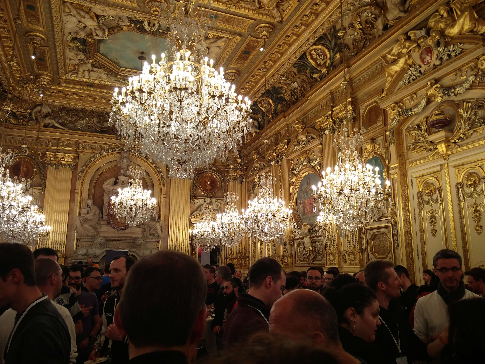
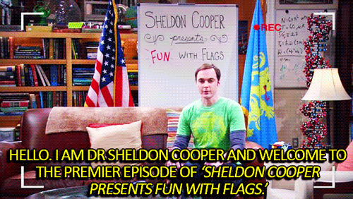

Cette fin de semaine c'était la nouvelle édition de la super _conférence
lyonnaise avec des crêpes et du coeur._ Malgré le tirage au sort (très contesté) mis en place cette année,
j'ai réussi a obtenir le _golden ticket_.

**⚠️ Disclaimer, dans cet article, je donne ici mon ressenti sur cette édition du mixit.
Je vais essayer d'ajouter ici les liens vers les vidéos des conférences dès que les liens seront disponibles
Je ne parle pas de tous les talks auxquels j'ai pu assister.**

## Une introduction toute en musique

Tout a commencé avec une super introduction musicale autour de la gestion de groupe
géré d'une main de maître ...du moins d'une baguette de chef d'orchestre par Samuel Couffignal.
Très bel exemple de l'autogestion d'un groupe et du pouvoir d'action qu'un leader peut avoir sur un groupe.

<div style="position:relative;height:0;padding-bottom:56.25%"><iframe src="https://player.vimeo.com/video/215505962" width="640" height="360" frameborder="0" style="position:absolute;width:100%;height:100%;left:0" allowfullscreen></iframe></div>

Je vous passe l'anecdotique présentation de la monnaie locale : _[La gonette](http://www.lagonette.org/)_

## Jour 1

### Elm on l'♥️, on l'♥️ pas

Premier talk, j'attaque par la présentation de Jordane
Grenat sur ELM, une alternative pour le monde JS. Une présentation bien sympathique de l'environnement et de ses avantages.
Beaucoup d'avantages sur cette plateforme, notamment le compilateur qui a vraiment été orienté utilisateur.
L'analyse d'erreur de compilation est très fine et donne beaucoup d'informations sur la résolution de l'erreur.
Je reste cependant pas du tout convaincu par la syntaxe que je trouve beaucoup trop concise
et du coup pas forcément lisible. Et oui ceci est une fonction qui fait juste une addition.

<div style="position:relative;height:0;padding-bottom:56.25%"><iframe src="https://player.vimeo.com/video/215620393" width="640" height="360" frameborder="0" style="position:absolute;width:100%;height:100%;left:0" allowfullscreen></iframe></div>

```elm
add x y =
  x + y
```

Je pense qu'avec de la pratique la syntaxe doit moins piquer les yeux mais quand même.

### Electron par les copains nantais

Contrairement à ce qu'on peut lire sur le slack de Zenika, Yvonnick Frin ne fait pas que de l'ionic ;)
Il est même venu avec son collègue Eric Briand pour nous montrer Electron, la solution Github pour
développer des applications desktop avec nos bonnes "vieilles" technologies front.
Difficile de rentrer dans certains détails qui font polémique notamment la consommation
des resources, mais cette présentation sait nous montrer les bases pour qu'on puisse commencer à faire joujou
avec Electron.

<div style="position:relative;height:0;padding-bottom:56.25%"><iframe src="https://player.vimeo.com/video/215528389" width="640" height="360" frameborder="0" style="position:absolute;width:100%;height:100%;left:0" allowfullscreen></iframe></div>

### Éthique et tac !

Quand un ancien journaliste de Numerama et actuel directeur de l'éthique chez Qwant (Guillaume Champeau) vient nous parler d'éthique, on se rappelle qu'on est bien à MiXiT.
La conférence a abordé des thématiques comme les responsabilisations du développeur sur ce qu'il produit, le respect de la vie privée, etc.
Sans parler d'un monde à la _Mister Robot,_ on peut quand même faire le constat que notre sphère privée et intime
ne nous appartient aujourd'hui plus tout à fait. A voir absolument, surtout si un complotiste sommeille en vous.

<div style="position:relative;height:0;padding-bottom:56.25%"><iframe src="https://player.vimeo.com/video/215558307" width="640" height="360" frameborder="0" style="position:absolute;width:100%;height:100%;left:0" allowfullscreen></iframe></div>

### 🦄 is awesome!!

Dans le monde du web journalisme on parle souvent de titre putaclick et ce talk aurait
quand même eu un prix pour son nom : _Css is awesome!_
Derrière ce titre très racoleur se cachait une intervention très bien détaillée sur la puissance propre de CSS.
Par des exemples simples, Igor Labori nous partage quelques tricks CSS bien pratiques mais également quelques
balises HTML5 oubliées.

<div style="position:relative;height:0;padding-bottom:56.25%"><iframe src="https://player.vimeo.com/video/215621504" width="640" height="360" frameborder="0" style="position:absolute;width:100%;height:100%;left:0" allowfullscreen></iframe></div>

<details>
    <summary>Sérieusement vous connaissez cette balise ?</summary>
    Et oui, on a pu voir quelques balises html cool aussi
</details>

### Futur of Kotlin _Oui je sais, encore du Kotlin_

Quand Mr Andrey Breslav lui-même se déplace à Lyon pour parler Kotlin, je me devais de venir suivre sa conférence.
Outre la présentation des approximatives prochaines features (non-beta) de Kotlin, Andrey a pu nous partager
son expérience de créateur de langage. A voir si on veut se tenir au courant des nouveautés de Kotlin et si
on s'intéresse à la conception de langage.

<div style="position:relative;height:0;padding-bottom:56.25%"><iframe src="https://player.vimeo.com/video/215556547" width="640" height="360" frameborder="0" style="position:absolute;width:100%;height:100%;left:0" allowfullscreen></iframe></div>

### Progressive Web Apps, rien de nouveau

Un peu déçu de la présentation sur les progressive web apps, je ne m'attendais pas
à une initiation PWA en 2017 sachant que ces concepts avaient été déjà présentés à MiXiT
il y a 2 ans. Mais après je fais mon difficile, la présentation était très complète pour une initiation
alors foncez la voir si pour vous les PWA sont un monde obscure.

<div style="position:relative;height:0;padding-bottom:56.25%"><iframe src="https://player.vimeo.com/video/215625792" width="640" height="360" frameborder="0" style="position:absolute;width:100%;height:100%;left:0" allowfullscreen></iframe></div>

## La soirée à l'hotel de ville



## Jour 2

On passe sur la keynote un peu trop _commercialobullshitojustu_ de Regen Villages
qui semble plus concentré sur sa communication publicitaire que sur la qualité de ses slides.

### Un petit talk sur le monde mystérieux de l'ergonomie

Et si on apprenait un peu à dialoguer avec un ergonome ? Ici Nathalie Cotté nous partage son expérience en tant
qu'ergonome au sein d'une société d'édition de soft.
Son retour et ses conseils sont très appréciables, elle nous donne un méthodologie assez simple pour améliorer
l'ergonomie de son application afin d'éviter l'échec auprès des utilisateurs. A voir absolument si vous voulez arrêter
de devoir former vos utilisateurs sur vos applications.

### La vexil**LOL**ogie pour les nuls 🇫🇷

Quand un passioné nous montre son bébé/son chef d'oeuvre autour de CSS et de la science des drapeaux,
ça nous donne un talk hyper intéressant. Le défi fou de faire les drapeaux du monde entier avec un
seul `div` et uniquement du CSS, c'est quand même beau. Le talk est en plus très bien conçu pour pouvoir comprendre la démarche
et les solutions techniques mises en place. ([Le lien vers la page de ses drapeaux](https://pixelastic.github.io/css-flags/))

<div style="position:relative;height:0;padding-bottom:56.25%"><iframe src="https://player.vimeo.com/video/216848472" width="640" height="360" frameborder="0" style="position:absolute;width:100%;height:100%;left:0" allowfullscreen></iframe></div>



### Un revenu universel démystifié

Quand on voit cette conf on se dit que la fête de l'huma ça a bien changé, attendez... heu non on est à MiXiT en fait.
Ce talk, qu'on pourrait critiquer dans le contexte actuel des élections cache en fait une présentation assez claire sur ce qu'est
concrêtement le revenu universel.

<div style="position:relative;height:0;padding-bottom:56.25%"><iframe src="https://player.vimeo.com/video/217015501" width="640" height="360" frameborder="0" style="position:absolute;width:100%;height:100%;left:0" allowfullscreen></iframe></div>

### Random talk => se libérer du temps

Et si on se dégageait une journée par semaine pour vraiment faire ce dont on a envie.
Est on prêt à se passer de 20% de notre salaire pour enfin avoir du temps pour soi.
Tout cela était le sujet du random talk auquel j'ai eu le droit de participer le deuxième jour.
Une belle introduction au _travailler autrement_.

<div style="position:relative;height:0;padding-bottom:56.25%"><iframe src="https://player.vimeo.com/video/217023172" width="640" height="360" frameborder="0" style="position:absolute;width:100%;height:100%;left:0" allowfullscreen></iframe></div>

### Cosmogonie, informatique et trou noir, un super vrai 👽 pour finir

Après deux jours de conférences, j'avais envie de me changer les idées et voir autre chose. Alors, pour finir,
je suis allé voir une présentation typiquement alien sur l'univers et les trous noirs. Le talk est vraiment passionnant
et ne semble pas avoir déçu la foule présente dans la salle. On notera quand même sur les panneaux de feedback que
cette présentation manquait cruellement de démo.

# Conclusion

Encore une super édition concoctée par les bénévoles de MiXiT. Merci à eux.
Je reste quand même sur ma faim avec certaines keynotes, mais le cru 2017 reste quand même une
bonne année.

_Merci [@npayot](https://twitter.com/npayot) (aka flipper le dauphin) serial blagueur et photographe à ses heures perdues pour la photo de l'article_

_Merci à [@hdurix](https://twitter.com/hdurix) pour la revue_
_Crédit vidéo MiXiT_
