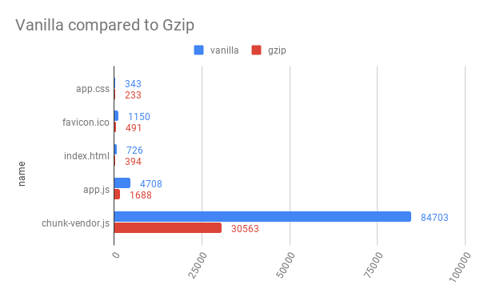
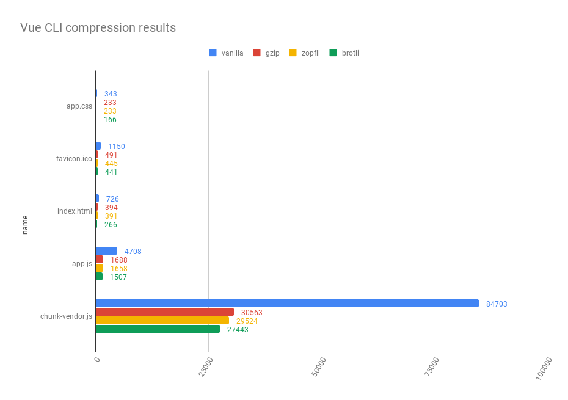

Si vous utilisez webpack comme bundler pour votre application, vous êtes probablement préoccupé par ses propres performances et son temps de chargement.
Vous avez peut-être utilisé le code-splitting, le tree-shaking, l'uglification mais vous avez peut-être oublié une étape très importante.

## La compression est obligatoire

En 2019, si vous n'utilisez pas un algorithme de compression pour livrer vos fichiers dans une version allégée afin de rendre le chargement de votre site web plus rapide, la situation est critique.
Chaque analyseur de performance de site web vous dira de le faire.
Voici une comparaison de la taille d'un site web sur la vanille [Vue CLI](https://cli.vuejs.org/) avec et sans Gzip.



**Ici, nous réduisons 64% de la taille réelle avec Gzip.**

## Compresser des fichiers statiques à la volée est redondant

Tout serveur web moderne a la possibilité de compresser des fichiers à la demande.
Bien que Gzip soit rapide, la compression de fichiers statiques à chaque demande est contraire au modèle, même si vous utilisez un cache devant vos demandes de fichiers statiques.

**La compression des fichiers statiques doit être effectuée pendant la période de construction.**

Si vous êtes dans un contexte de webpack, il est très facile d'ajouter une compression.

Pour ce faire, vous pouvez installer le _compression-webpack-plugin_ avec :

```bash
npm install --dev compression-webpack-plugin
```

...et l'ajouter dans votre configuration de production :

```js
...
plugins: [
    new CompressionWebpackPlugin(),
]
...
```

En deux étapes faciles, vos fichiers statiques de sortie auront leur équivalent _.gz_.
Maintenant, si vous envoyez ces fichiers sur un serveur web comme [Caddy](https://caddyserver.com/).
Il délivrera automatiquement la version pré-zippée s'ils existent.
Cependant, vous devez l'activer [dans la configuration du serveur Nginx](http://nginx.org/en/docs/http/ngx_http_gzip_static_module.html).

## "Devrions-nous seulement générer des .gz ?

Si vous avez suivi les étapes ci-dessus, vous avez activé la compression sur votre serveur web. C'est génial !

**Mais en 2019, Gzip n'est pas la seule solution pour compresser vos fichiers.**

### Zopfli

Zopfli est un algorithme de compression sans perte qui donne de meilleurs résultats de compression que Gzip avec un temps de compression plus lent.
Donc si vous le pouvez, vous devez toujours utiliser la compression Zopfli pour les fichiers statiques, au lieu de Gzip de base.
Les fichiers de sortie de Zopfli respectent le même format que Gzip, le support du navigateur est le même.

Vous pouvez utiliser zopfli [avec le plugin de compression webpack](https://github.com/webpack-contrib/compression-webpack-plugin#using-zopfli)

### Brotli

Brotli est un algorithme de compression récent ([RFC 7932](https://tools.ietf.org/html/rfc7932)) avec [un excellent support du navigateur](https://caniuse.com/#search=brotli).
Basé sur une nouvelle modélisation et un nouveau format de fichier, brotli est très performant pour la compression des fichiers statiques.
Il y a encore quelques parties difficiles avec brotli (non disponible sur Node < v11, difficile à configurer sur certains serveurs web comme Nginx)

Vous pouvez utiliser brotli [avec le plugin de compression webpack.](https://github.com/webpack-contrib/compression-webpack-plugin#using-zopfli)



## En conclusion : "Pourquoi le faire avec Webpack ?

La compression des fichiers statiques pendant les étapes de construction est encore un sujet discutable.
Certaines personnes affirment que c'est au serveur web de compresser les fichiers.
Cependant, aujourd'hui, les serveurs web n'optimisent pas vraiment la compression des fichiers statiques.

Lorsque vous comprimez pendant la construction :

- Vous pouvez facilement voir la taille complète de votre application web (ce qui est très utile lorsque vous voulez suivre les performances d'une application web)
- Votre application est beaucoup plus portable (vous pourrez facilement changer votre déploiement ou votre serveur web avec des ressources pré-compressées)
- En tant que développeur de frontend, vous êtes familier avec la grande valeur de la compression sans perte.
