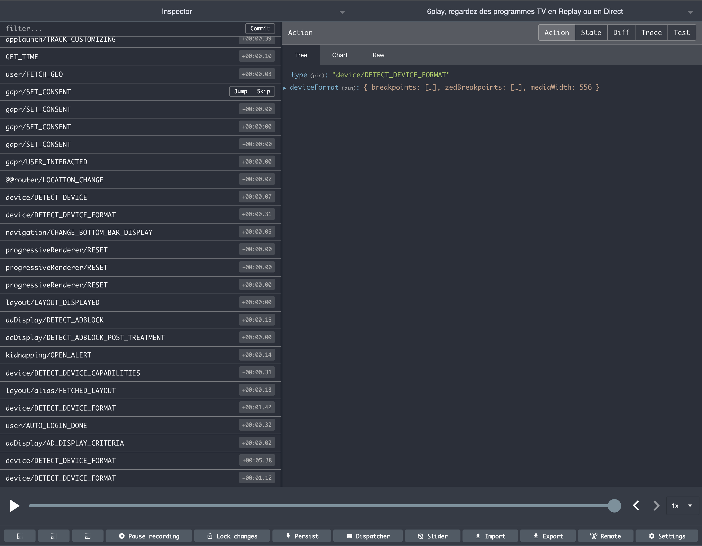
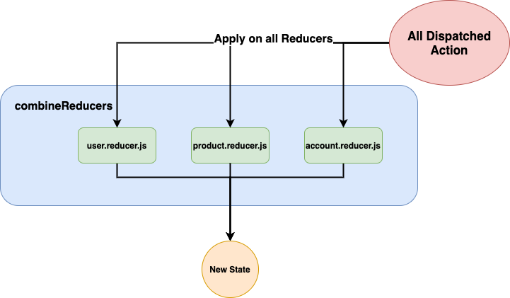

Après 2 ans d'utilisation de React avec Redux pour la plateforme vidéo [6play](https://6play.fr), j'ai pu identifier les bonnes pratiques et les pièges à éviter à tout prix.
L'équipe de [Bedrock](https://www.bedrockstreaming.com/) (à laquelle j'appartiens actuellement) a maintenu la pile technique du projet à jour pour profiter des nouvelles fonctionnalités de `react`, `react-redux` et `redux`.

Voici donc mes conseils pour maintenir et utiliser React et Redux dans votre application sans devenir fou.

Cet article n'est pas une introduction à React ou Redux. Je vous recommande [cette documentation](https://redux.js.org/basics/usage-with-react) si vous voulez voir comment les mettre en œuvre dans vos applications.

Vous pouvez également jeter un coup d'œil au [guide de style officiel de Redux] dans lequel vous pourriez trouver certains de ces conseils et d'autres.
Notez que si vous utilisez le [Redux Toolkit], certaines des astuces/pratiques présentées dans cet article sont déjà intégrées directement dans l'API.

## Évitez d'avoir un seul reducer

Le [reducer] est la fonction qui est en charge de construire un nouvel état à chaque `action`.
On pourrait être tenté de ne manipuler qu'un seul reducer.
Dans le cas d'une petite application, ce n'est pas un problème.
Pour les applications exprimant une activité complexe et évolutive, il est préférable d'opter pour la solution [combineReducers].

Cette fonctionnalité de `redux` permet de manipuler non pas un mais plusieurs [reducer]s qui agissent respectivement sur l'état.

> Quand et comment scinder son application ?

Ce que nous recommandons à Bedrock, c'est un découpage fonctionnel de l'application.
Dans mon approche, nous aurions tendance à représenter le métier de l'application plus que les trucs techniques sous-entendus.
De très bons articles l'expliquent notamment par l'utilisation des [principes DDD](https://en.wikipedia.org/wiki/Domain-driven_design).

À Bedrock, nous utilisons un dossier nommé _modules_ qui regroupe les différents dossiers associés à la fonctionnalité de votre application.

```txt
app/
  modules/
    user/
      __tests__/
        user.reducer.spec.js
      components/
      user.reducer.js
    product/
      __tests__/
        product.reducer.spec.js
      components/
      product.reducer.js
    account/
      __tests__/
      account.reducer.spec.js
      components/
      account.reducer.js
  store.js
  index.js
```

Ainsi, dans `store.js`, tout ce que vous avez à faire est de combiner vos différents reducers.

```js
import { createStore, combineReducers } from "redux";
import { user } from "./modules/user/user.reducer.js";
import { product } from "./modules/user/product.reducer.js";
import { account } from "./modules/user/account.reducer.js";

export const store = createStore(combineReducers({ user, product, account }));
```

En suivant ce principe, vous allez :

- garder les reducers lisibles car ils ont une portée limitée.
- structurer et définir les fonctionnalités de votre application
- faciliter les tests

Historiquement, cette segmentation nous a permis de supprimer des domaines d'application complets sans avoir d'impact sur l'ensemble du codebase, simplement en supprimant le dossier `module` associé à la fonctionnalité.

### Accès par proxy à l'état

Maintenant que vos reducers ont été placés dans le `module` fonctionnel, vous devez permettre à vos composants d'accéder à l'état via un `selector`.
Un `selector` est une fonction qui a l'`state` comme paramètre, et récupère ses informations.
Cela peut aussi vous permettre de ne sélectionner que les props nécessaires au composant en vous découplant de la structure de l'état.

```js
export const getUserName = ({ user: { lastName } }) => lastName;
```

Vous pouvez également passer des paramètres à un "sélecteur" en l'entourant d'une fonction.

```js
export const getProduct =
  productId =>
  ({ product: { list } }) =>
    list.find(product => product.id === productId);
```

Cela vous permettra de les utiliser dans vos composants en utilisant le crochet [useSelector].

```js
const MyComponent = () => {
  const product = useSelector(getProduct(12));
  return <div>{product.name}</div>;
};
```

Il est spécifié dans la doc `react-redux` que le _selector_ est appelé pour chaque rendu du composant.
Si la référence de la fonction `selector` ne change pas, une version en cache de l'objet peut être retournée directement.

```txt
app/
  modules/
    user/
      __tests__/
        user.reducer.spec.js
      components/
      user.reducer.js
      user.selectors.js <--- This is where all module selectors are exported
```

### Préfixer le nom de vos actions

> Je vous conseille vraiment de définir des règles de nommage pour vos actions et si possible de les vérifier avec une règle `eslint`.

Les actions sont en lettres majuscules séparées par '\_'.
Voici un exemple avec cette action : `SET_USERS`.

```txt
app/
  modules/
    user/
      __tests__/
        user.reducer.spec.js
      components/
      user.actions.js <--- This is where all module action creators are exported
      user.reducer.js
      user.selectors.js
```

Les noms des actions sont préfixés par le nom du `module` dans lequel il se trouve.
Cela donne un nom complet : `user/SET_USERS`.
Un grand avantage de cette règle de nommage est que vous pouvez facilement filtrer l'action dans [redux-devtools](https://github.com/reduxjs/redux-devtools).



### Toujours tester vos reducers

Les `reducers` sont les détenteurs de l'activité de votre application.
Ils manipulent l'état de votre application.

**Ce code est donc _sensible_.**

➡️ Une modification peut avoir beaucoup d'impact sur votre application.

**Ce code est riche en règles de gestion**.

➡️ Vous devez être sûr que celles-ci sont correctement mises en œuvre.

La bonne nouvelle est que ce code est relativement facile à tester.
Un [reducer] est une fonction unique qui prend 2 paramètres.
Cette fonction retournera un nouvel `state` en fonction du type d'action et de ses paramètres.

Voici la structure standard pour tester les [reducer] avec [Jest](https://jestjs.io/) :

```js
describe("ReducerName", () => {
  beforeEach(() => {
    // Init a new state
  });
  describe("ACTION", () => {
    // Group tests by action type
    it("should test action with some params", () => {});
    it("should test action with other params", () => {});
  });
  describe("SECOND_ACTION", () => {
    it("should test action with some params", () => {});
  });
});
```

Je vous recommande également d'utiliser le package [deep-freeze](https://www.npmjs.com/package/deep-freeze) sur votre `state` pour vous assurer que toutes les actions retournent de nouvelles références.

En fin de compte, le fait de tester vos [reducer]s vous permettra de remanier facilement la structure interne de leur état sans risquer d'introduire des régressions.

## Conserver l'immuabilité et la lisibilité de vos reducers

Un [reducer] est une fonction qui doit retourner une nouvelle version de l'état contenant ses nouvelles valeurs tout en gardant les mêmes références des objets qui n'ont pas changé.
Cela vous permet de profiter pleinement du _partage structurel_ et d'éviter de faire exploser votre utilisation de la mémoire.
L'utilisation de l'opérateur _spread_ est donc plus que recommandée.

Cependant, dans le cas où l'état a une structure compliquée et profonde, il peut être verbeux de changer l'état sans détruire les références qui ne doivent pas changer.

Par exemple, ici nous voulons surcharger la valeur `Rhone.Villeurbanne.postal` de l'état tout en gardant les objets qui ne changent pas.

```js
const state = {
  Rhone: {
    Lyon: {
      postal: "69000",
    },
    Villeurbanne: {
      postal: "",
    },
  },
  Isère: {
    Grenoble: {
      postal: "39000",
    },
  },
};

// When you want to change nested state value and use immutability
const newState = {
  ...state,
  Rhone: {
    ...state.Lyon,
    Villeurbanne: {
      postal: "69100",
    },
  },
};
```

Pour éviter cela, [un membre de l'équipe Bedrock](https://github.com/flepretre) a publié un paquet qui permet de `set` des attributs imbriqués tout en assurant l'immutabilité : [immutable-set]
Ce paquet est beaucoup plus facile à utiliser que des outils comme [immutable.js] car il n'utilise pas de prototype d'objet.

```js
import set from "immutable-set";

const newState = set(state, `Rhone.Villeurbanne.postal`, "69100");
```

## Ne pas utiliser le cas par défaut

L'implémentation d'un `redux` [reducer] consiste très souvent en un `switch` où chaque `case` correspond à une `action`.
Un `switch` doit toujours définir le cas `default` si vous suivez les règles `eslint` de base.

Imaginons le [reducer] suivant :

```js
const initialState = {
  value: "bar",
  index: 0,
};

function reducer(initialState, action) {
  switch (action.type) {
    case "FOO":
      return {
        value: "foo",
      };
    default:
      return {
        value: "bar",
      };
  }
}
```

Nous pouvons dire naïvement que ce [reducer] gère deux actions différentes. Ce n'est pas le cas.
Si nous isolons ce [reducer], il n'y a que deux types d'"actions" qui peuvent changer cet état : l'action "OFO" et toute autre action.

Cependant, si vous avez suivi le conseil de découper vos reducers, vous n'avez pas qu'un seul reducer agissant sur votre store.

C'est là que le [reducer] précédent pose problème.
En effet, toute autre action changera cet état en un état `default`.
Une action `dispatch` passera par chacun des reducers associés à celui-ci.
Une action à l'autre bout de votre application pourrait affecter cet état sans être exprimée dans le code.
Ceci doit être évité.



Si vous voulez modifier l'état avec une action d'un autre module, vous pouvez le faire en ajoutant un `case` sur cette action.

```js
function reducer(state = initialState, action) {
  switch (action.type) {
    case "FOO":
      return {
        value: "foo",
      };
    case "otherModule/BAR":
      return {
        value: "bar",
      };
    default:
      return state;
  }
}
```

## Utiliser des middlewares personnalisés

J'ai souvent vu des comportements `action` être copiés et collés, d'une action à l'autre.
Quand on est développeur, le "copier-coller" n'est jamais la bonne méthode.

L'exemple le plus courant est la gestion des appels HTTP pendant une action qui utilise `redux-thunk`.

```js
export const foo = () =>
  fetch("https://example.com/api/foo")
    .then(data => ({ type: "FOO", data }))
    .catch(error => {
      // Do something
    });

export const bar = () =>
  fetch("https://example.com/api/bar")
    .then(data => ({ type: "BAR", data }))
    .catch(error => {
      // Do something
    });
```

Ces deux actions sont fondamentalement la même chose, nous pourrions très bien faire une usine qui ferait le code en commun.

En gros, l'action _meta_ que nous voulons représenter ici quand elle est `dispatchée` :

```
Récupérer quelque chose
-- retourner l'action avec le résultat
-- en cas d'erreur, faire quelque chose
```

On pourrait très bien définir un middleware qui s'occuperait de ce comportement.

```js
const http = store => next => async action => {
  if (action.http) {
    try {
      action.result = await fetch(action.http);
    } catch (error) {
      // Do something
    }
  }
  return next(action);
};

// in redux store init
const exampleApp = combineReducers(reducers);
const store = createStore(exampleApp, applyMiddleware(http));
```

Ainsi, les deux actions précédentes pourraient être écrites de manière beaucoup plus simple :

```js
export const foo = () => ({ type: "FOO", http: "https://example.com/api/foo" });

export const bar = () => ({ type: "BAR", http: "https://example.com/api/bar" });
```

Les grands avantages de l'utilisation d'un intergiciel dans une application complexe :

- évite la duplication du code
- vous permet de définir des comportements communs entre vos actions
- standardisation des types d'actions redux _meta_.

## Éviter le rerender lié à redux

L'astuce quand on utilise redux est de déclencher le re-render des composants quand on les connecte à l'état.
Même si [les re-render ne sont pas toujours un problème], le re-render causé par l'utilisation de redux doit vraiment être évité.
Il suffit de se méfier des pièges suivants.

### Ne pas créer de référence dans le _selector_.

Imaginons le prochain _sélecteur_ :

```js
const getUserById = userId => state =>
  state.users.find(user => user.id === userId) || {};
```

Ici, le développeur voulait s'assurer que son _sélecteur_ est protégé contre les nullités et renvoie toujours un _objet_.
C'est quelque chose que nous voyons assez souvent.

Chaque fois que ce sélecteur sera appelé pour un `utilisateur` non présent dans l'état, il retournera un nouvel objet, une nouvelle référence.

> Avec [useSelector](), retourner un nouvel objet à chaque fois forcera toujours un re-rendu par défaut.
> [Doc de react-redux](https://react-redux.js.org/api/hooks#equality-comparisons-and-updates)

Cependant, dans le cas d'un objet, comme dans l'exemple ci-dessus (ou d'un tableau), la référence de cette valeur par défaut est nouvelle à chaque fois que le sélecteur est exécuté.
De même pour les valeurs par défaut dans la déstructuration, vous ne devriez jamais faire ceci :

```js
const getUsers =
  () =>
  ({ users: [] }) =>
    users;
```

Que faire alors ?
Dans la mesure du possible, les valeurs par défaut doivent être stockées dans le reducer.
Sinon, la valeur par défaut doit être extraite dans une constante afin que la référence reste la même.

```js
const defaultUser = {};

const getUserById = userId => state =>
  state.users.find(user => user.id === userId) || defaultUser;
```

Il en va de même pour l'utilisation du sélecteur qui renvoie une nouvelle référence à chaque appel.
L'utilisation de la fonction `filter` renvoie un nouveau tableau à chaque fois une nouvelle référence même si les conditions du filtre n'ont pas changé.

Pour continuer, il est important que [useSelector] ne renvoie pas une fonction.
En fait, vous ne devez jamais faire cela :

```js
const getUserById = state => userId =>
  state.users.find(user => user.id === userId);
const uider = useSelector(getUserById)(userId);
```

Un sélecteur ne doit pas retourner une _vue_ (une copie) de l'état mais directement ce qu'il contient.
En respectant ce principe, vos composants ne se rendront que si une action modifie l'état.
Des utilitaires tels que [reselect] peuvent être utilisés pour implémenter des sélecteurs avec un système de mémoire.

### Ne transformez pas vos données dans les composants

Parfois, les données contenues dans le `state` ne sont pas dans le bon format d'affichage.
Nous aurions rapidement tendance à la générer directement dans le composant.

```js
const MyComponent = () => {
  const user = useSelector(getUser);

  return (
    <div>
      <h1>{user.name}</h1>
      
    </div>
  );
};
```

Ici, l'url de l'image est calculée dynamiquement dans le composant, et donc à chaque rendu.
Nous préférons modifier nos reducers afin d'inclure un attribut `profileUrl` pour que cette information soit directement accessible.

```js
switch (action.type) {
  case `user/SET_USER`:
    return {
      ...state,
      user: {
        ...action.user,
        profilUrl: `https://profil-pic.com/${action.user.id}`,
      },
    };
}
```

Ces informations sont ensuite calculées une fois par action et non à chaque fois qu'elles sont rendues.

## N'utilisez pas _useReducer_ pour vos données professionnelles

Depuis l'arrivée des hooks, nous avons beaucoup plus d'outils fournis directement par React pour gérer l'état de nos composants.
Le hook [useReducer] permet de définir un état qui pourra être modifié par des actions.
On est vraiment très très proche d'un état redux que l'on peut associer à un composant, c'est génial.

Cependant, si vous utilisez redux dans votre application, il semble assez étrange de devoir utiliser [useReducer].
Vous avez déjà tout ce dont vous avez besoin pour manipuler un état complexe.

De plus, en utilisant redux au lieu du hook [useReducer], vous pouvez profiter d'outils de développement et de middlewares vraiment efficaces.

---

## Ressources utiles

- [Utiliser react avec redux](https://redux.js.org/basics/usage-with-react)
- [flux redux animé par Dan Abramov](https://github.com/reduxjs/redux/issues/653#issuecomment-216844781)
  
- [documentation redux sur les middlewares](https://redux.js.org/api/applymiddleware)
- [immutable-set]

[usereducer]: https://fr.reactjs.org/docs/hooks-reference.html#usereducer
[useselector]: https://redux.js.org/recipes/usage-with-typescript#typing-the-useselector-hook
[combiner les reducers]: https://redux.js.org/api/combinereducers
[les rerenders ne sont pas toujours un problème]: https://kentcdodds.com/blog/fix-the-slow-render-before-you-fix-the-re-render
[reselect]: https://www.npmjs.com/package/reselect
[immutable-set]: https://www.npmjs.com/package/immutable-set
[reducer]: https://redux.js.org/basics/reducers
[immutable.js]: https://immutable-js.github.io/immutable-js/
[guide de style officiel de redux]: https://redux.js.org/style-guide/style-guide
[redux toolkit]: https://redux-toolkit.js.org/

Merci aux relecteurs :
[@flepretre](https://github.com/flepretre),
[@mfrachet](https://github.com/mfrachet),
[@fdubost](https://github.com/fdubost),
[@ncuillery](https://github.com/ncuillery),
[@renaudAmsellem](https://github.com/renaudAmsellem)\_
