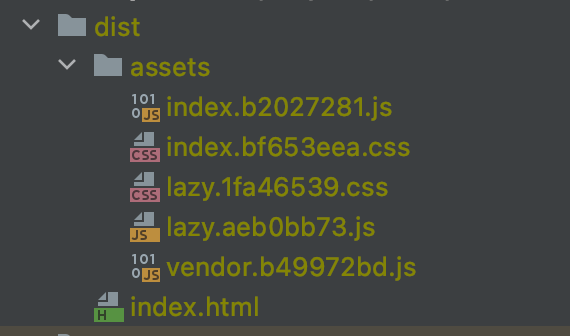

After having dealt on this blog [in several articles about webpack](/en/webpack/), I have started a new series of articles about new generation bundlers.
It seems that we are now entering a new era of web tooling.

Having introduced [esbuild and its interesting features](../esbuild-bundler-incredibly-fast-and-promising), it seems logical to me to deal with the _"little brothers"_ bundlers.
So let's start with Vite, a project from the VueJS community and started by [Evan You](https://github.com/yyx990803).

## Same starting point

With `Vite` we are in the same situation as with `esbuild`.
Globally the community is happy with the current tools even if they have some performance issues.

As I said in my previous article, having a big JS project today often means having a dev and prod environment that is sometimes a bit slow.
Between the choice of tools that do not sufficiently exploit parallelization or memory optimization, or repetitive operations that exploit caching very little, it is easy to identify culprits for these slowness.

NB: I have proposed some solutions to [improve the performance of your webpack build in this article](/hunting-webpack-performances/).\_

Moreover, the _second generation_ tools (like webpack, Rollup, Parcel) could not handle from the beginning [recent features of our browsers like ESmodules](https://caniuse.com/?search=es6).

## What is the idea?

The _revolutionary_ idea of `Vite` is to combine two tools for two different needs in order to optimize the build to be as fast as possible.
The two tools that make up `Vite` are `esbuild` and `Rollup`, so nothing new.
But why two bundling tools?
Basically, for two reasons:

- Our dependencies don't change often, so re-evaluating their module tree at each build is not necessary.
  We can generate the bundle of our _vendor_ once and for all with an optimized tool like `esbuild`.
  This bundler is very fast and allows a quick start of the server.

- The modules in our source code are subject to a lot of changes unlike the dependencies.
  So `Vite` uses another treatment based on ESM that works natively on recent browsers.

Feel free to read [this doc page](https://vitejs.dev/guide/why.html) for more details.

## In fact, how does it work?

In order to play a little with the tool, I propose a small presentation through an example project.
Let's start by creating an example project.
I show you here how to create it and put you [the link of the github repository in which I published it](https://github.com/Slashgear/example-vite).

```shell
mkdir "example-vite"
cd "example-vite"

git init
yarn init -y
```

Installing `Vite` is very easy, you just need a dependency.

```shell
yarn add -D vite
```

For the purpose of this example, I propose an example with React (there are already many examples with Vue 😉 )

```shell
yarn add react react-dom
```

Let's add 3 usual commands to launch `Vite` in the `package.json` file

_package.json_

```json
{
  "scripts": {
    "dev": "vite",
    "build": "vite build",
    "serve": "vite preview"
  }
}
```

Finally, we need some small source files for `Vite` to play with.

_index.html_

```html
<!DOCTYPE html>
<html lang="en">
  <head>
    <meta charset="UTF-8" />
    <title>Example Application with Vite</title>
  </head>
  <body>
    <div id="app"></div>
    <script type="module" src="/src/main.jsx"></script>
  </body>
</html>
```

_src/main.jsx_

```jsx
import React from 'react'
import ReactDOM from 'react-dom'

ReactDOM.render(
  <React.StrictMode>
    <h1>Hello world dear readers ! </h1>
  </React.StrictMode>,
  document.getElementById('app')
)
```

Now you just have to start the development server with this command.

```shell
yarn dev
```

🎉 Normally, within milliseconds `Vite` has started a server and if you go to `https://localhost:3000` that presents you with this beautiful application.


Let's not lie, it's a bit sad, let's see how `Vite` does if we add some CSS.
Let's put a beautiful color [chartreuse](<https://fr.wikipedia.org/wiki/Chartreuse_(liqueur)>) to this title.
Let's add the following stylesheet.

_src/index.css_

```css
h1 {
  color: chartreuse;
}
```

Then we just need to add an import to this new file.
_src/main.jsx_

```javascript
import './index.css'
```

There, now you have a beautiful color that [clearly lacks contrast to be accessible](https://webaim.org/articles/contrast/)!


If you now try to run the `yarn build` command, you can see that `Vite` will build you a `dist` folder.
Without any settings I have these different resources ready to be deployed on a static server.


We can observe that natively `Vite` exports 2 javascript bundles (1 for the sources, 1 for the _vendors/dependencies_) and a CSS bundle that exports the style that has been imported in your application.
And this is clearly a big plus of `Vite` compared to the competition of other tools (although parcel offers some of the same logic).
The _build_ is extremely fast and does what you would expect it to do without having to configure it.
Sorry but I think it's great!

I don't know if you know [`react-refresh`](https://www.npmjs.com/package/react-refresh), the official React package that allows you to optimize the auto-refresh of a React application.
This package allows you to update your React components on the fly without them losing their _state_.
`Vite` even though it was born out of the VueJS community, is not specifically oriented towards a frontend framework.
Tools like `react-refresh` are therefore not included by default.
So you have to define it in the configuration.
Unfortunately, `Vite` doesn't fare any better than the other tools; we are forced to define yet another config file at the root of the project.

So let's install the plugin:

```shell
yarn add -D @vitejs/plugin-react-refresh
```

_vite.config.js_

```javascript
import { defineConfig } from 'vite'
import reactRefresh from '@vitejs/plugin-react-refresh'

export default defineConfig({
  plugins: [reactRefresh()],
})
```

Now I wanted to test some of the more advanced features that you can expect from a quality bundler.
So I set up a single page application that uses _lazy loading_.
I won't show you how I did it in this article, it would be too long but you can go directly to [test it in your browser](https://example-vite.netlify.app/).

So clearly for _lazy loading_ it's easy with `Vite`, I'm amazed!
The tool immediately detects my use of the dynamic import `import()` to generate a separate chunk for the JS but also the CSS.

```javascript
const Content = React.lazy(() => import('./lazy'))
```



## The strengths of Vite

It is clear that `Vite` has many nice features and advantages.
Besides its incredible speed, I would like to note that this bundler offers a really well thought out _autoconfiguration_.

In the demo I gave you earlier, I didn't show you that `Vite` handles natively and without configuration _static files, Web Workers, WASM binaries_.
But it doesn't stop there, we have to admit that this _magical_ tool also natively supports **JSX and Typescript**.

When it comes to style management, `Vite` is not to be outdone.
Without any plugin or configuration, it allows you to manage CSS `@imports`, preprocessors like **SASS and LESS, CSS modules** and even the postprocessor _PostCSS_ (if you define a configuration).

More anecdotally, `Vite` knows how to manage your `.env` file to manage your environment variables thanks to [dotenv](https://github.com/motdotla/dotenv).

But the feature that completely blew me away was the rather simple setup of the [SSR](https://tech.bedrockstreaming.com/spa-mode-isomorphism-js/).


This is the first time I'm talking about a _bundler_ that natively handles **Server Side Rendering**.
I use other tools in production for the different applications I develop.
Unfortunately, it is still very complicated to set up such an architecture (even with tools like Webpack).

So we can see that developers are mainly turning to turnkey solutions like Next and Nuxt to manage these issues for them.
This is not a bad thing in itself.
However, I think that it is sometimes necessary in some projects to take control of this functionality for business needs.
So we can only be happy that tools like `Vite` have thought about it.
I invite you to go [read this page of the documentation of `Vite`](https://vitejs.dev/guide/ssr.html#ssr-externals) to understand how to implement this.

## So we stop using webpack?

After this laudatory presentation of this tool, one could ask the question yes.
However, you should not forget a simple rule.

> Everything that a tool tends to do magically for you often becomes much more complicated to customize.

The many choices `Vite` seems to make to improve the _developer experience_ worry me a bit.
I'm a bit afraid that all this default configuration will be complicated to maintain by the `Vite` teams.

Contrary to `esbuild` which has the motto _"I want to offer a tool that does few things but does them very well"_, we have here a tool that makes a lot of promises.
However, we must recognize that `Vite` also offers to use and define plugins to extend its functionalities without making them native to the main tool.

Moreover, it should not be forgotten that `Vite` is also based on `Rollup`, a second generation bundler that benefits from a rich ecosystem of plugins that are mostly compatible.
But the Rollup configuration is very complicated to edit and maintain, so I hope you won't have to touch it if you are tempted to test `Vite` on your applications.

I would like to point out that some tools like VuePress offer today an alternative [Vitepress](https://vitepress.vuejs.org/) which uses `Vite` as a bundler.

Before jumping on the `Vite` solution, I suggest you to test another third generation bundler which is much talked about: [Snowpack](https://www.snowpack.dev/)

> Stay tuned!
