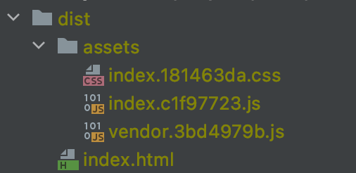
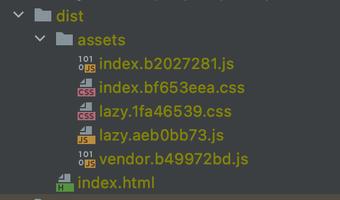

Après avoir traité sur ce blog [dans plusieurs articles de webpack](/fr/webpack/), j'ai commencé une nouvelle série d'articles sur les bundlers nouvelles générations.
Il semblerait qu'on rentre aujourd'hui dans une nouvelle ère du tooling web.

Ayant présenté [esbuild et ses features intéressantes](../esbuild-bundler-incroyablement-rapide-et-prometteur), il me semble logique de traiter les bundler _"petits frères"_.
Commençons donc par Vite, un projet de la communauté VueJS et lancé par [Evan You](https://github.com/yyx990803).

## Un même constat de départ

Avec `Vite` on est dans le même constat qu'avec `esbuild`.
Globalement la communauté est contente des outils actuels même s'ils accusent quelques soucis de performances.

Comme je le disais dans mon précédent article, avoir un gros projet JS aujourd'hui c'est souvent avoir un environnement de dev et de prod parfois un peu lent.
Entre le choix des outils qui n'exploitent pas suffisamment la parallelization ou l'optimisation mémoire, ou les opérations répétitives qui n'exploitent que très peu le caching, on peut facilement identifier des coupables à ces lenteurs.

_NB: J'ai proposé quelques solutions pour [améliorer les performances de vos build webpack dans cet article](/hunting-webpack-performances/)._

De plus, les outils de _deuxième génération_ (comme Webpack, Rollup, Parcel) n'ont pas pu gérer dès leur début [des fonctionnalités récentes de nos navigateurs comme les ESmodules](https://caniuse.com/?search=es6).

## C'est quoi l'idée ?

L'idée _révolutionnaire_ de `Vite` est d'allier deux outils pour deux besoins différents afin d'optimiser le build pour qu'il soit le plus rapide possible.
Les deux outils qui composent `Vite` sont `esbuild` et `Rollup`, rien de bien nouveau donc.
Mais pourquoi deux outils de bundling ?
Globalement, pour deux raisons:

- Nos dépendances ne changent pas souvent, réévaluer l'arborescence de leurs modules à chaque build n'est donc pas nécessaire.
  On peut donc générer le bundle de nos _vendor_ une fois pour tout avec un outil optimisé comme `esbuild`.
  Ce bundler étant hyper rapide, il permet un démarrage rapide du server.

- Les modules de notre code source sont beaucoup amenés à changer contrairement aux dépendances.
  `Vite` utilise donc un autre traitement basé sur les ESM qui fonctionnent nativement sur les navigateurs récents.

N'hésitez pas à lire [cette page de la doc](https://vitejs.dev/guide/why.html) pour plus de détails.

## Dans les faits, comment ça marche ?

Afin de jouer un peu avec l'outil, je vous propose une petite présentation par le biais d'un projet exemple.
Déjà commençons par init un projet exemple.
Je vous montre ici comment le créer et vous mets [le lien du repository github dans lequel je l'ai publié](https://github.com/Slashgear/example-vite).

```shell
mkdir "example-vite"
cd "example-vite"

git init
yarn init -y
```

Pour installer `Vite` rien de plus simple, il vous suffit d'une dépendance.

```shell
yarn add -D vite
```

Pour les besoins de cet exemple, je vous propose un exemple avec React (on trouve déjà de nombreux exemples avec Vue 😉)

```shell
yarn add react react-dom
```

Ajoutons 3 commandes usuelles pour lancer `Vite` dans le fichier `package.json`

_package.json_

```json
{
  "scripts": {
    "dev": "vite",
    "build": "vite build",
    "serve": "vite preview"
  }
}
```

Il nous faut enfin quelques petits fichiers source pour que `Vite` ait quelque chose à se mettre sous la dent.

_index.html_

```html
<!doctype html>
<html lang="en">
  <head>
    <meta charset="UTF-8" />
    <title>Example Application with Vite</title>
  </head>
  <body>
    <div id="app"></div>
    <script type="module" src="/src/main.jsx"></script>
  </body>
</html>
```

_src/main.jsx_

```jsx
import React from "react";
import ReactDOM from "react-dom";

ReactDOM.render(
  <React.StrictMode>
    <h1>Hello world dear readers ! </h1>
  </React.StrictMode>,
  document.getElementById("app")
);
```

Maintenant il ne vous reste qu'à démarrer le server de developement avec cette commande.

```shell
yarn dev
```

🎉 Normalement, en quelques millisecondes `Vite` a démarré un server et si vous allez sur `https://localhost:3000` qui vous présente cette magnifique application.


On va pas se mentir c'est un peu triste, voyons voir comment `Vite` s'en sort si on lui ajoute du CSS.
On va mettre une magnifique couleur [chartreuse](<https://fr.wikipedia.org/wiki/Chartreuse_(liqueur)>) à ce titre.
Ajoutons d'abord la feuille de style suivante.

_src/index.css_

```css
h1 {
  color: chartreuse;
}
```

Il nous suffit ensuite de rajouter un import vers ce nouveau fichier.

_src/main.jsx_

```javascript
import "./index.css";
```

Voilà, maintenant vous avez une magnifique couleur qui [manque clairement de contraste pour être accessible](https://webaim.org/articles/contrast/) !


Si vous tenter maintenant de lancer la commande `yarn build`, vous pouvez observer que `Vite` va vous construire un dossier `dist`.
Sans paramétrage j'ai directement ces différentes ressources prêtent à être déployées sur un server statique.



On peut observer que nativement `Vite` exporte 2 bundle javascript (1 pour les sources, 1 pour les _vendors/dépendances_) et un bundle CSS qui exporte le style qui a été importé dans votre application.
Et la c'est clairement un gros plus de `Vite` par rapport à la concurrence des autres outils (quoique parcel propose un peu la même logique).
Le _build_ est extrêmement rapide et fait ce qu'on pourrait espérer de lui sans qu'on ait à le configurer.
Désolé mais je trouve ça génial!

Je ne sais pas si vous connaissez [`react-refresh`](https://www.npmjs.com/package/react-refresh), le package officiel de React qui permet d'optimiser le rafraichissent auto d'une application React.
Ce package vous permet de mettre à jour vos composants React à chaud sans qu'ils perdent leur _state_.
`Vite` même étant né de la communauté VueJS, n'est pas spécifiquement orienté vers un framework frontend.
Les outils comme `react-refresh` ne sont donc pas inclus par défaut.
Il vous faut donc le définir dans de la configuration.
Malheureusement, `Vite` s'en sort pas mieux que les autres outils ; on est forcé de définir un énième fichier de config à la racine du projet.

Installons donc le plugin vite nécessaire :

```shell
yarn add -D @vitejs/plugin-react-refresh
```

_vite.config.js_

```javascript
import { defineConfig } from "vite";
import reactRefresh from "@vitejs/plugin-react-refresh";

export default defineConfig({
  plugins: [reactRefresh()],
});
```

Maintenant j'ai voulu tester des features un peu plus avancées qu'on peut espérer avec un bundler de qualité.
J'ai donc setup une application single page qui utilise du _lazy loading_.
Je ne vous présente pas comment j'ai fait dans cet article, ce serait un peu trop long mais vous pouvez directement aller la [tester dans votre navigateur](https://example-vite.netlify.app/).

Alors clairement pour le _lazy loading_ c'est clairement simple avec `Vite`, je suis épaté!
L'outil détecte immédiatement mon usage de l'import dynamique `import()` pour générer un chunk séparé pour le JS mais aussi le CSS.

```javascript
const Content = React.lazy(() => import("./lazy"));
```



## Les points forts de Vite

Il est clair que `Vite` possède de nombreux avantages et fonctionnalités très sympathiques.
Outre sa vitesse incroyable, je tiens quand même à noter que ce bundler propose une _autoconfiguration_ vraiment bien pensée.

Dans la démo que je vous proposais précédemment, je ne vous ai pas présenté le fait que `Vite` gère nativement et sans configuration les _fichiers statiques, les Web Workers, les binaires WASM_.
Mais cela ne s'arrête pas la, force est de constater que cet outil _magique_ supporte également nativement le **JSX et Typescript**.

Coté gestion du Style, `Vite` n'est pas en reste.
Sans plugin ni configuration, il vous permet de gérer les `@import` CSS, les préprocesseurs comme **SASS et LESS, les CSS modules** et même le postprocesseur _PostCSS_ (si vous définissez une configuration).

Plus anecdotique, `Vite` sait gérer vos fichier `.env` pour gérer vos variables d'environnement grâce à [dotenv](https://github.com/motdotla/dotenv).

Mais la fonctionnalité qui m'a complètement scotché, c'est la gestion plutôt simple à setup du [SSR](https://tech.bedrockstreaming.com/spa-mode-isomorphism-js/).


C'est la première fois que je vous parle d'un _bundler_ qui gère nativement le **Server Side Rendering**.
J'utilise d'autres outils en production pour les différentes applications que je développe.
Malheureusement, il est encore très compliqué de mettre en place une telle architecture (même avec des outils comme Webpack).

On constate donc que les développeurs se tournent principalement vers des solutions clés en main comme Next et Nuxt pour gérer ces problématiques à leur place.
Ce n'est pas une mauvaise chose en soit.
Je pense cependant qu'il est parfois nécessaire dans certains projets de prendre la main sur cette fonctionnalité pour des besoins business.
On ne peut donc que se réjouir que des outils comme `Vite` y ait pensé.
Je vous invite à aller [lire cette page de la documentation de `Vite`](https://vitejs.dev/guide/ssr.html#ssr-externals) pour comprendre comment mettre en place cela.

## Du coup on arrête webpack ?

Après cette présentation élogieuse de cet outil on pourrait se poser la question oui.
Cependant, il ne faut pas oublier une règle assez simple.

> Tout ce qu'un outil à tendance à faire magiquement à votre place devient souvent bien plus compliqué à customiser.

Les nombreux choix que `Vite` semble faire pour améliorer la _developpeur experience_ m'inquiètent un peu.
J'ai un peu peur que toute cette configuration par défaut ne fissent par être compliqué à maintenir par les équipes de `Vite`.

Contrairement à `esbuild` qui a le leitmotiv _"je souhaite proposer un outil qui fait peu de choses mais qui le fait très bien"_, on a ici un outil qui fait beaucoup de promesses.
Il faut cependant reconnaitre que `Vite` propose également d'utiliser et de définir des plugins pour étendre ses fonctionnalités sans pour autant les rendre native à l'outil principal.

De plus, il ne faut pas oublier que `Vite` est également basé sur `Rollup`, un bundler deuxième génération qui profite lui d'un riche écosystem de plugin qui sont pour la plupart compatible.
Seulement la configuration de Rollup est à mes yeux très compliqué à éditer et maintenir, j'espère donc pour vous que vous n'aurez pas à y toucher si vous êtes tentés de tester `Vite` sur vos applications.

Je tiens quand même à souligner que quelques outils comme VuePress proposent aujourd'hui une alternative [Vitepress](https://vitepress.vuejs.org/) qui utilise `Vite` comme bundler.

Avant de sauter sur la solution `Vite`, je vous propose de tester un autre bundler de troisième génération qui fait beaucoup parler: [Snowpack](https://www.snowpack.dev/)

> Stay tuned!
