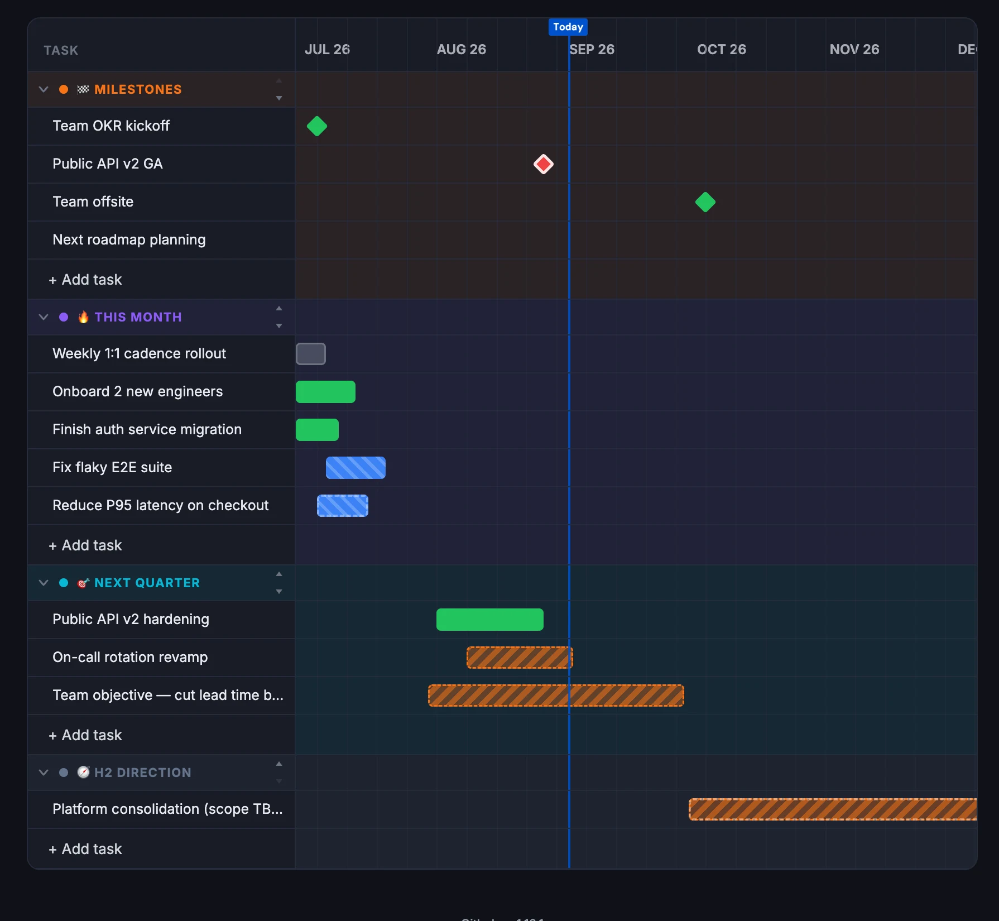

C'est le troisième article de ma série sur ce que le rôle d'engineering
manager m'a appris. Comme pour les épisodes précédents, ce qui suit n'est
ni une méthode ni une vérité générale : c'est un retour d'expérience
personnel, structuré autour des citations et des principes que des
personnes qui ont compté dans mon parcours m'ont transmis, et de ce qu'ils
m'apportent au quotidien.

Le premier épisode portait sur le [rôle et la posture d'engineering
manager](/posts/engineering-manager-role-et-posture), le deuxième sur [le
1:1 et le suivi individuel](/posts/engineering-manager-1-1-et-suivi-individuel).
Vous pouvez retrouver tous les articles de la série sur la page du tag
[engineering-management](/tags/engineering-management).

Ce billet-ci se concentre sur les objectifs et la vision : comment se
donner des horizons de travail, comment les faire vivre dans le temps, et
comment les rendre compréhensibles par toute l'équipe.

## Se donner des horizons

> « Un auteur sans deadline, c'est juste un mec au chômage. » (Kyan
> Khojandi, entendu dans une interview)

Il existe, pour moi, trois types de projets : ceux drivés par une date,
ceux drivés par un résultat attendu, et ceux drivés par les deux à la fois.
Ce troisième cas est de loin le plus inconfortable : si vous savez
exactement ce que vous voulez livrer, il devient très compliqué d'imposer
en plus une date fixe, sans risquer soit le retard, soit un scope amputé
pour tenir les délais.

La question à garder en tête en permanence, c'est : est-ce que l'important
c'est que ça sorte à telle date, quitte à ce que le scope bouge ? Ou est-ce
que l'important c'est ce qui doit sortir, quitte à ce que la date bouge ?
Un projet sans réponse claire à cette question navigue à vue.

Se donner des dates et des jalons, ce n'est pas de la rigidité gratuite :
c'est se forcer à se demander régulièrement « comment je peux rapidement
délivrer un truc qui marche, que je peux montrer ? ». On touche là au cœur
de l'agilité et de la création de valeur. Et l'inverse est tout aussi vrai
: si vous n'avez pas d'ambition de date de fin pour un projet, ne soyez pas
surpris s'il ne finit jamais. C'est la loi de Parkinson : un travail
s'étend jusqu'à occuper tout le temps disponible pour son achèvement.

Pour fixer ces horizons, je recommande de s'aligner sur le calendrier de
l'entreprise. Si elle revoit ses objectifs tous les six mois, construire
des projets qui tiennent sur six mois est une bonne idée ; pareil pour
trois mois, ou pour quatre semaines. Appelons ça, comme en musique, la
**Mesure** : l'unité de temps qui rythme le travail de l'équipe. La
question qui en découle, à se poser à chaque nouvelle Mesure : « qu'est-ce
qu'on peut faire de mieux pour répondre à ce problème en X semaines ? »

## La macula : net de près, flou de loin

> « Construire une roadmap sur six mois ou un an, ce n'est pas savoir
> exactement ce qu'on fera dans six mois ou un an, c'est définir ce qu'on
> fait demain et dans quelle direction on va. » (plusieurs coachs Agile
> avec qui j'ai travaillé)

C'est l'image que je préfère pour parler de roadmap : celle de la macula,
cette petite zone au centre de la rétine qui capte le détail net, entourée
d'une vision périphérique bien plus floue. D'abord avoir une vision claire
du mois prochain, avant d'essayer de savoir précisément ce qu'on fera dans
six mois. Se laisser de la place sur le moyen et le long terme, plutôt que
de prétendre à une précision qu'on n'a pas.

<figure>
  <svg
    viewBox="0 0 520 220"
    role="img"
    aria-label="Une ligne temporelle où la netteté décroît de gauche à droite : demain est net et détaillé, le mois prochain un peu moins, et l'horizon à six mois-un an n'est plus qu'une direction floue"
    style="width: 100%; max-width: 560px; height: auto; margin: 0 auto; display: block;"
  >
    <title>La macula appliquée à la roadmap</title>
    <line x1="30" y1="140" x2="490" y2="140" stroke="rgb(var(--color-border))" stroke-width="1" />
    <g fill="rgb(var(--color-accent))">
      <rect x="40" y="70" width="46" height="46" rx="3" fill-opacity="1" />
      <rect x="96" y="76" width="46" height="40" rx="3" fill-opacity="0.9" />
      <rect x="152" y="82" width="46" height="34" rx="3" fill-opacity="0.75" />
      <rect x="208" y="88" width="46" height="28" rx="3" fill-opacity="0.55" />
      <rect x="264" y="94" width="46" height="22" rx="3" fill-opacity="0.35" />
      <rect x="320" y="98" width="46" height="18" rx="3" fill-opacity="0.2" />
    </g>
    <path d="M382 107 L470 107" stroke="rgb(var(--color-border))" stroke-width="2" stroke-dasharray="4 5" />
    <path d="M462 100 L472 107 L462 114" fill="none" stroke="rgb(var(--color-border))" stroke-width="2" stroke-linecap="round" stroke-linejoin="round" />
    <text x="63" y="60" text-anchor="middle" fill="rgb(var(--color-text-base))" font-size="11" font-weight="600">Demain</text>
    <text x="230" y="60" text-anchor="middle" fill="rgb(var(--color-text-base))" font-size="11" font-weight="600">Ce mois-ci</text>
    <text x="426" y="60" text-anchor="middle" fill="rgb(var(--color-text-base))" font-size="11" font-weight="600">Direction</text>
    <text x="40" y="170" fill="rgb(var(--color-text-base))" font-size="11" opacity="0.7">Détail net et engageant</text>
    <text x="320" y="170" text-anchor="end" fill="rgb(var(--color-text-base))" font-size="11" opacity="0.7">Flou, juste un cap</text>
    <text x="260" y="200" text-anchor="middle" fill="rgb(var(--color-text-base))" font-size="12" font-weight="600">6 mois – 1 an</text>
  </svg>
  <figcaption style="text-align: center; font-size: 0.875rem; margin-top: 0.5rem;">
    Comme la vision humaine : net au centre, de plus en plus flou vers la
    périphérie. La roadmap fonctionne pareil.
  </figcaption>
</figure>

Expliquer ce qu'on va faire est important, mais exprimer pourquoi on va le
faire, en quoi c'est nécessaire, est un besoin tout aussi fort — j'y
reviens dans la section sur la répétition, un peu plus loin.

Il y a un moment où cette netteté se rejoue : la bascule d'une Mesure à la
suivante. C'est souvent là qu'il faut consacrer plus de temps que
d'habitude, en deux temps. D'abord faire les comptes de la Mesure qui se
termine : est-ce que les objectifs sont atteints, est-ce qu'on a fini ce
qu'on voulait faire. Ensuite regarder ce qu'on veut faire dans la
suivante, et le valider avec l'équipe. On ne bascule pas une Mesure en
mode automatique ; on la clôt, puis on en ouvre une nouvelle.

## Mesurer le lead time

> « Ça fait quatre ans qu'on parle de ce projet, donc on va pas parler de
> lead time. » (un ancien collègue, anonyme — la formule fait toujours
> mouche)

Le lead time, c'est le temps écoulé entre le moment où un sujet est
identifié et le moment où il est réellement livré. C'est une mesure
implacable : elle ne s'intéresse pas à combien de temps vous avez
« vraiment » travaillé dessus, seulement à combien de temps il a fallu à
l'idée pour devenir réalité.

Je tiens, de mon côté, une petite liste personnelle où je note et je
mesure le lead time des projets de mon équipe. Ce n'est pas un outil de
flicage : c'est un instrument de calibrage. Mon objectif en tant
qu'engineering manager, c'est que la médiane des lead time de mon équipe
reste inférieure à la Mesure de temps de l'entreprise vue plus haut. Si
l'entreprise raisonne à six mois et que la médiane de mes projets dépasse
six mois, quelque chose ne va pas dans la façon dont je les découpe ou dont
je les priorise — et la citation ci-dessus finit tôt ou tard par devenir
vraie dans ma propre équipe.

## Répéter et multiplier les formats

> « Monsieur, qu'est-ce qu'il faut faire déjà ? » (mes étudiants, à
> l'époque où je donnais des cours à la fac)

Donner des cours m'a appris quelque chose que j'ai réemployé sans arrêt en
tant que manager : pour qu'une information soit transmise et vraiment
comprise, il faut la répéter, et la répéter sous des formats différents.
Une seule annonce, un seul support, ne suffit jamais — même quand on a
l'impression d'avoir été parfaitement clair la première fois.

Concrètement, pour la vision et les objectifs, je fais vivre la même
information sous plusieurs formes :

- une réunion en fin de Mesure pour présenter et discuter la suivante ;
- en 1:1, une question que je pose régulièrement à chacun : « est-ce que tu
  vois où on va ? est-ce qu'il y a un projet, chez nous, qui te semble pas
  clair ? » ;
- la roadmap elle-même, partagée et mise à jour régulièrement, au format
  image — un visuel qu'on peut regarder d'un coup d'œil vaut mieux qu'un
  document qu'il faut rouvrir pour se souvenir où on en est.

Petite parenthèse : c'est en cherchant justement ce format visuel, simple
à tenir à jour, que j'ai fini par construire mon propre petit outil de
roadmap, disponible ici : [roadmap.slashgear.dev](https://roadmap.slashgear.dev/).



Vous remarquerez que cet exemple applique lui-même le principe de la
macula vu plus haut : beaucoup de détail confirmé sur le mois en cours,
un peu moins sur le trimestre suivant, et un unique bandeau flou « scope
TBD » pour le second semestre.

## SMART, et le piège du silo

> « Un objectif malin, c'est SMART. » (un coach agile)

Un petit rappel s'impose : un objectif SMART est **S**pécifique,
**M**esurable, **A**tteignable, **R**éaliste (ou pertinent) et **T**emporel.
« Améliorer la qualité » n'est pas un objectif SMART ; « réduire de 30 % le
nombre de tickets de support ouverts par mois d'ici la fin de la Mesure »
en est un. La différence, c'est qu'on sait, sans ambiguïté possible, quand
il est atteint.

Mais définir un objectif SMART ne dit rien de qui le porte, et c'est là que
se cache le vrai piège. Je préfère, autant que possible, donner des
objectifs à l'équipe plutôt que des objectifs individuels. Un objectif
individuel a tendance à siloter le travail : chacun défend son bout de
périmètre, et l'entraide en pâtit, parfois sans même qu'on s'en rende
compte. Un objectif d'équipe pousse au contraire tout le monde à avancer
ensemble, à s'entraider pour l'atteindre, plutôt qu'à optimiser
chacun dans son coin.

## Pas de ticket pour dans six mois

> « Écrire un ticket pour un sujet potentiel à faire dans six mois, c'est
> globalement toujours une mauvaise idée. »
> ([Emmanuel Hervé](https://www.linkedin.com/in/emmanuelherve/))

Le coût de maintenance d'un ticket ouvert pour dans six mois est énorme,
même à l'ère de l'IA qui promet d'en absorber une partie. On finit avec un
backlog de 600 tickets, dont certains ont deux ou trois ans, et dont plus
personne ne connaît vraiment le détail. Un backlog de 2 000 tickets n'est
pas une roadmap : c'est un cimetière d'intentions.

Si un sujet est vraiment important, il reviendra. Pas besoin de lui
réserver une place dans le backlog pour ça. Ce que je fais à la place :
noter l'idée dans une page « boîte à idées », pas dans un vrai ticket. Ça
évite le coût de maintenance, tout en gardant une trace suffisante pour la
retrouver le jour où le sujet redevient d'actualité.

Construire une roadmap, ça demande justement de s'extraire des sujets du
quotidien pour aller enquêter sur les véritables enjeux de l'entreprise.
Et côté technique, c'est aussi accepter de trancher : décider sur quoi on
choisit d'investir, et donc, implicitement, sur quoi on choisit de ne pas
investir tout de suite.

Un squelette de boîte à idées que vous pouvez copier tel quel :

```markdown
# Boîte à idées

| Idée | Notée le   | Contexte | Statut                              |
| ---- | ---------- | -------- | ----------------------------------- |
| …    | AAAA-MM-JJ | …        | à explorer / abandonnée / en Mesure |
```

## Et la suite ?

Il reste d'autres aspects des objectifs et de la vision que je n'ai pas
abordés ici. Si vous voulez que je précise un point ou que j'aborde un
thème en particulier, mes réseaux sont accessibles depuis ce blog :
écrivez-moi, je serai ravi de vous lire.

Le lead time n'est qu'une métrique parmi d'autres : le prochain épisode
portera sur **les métriques que je surveille en tant qu'engineering
manager**, pour aller plus loin. Comme toujours, vous pouvez retrouver
l'ensemble de la série via le tag
[engineering-management](/tags/engineering-management).
