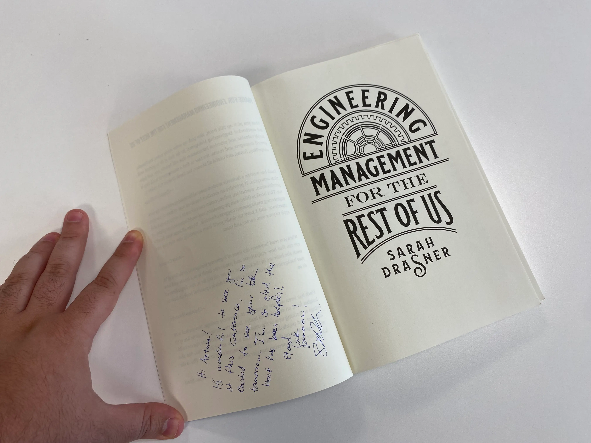
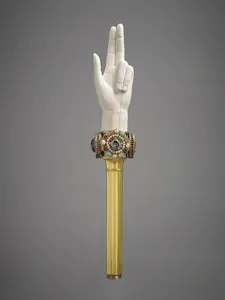

Avant de commencer, une précision : ce qui suit n'est ni une méthode ni une
vérité générale. C'est un retour d'expérience personnel, forcément subjectif,
sur ce que le rôle d'engineering manager m'a appris. Je n'ai aucune prétention
à la démonstration, juste l'envie de partager honnêtement ce qui m'a construit
dans ce rôle.

C'est le premier article d'une série où je vais explorer, à chaque fois avec
un focus différent, ce que ce métier m'a apporté. Plutôt que de vous exposer
mes propres principes, j'ai préféré faire autrement : partager les citations
et les principes que des personnes qui ont compté dans mon parcours
(collègues, mentors) m'ont transmis, et vous dire ce qu'ils m'apportent au
quotidien. Ce premier épisode porte sur le rôle et la posture d'engineering
manager.

Si ces articles ouvrent des voies à quelques personnes, alors j'en serai
déjà ravi.

## Une référence avant les citations : "Engineering Management for the Rest of Us"

Avant d'entrer dans les citations qui ont individuellement marqué mon
parcours, je ne peux pas commencer cette série sans mentionner une
référence : le livre [_Engineering Management for the Rest of
Us_](https://www.engmanagement.dev/) de Sarah Drasner.

C'est une vraie recommandation, du contenu de grande qualité. En un format
relativement court, elle aborde énormément de sujets et formalise une
multitude de concepts et de conseils de façon très simple. Si vous ne devez
lire qu'un seul livre sur le sujet, c'est celui-là.

_Merci Sarah pour cette dédicace, obtenue lors de la DotJS 2025 où nous étions
tous les deux speakers et avons pu échanger brièvement._

Je citerai quand même un conseil tiré du livre : demander explicitement les
attentes qu'ont vos managés de vous.

C'est un exercice très sain, et vous verrez que chaque individu a des
besoins et des attentes très différentes. C'est là aussi que ressort une
nécessité importante : il vous faudra vous adapter à chaque individu de
l'équipe. Une méthode unique ne fonctionnera pas avec tout le monde, sinon
ce serait de la magie.

## Le rôle du manager vs. celui de l'IC : hands on, hands off

> "Tout ce que tu fais, l'équipe doit savoir et pouvoir le faire, mis à part
> les aspects de management." ([Florent Dubost](https://www.linkedin.com/in/florent-dubost-914346181/))

Tous mes modèles en management d'équipe d'ingénierie ont toujours gardé un
aspect technique dans leur travail. Le pourcentage varie d'une personne à
l'autre, mais iels ont toujours eu les mains dedans.

Pour moi, engineering manager est un rôle étendu du rôle de contributeur
individuel — l'IC[^ic] —, pas un rôle qui s'y substitue.

C'est aussi ce que j'en interprète : se réserver des tâches et des sujets en
tant que "chef" est une mauvaise pratique. Si on veut pouvoir compter sur son
équipe, toute l'équipe doit pouvoir nous épauler.

Comment fonctionnerait l'équipe en cas de vacances si vous silotez des étapes
de développement, de planification, ou des tâches spécifiques ?

## La posture face à l'équipe : confiance et délégation

> "Ta priorité c'est ton équipe, puis les individus qui composent ton
> équipe, et enfin les projets que ton équipe doit réaliser."
> ([Kenny Dits](https://www.linkedin.com/in/kenny-d-3761b59b/), mon chef
> pendant de nombreuses années chez M6)

J'ai eu la chance d'avoir des managers humanistes. Je pense qu'il est
nécessaire de prioriser l'équipe pour construire de la confiance, et qu'avec
cette confiance, il n'y a plus de crainte à avoir pour l'accomplissement des
objectifs.

Pour la priorisation, il faut comprendre quelque chose qui n'apparaît pas
forcément à la première lecture. Cela signifie que vous devrez parfois
abandonner des projets ou des objectifs pour protéger les individus ou votre
équipe. Cela signifie également qu'il sera parfois nécessaire de sortir
quelqu'un de l'équipe, pour le bien de l'équipe. Ce sera votre
responsabilité, autant s'y préparer. On ne sacrifie pas une équipe pour un
individu ou un projet.

De plus, votre équipe saura répondre présente lors d'un besoin plus
important, car elle sait que si vous la sollicitez, c'est vraiment pour un
sujet qui compte.

<figure>
  <svg
    viewBox="0 0 400 280"
    role="img"
    aria-label="Pyramide des priorités : à la base l'équipe, au milieu les individus, au sommet les projets"
    style="width: 100%; max-width: 420px; height: auto; margin: 0 auto; display: block;"
  >
    <title>Pyramide des priorités d'un engineering manager</title>
    <polygon
      points="93.33,180 306.67,180 360,260 40,260"
      fill="rgb(var(--color-accent))"
      fill-opacity="0.45"
      stroke="rgb(var(--color-border))"
      stroke-width="2"
    />
    <polygon
      points="146.67,100 253.33,100 306.67,180 93.33,180"
      fill="rgb(var(--color-accent))"
      fill-opacity="0.7"
      stroke="rgb(var(--color-border))"
      stroke-width="2"
    />
    <polygon
      points="200,20 146.67,100 253.33,100"
      fill="rgb(var(--color-accent))"
      fill-opacity="1"
      stroke="rgb(var(--color-border))"
      stroke-width="2"
    />
    <text x="200" y="225" text-anchor="middle" fill="rgb(var(--color-fill))" font-size="18" font-weight="600">Équipe</text>
    <text x="200" y="145" text-anchor="middle" fill="rgb(var(--color-fill))" font-size="16" font-weight="600">Individus</text>
    <text x="200" y="70" text-anchor="middle" fill="rgb(var(--color-fill))" font-size="14" font-weight="600">Projets</text>
  </svg>
  <figcaption style="text-align: center; font-size: 0.875rem; margin-top: 0.5rem;">
    La priorité descend de la base vers le sommet : d'abord l'équipe, puis
    les individus qui la composent, enfin les projets.
  </figcaption>
</figure>

Oui, c'est une référence troll à la pyramide des tests, un modèle que tout le
monde connaît, que tout le monde cite, et que tout le monde finit par
retoucher à sa sauce tant il ne veut plus dire grand-chose. J'en ai
justement parlé dans une conférence avec Jules Poissonnet, mon ancien
alternant : [_Tester c'est tricher !_](https://www.youtube.com/watch?v=I_zNxGqRI3w).

## La posture de challenge : débloquer et faire grandir

> "Qu'est-ce qui t'en empêche ?" ([Yann Verry](https://verry.org/), mon
> ancien collègue, qui me l'a dit plusieurs fois)

Un manager, c'est aussi quelqu'un qui challenge et qui permet à son équipe
de sortir de ses blocages. C'est aussi être là pour débloquer des
situations, mentorer, accompagner dans des décisions.

Un manager est également là pour faire en sorte que les individus qui
composent son équipe puissent s'épanouir et progresser.

## Ce que "servir" son équipe veut dire concrètement

> "Je fonctionne comme ça, je fais confiance de base et après si besoin je
> discute avec toi si il y a des choses à revoir."
> ([Étienne de Thoury](https://www.linkedin.com/in/%C3%A9tienne-de-thoury-a9290795/),
> mon actuel Head of chez Scaleway)

L'idée est simple : éviter le micromanagement, laisser de la liberté.

Quand on devient manager, on peut parfois ressentir du stress et se
retrouver à vouloir tout suivre, tout gérer.

C'est aussi souvent nos propres managers qui nous poussent, sans le
vouloir, vers ce travers : quand un n+1 demande un reporting ultra précis,
il ne reste pas beaucoup d'autre choix que de commencer à tout suivre. Je le
vois autrement : l'information en elle-même n'est pas un pouvoir. Savoir
vers qui la renvoyer l'est bien plus, car elle sera toujours plus pertinente
venant de la personne qui la maîtrise réellement.

J'en ai une autre lecture, qui me parle tout autant : ce stress est souvent
moins une question de contrôle que de confiance en soi. Si je vous confie
une tâche alors que moi-même je ne suis pas certain à 100 % du résultat, que
je n'ai pas confiance en moi pour la mener à bien, il me sera impossible de
vous faire confiance pour la réaliser. Et cette incertitude finit par
retomber sur le dos de la personne, ou de l'équipe.

## L'effet miroir

> "Quand tu réagis ou tu parles mal d'un projet ou d'une équipe en tant que
> manager, tu peux être sûr que ton équipe réagira en ×10 dans quelques
> semaines." ([Florent Dubost](https://www.linkedin.com/in/florent-dubost-914346181/))

Qu'on le veuille ou non, un manager est un modèle. Son équipe observe ses
réactions, son ton, la façon dont il parle d'un projet, d'une autre équipe,
d'une décision. Ce qui est capté, consciemment ou non, c'est ça qui se
répète et s'amplifie dans l'équipe au fil des semaines.

Si je me montre négatif ou désabusé sur un sujet, cette attitude ne reste pas
la mienne. Elle infuse les conversations de l'équipe, puis sa manière
d'aborder ce sujet avec les autres, et elle finit par me revenir, amplifiée.
L'inverse est vrai aussi : la confiance et l'énergie qu'on montre se
propagent de la même façon.

Ça veut dire faire attention non seulement à ce que je dis, mais à comment
je le dis, car c'est ça qui devient la norme de l'équipe, bien plus que
n'importe quelle consigne explicite.

## La sécurité psychologique : une responsabilité de leader

> "Chaque leader de chaque groupe d'influence est responsable de la sécurité
> psychologique de son groupe d'influence." (Léa Coston, dans son talk
> [_Les gens ne savent pas ce qu'ils font, la plupart du
> temps !_](https://www.youtube.com/watch?v=a670TeroQS0))

En tant qu'engineering manager, on est le leader du groupe d'influence que
constitue son équipe. La sécurité psychologique n'est pas un supplément
d'âme ou une option "sympa à avoir" : c'est une responsabilité structurelle
du rôle.

Ce n'est d'ailleurs pas qu'une conviction personnelle : le [projet
Aristote](https://rework.withgoogle.com/intl/en/guides/understand-team-effectiveness)
mené par Google, qui a étudié des centaines d'équipes internes, a montré que
le facteur le plus déterminant de la performance d'une équipe n'était ni les
compétences individuelles ni l'ancienneté, mais bien son niveau de sécurité
psychologique.

Une équipe en sécurité psychologique, c'est une équipe qui ose dire qu'elle
s'est trompée, qui ose remonter un problème avant qu'il ne devienne
critique, qui ose ne pas être d'accord avec vous. Une équipe qui n'a pas
cette sécurité apprend vite à se taire, et vous perdez l'information la plus
précieuse : celle qui arrive tôt.

Il y a là un vrai enjeu d'exemplarité : être capable de dire à son équipe
qu'on peut se tromper, qu'on s'est trompé, ou qu'on ne sait pas, ça rassure
chacun sur sa propre capacité à faire ou dire la même chose.

Ça rejoint directement l'effet miroir vu plus haut : la sécurité
psychologique ne se décrète pas, elle se construit par la façon dont vous
réagissez, en particulier quand quelque chose se passe mal.

## Le bâton de pouvoir

> "Le bâton de pouvoir" (une phrase lue quelque part, dont la source
> m'échappe malheureusement)

_Photo : [collection du musée du Louvre](https://collections.louvre.fr/ark:/53355/cl010110048)._

Lorsqu'on décide de vous nommer responsable d'une équipe, cela signifie
qu'on a confiance en vous pour vous donner ce pouvoir de décision. Ce
pouvoir est un acte de confiance important, mais c'est aussi un fardeau : il
faut, dans la mesure du possible, éviter de trop l'utiliser au sein de votre
équipe.

Les décisions doivent rester collectives, mais il vous faudra parfois
arbitrer, plusieurs fois. C'est ce qu'on attend de vous, et non d'escalader
la décision plus haut si son scope ne concerne que votre équipe.

Une décision collective embarquera toujours bien plus l'équipe qu'une
décision descendante. Faire émerger le maximum d'intelligence collective
est, à mes yeux, l'une des missions les plus importantes d'un manager.

## Se créer un réseau de managers

Un dernier point, essentiel selon moi : se créer un réseau de managers, dans
son entreprise ou ailleurs, avec qui échanger sur ces sujets, prendre des
avis, des conseils. Je vous assure que ça aide, énormément.

Une pensée pour les managers avec qui j'échange régulièrement : ils se
reconnaîtront, merci à eux.

Si vous n'en avez pas encore, des communautés en ligne existent, comme le
Slack [Engineering Managers Community](https://engmanagers.github.io/).

## Et la suite ?

C'est le premier article de cette série sur mon retour d'expérience en tant
qu'engineering manager. Le prochain épisode abordera le **1:1 et le suivi
individuel**. Vous pouvez retrouver tous les articles de la série via le tag
engineering-management.

[^ic]:
    IC, pour _individual contributor_ (contributeur individuel) : un membre
    de l'équipe qui contribue directement à la production — code, design,
    etc. — sans responsabilité de management.
