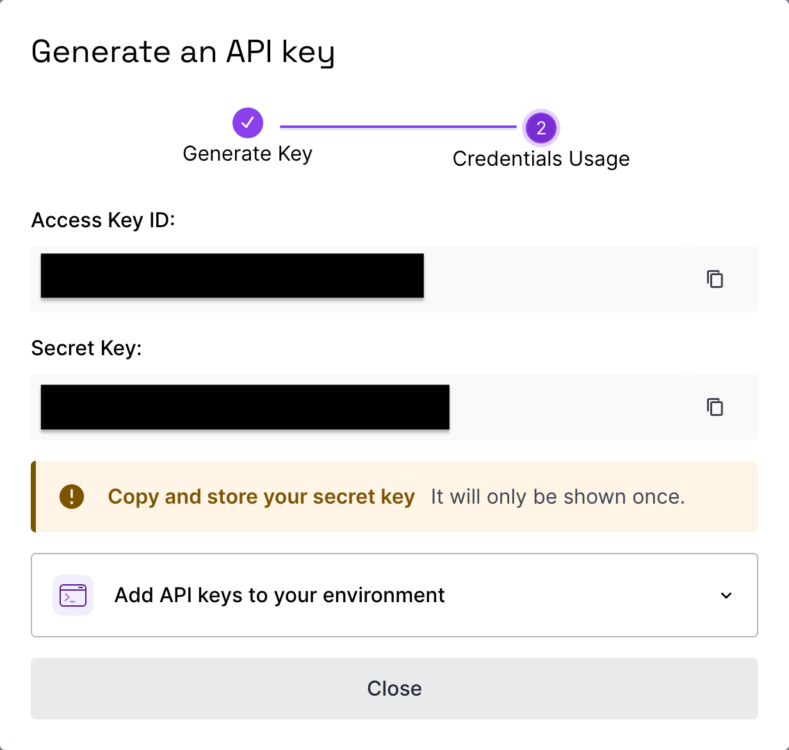

Last year, I bought three solar panels from [Beem](https://beemenergy.fr/) for my apartment to generate my own electricity.
Since I work from home most of the time, the majority of my electricity consumption occurs during daylight hours.

I achieved excellent results, but I wanted to go further by integrating more home automation.
I decided to set up [Home Assistant](https://www.home-assistant.io/) to better utilize my solar energy—for example, automatically turning on my washing machine when the sun is shining.
Or, more importantly during summer, activating my air conditioner when solar production is high.

Setting this up was partially straightforward, but I quickly realized it takes time and effort to configure properly.
All the configurations I've added to my Home Assistant instance represent several hours of work, and I definitely don't want to lose them.
So, backups are essential!
I couldn't find any tutorial on how to do this with [Scaleway](https://www.scaleway.com/en/), so I decided to write one.

## How to Configure Backups on Home Assistant?

To get started, you need to be an administrator on your Home Assistant instance.
Then, navigate to **Settings > System > Backups**.

I highly recommend setting up a daily backup of your Home Assistant configuration.
If you ever make a mistake or introduce a faulty configuration, you can easily restore a working version.
By default, backups are stored locally within your Home Assistant system.
While convenient, this approach lacks resilience—should your device fail, you risk losing both your system and your backups.

To ensure greater reliability, let's configure automatic backups to Scaleway Object Storage, just as I did.


[If you get stuck at any point, refer to the official tutorial for guidance.](https://www.home-assistant.io/common-tasks/general/#setting-up-an-automatic-backup-process)

## How to configure Backups on Scaleway ?

Make to have a valid account on Scaleway console.

### Create a bucket and access tokens

<details>
<summary>Skip this part if you are familiar with Scaleway Ecosystem</summary>

In object storage product, create a Bucket in your project so that it will contain copy of your backups.
Region you use is not that important, backups are not heavy so you can host them everywhere you want.

Here is an example of my bucket


You can see that my bucket is not empty, all my backups are securily stored in it.

Then you will need to create API token with correct rights to allow your home assistant to upload content in it.
Take a look [at Scaleway documentation for that subject.](https://www.scaleway.com/en/docs/iam/how-to/create-policy/).
What I recommend is to create a specific policy to offer access rights to your bucket in read / write / delete.
You can create it in the web UI or with [terraform](https://developer.hashicorp.com/terraform) if you want.

You will need to get your access token and your secret token



<details>
<summary>Code for terraform</summary>

```terraform
provider "scaleway" {
  region  = "fr-par" # or "nl-ams", "pl-waw"
  zone    = "fr-par-1"
}

# Create a Scaleway IAM application (needed to generate an API token)
resource "scaleway_iam_application" "bucket_app" {
  name        = "bucket-access-app"
  description = "IAM application for accessing the object storage bucket"
}

# Create the API token for the IAM application
resource "scaleway_iam_api_token" "bucket_token" {
  application_id = scaleway_iam_application.bucket_app.id
  description    = "Token with read/write access to a specific bucket"
  expires_at     = "2030-01-01T00:00:00Z" # Optional: set expiration
}

# Create the Object Storage bucket
resource "scaleway_object_bucket" "my_bucket" {
  name   = "my-secure-bucket" # must be globally unique
  region = "fr-par"
}

# Define a policy that grants read/write access to the specific bucket
data "scaleway_iam_policy_document" "bucket_rw_policy" {
  version = "2022-10-01"

  statement {
    effect    = "allow"
    action    = [
      "object:read",
      "object:write",
      "object:list",
      "object:delete"
    ]
    resource = [
      "rn:scw:object:fr-par::bucket:${scaleway_object_bucket.my_bucket.name}",
      "rn:scw:object:fr-par::object:${scaleway_object_bucket.my_bucket.name}/*"
    ]
  }
}

# Attach the policy to the IAM application
resource "scaleway_iam_policy" "bucket_rw_policy" {
  name           = "bucket-read-write-policy"
  description    = "Read and write access to specific bucket"
  policy_document = data.scaleway_iam_policy_document.bucket_rw_policy.json
  application_id = scaleway_iam_application.bucket_app.id
}
```

</details>

</details>

### Configure the module on your Home Assistant

To synchronize your local Home Assistant backups with your Scaleway bucket, I recommend using the [Rclone Backup](https://github.com/jcwillox/hassio-rclone-backup) add-on.
It allows you to easily upload your backups to your bucket on a daily basis with minimal configuration.
It also supports many [other providers](https://github.com/jcwillox/hassio-rclone-backup#providers).

Add the repository URL under `Supervisor → Add-on store → ⋮ → Manage add-on repositories`

https://github.com/jcwillox/hassio-rclone-backup

Once installed, in the configuration tab, you will need to put yaml like this.
Here, my bucket is named `home-assistant-backup`

```yaml
- name: Sync Daily Backups
  schedule: 10 4 * * *
  command: sync
  sources:
    - /backup
  destination: scaleway:home-assistant-backup/
```

Then, on the `homeassistant` folder of your system, create a `rclone.conf` file.
It will contain your secrets.

```toml
[scaleway]
type = s3
provider = Scaleway
access_key_id = XXXXXXXXXXXXXXXXXXXX
secret_access_key = XXXXXXXXXXXXXXXXXXXXXXXXXXXXXXXX
region = fr-par
endpoint = s3.fr-par.scw.cloud
acl = private
```
