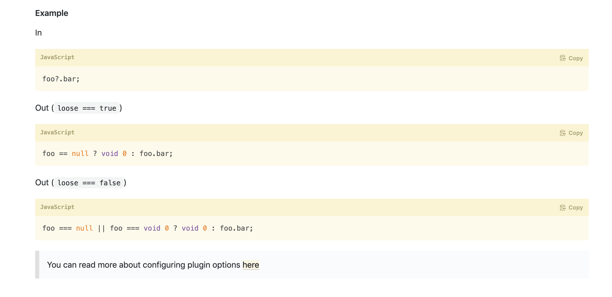

A few days ago, an announcement that many expected was published in TC39 Stage 3. **Optional Chaining**

Example here with

<blockquote class="twitter-tweet"><p lang="en" dir="ltr">🎉🎉🎉🎉BREAKING: <a href="https://twitter.com/hashtag/TC39?src=hash&amp;ref_src=twsrc%5Etfw">#TC39</a>: Optional Chaining has now moved to Stage 3!!! <a href="https://twitter.com/hashtag/JavaScript?src=hash&amp;ref_src=twsrc%5Etfw">#JavaScript</a> <a href="https://t.co/mUjJRXiOZx">pic.twitter.com/mUjJRXiOZx</a></p>&mdash; Sean Thomas Larkin 廖肖恩 (@TheLarkInn) <a href="https://twitter.com/TheLarkInn/status/1154456929898385408?ref_src=twsrc%5Etfw">July 25, 2019</a></blockquote> <script async src="https://platform.twitter.com/widgets.js" charset="utf-8"></script>

It is a **great news** for Javascript ! This feature is awesome but...

Please agree with me, this feature will not be available tomorrow in our browsers. In stage 3, it is very likely that this feature will be added in the next release of ES.

# But

We will need to babel it for a very long time.

If you take a look at [@babel/plugin-proposal-optional-chaining](https://babeljs.io/docs/en/babel-plugin-proposal-optional-chaining), this is how babel will transpile it.



This is kind of a very verbose output.

Let's imagine that we use this feature very many times in a web application, and you use it for deep case.

```js
const foo = everything?.could?.be.nullable?.maybe;

// Babel will generate this output

var _everything, _everything$could, _everything$could$be$;

var foo =
  (_everything = everything) === null || _everything === void 0
    ? void 0
    : (_everything$could = _everything.could) === null ||
        _everything$could === void 0
      ? void 0
      : (_everything$could$be$ = _everything$could.be.nullable) === null ||
          _everything$could$be$ === void 0
        ? void 0
        : _everything$could$be$.maybe;

// Terser would modify like this
(l, n, o);
null === (l = everything) ||
  void 0 === l ||
  null === (n = l.could) ||
  void 0 === n ||
  null === (o = n.be.nullable) ||
  void 0 === o ||
  o.maybe;
```

It's going to be really verbose in your bundles. The transformation made by babel in the state does not at all share the _nullsafe_ access mechanism as `lodash.get` can do. Even if _lodash_ is very/too heavy. It offers a more efficient nullsafe implementation while generating less code.

You're going to tell me,

> "What the heck! Antoine, it's not the first time we've used a not-so-great polyfill to be able to use a new feature of EcmaScript"

# Yeah

Ok but this time we can still look a few minutes to propose an implementation of a less trivial polyfill. This solution cannot really be applied in a world where the web developer turns into a `Ko` hunter.

Let's look at how `lodash.get` works. [Github link](https://github.com/lodash/lodash/blob/master/.internal/baseGet.js)

```js
import castPath from "./castPath.js";
import toKey from "./toKey.js";

/**
 * The base implementation of `get` without support for default values.
 *
 * @private
 * @param {Object} object The object to query.
 * @param {Array|string} path The path of the property to get.
 * @returns {*} Returns the resolved value.
 */
function baseGet(object, path) {
  path = castPath(path, object);

  let index = 0;
  const length = path.length;

  while (object != null && index < length) {
    object = object[toKey(path[index++])];
  }
  return index && index == length ? object : undefined;
}

export default baseGet;
```

It's very effective (very compact). What if the polyfill of **the Optional Chaining** involved the application of a utility function like `lodash.get`?

What's your opinion on that?

Feel free to share and react if you liked this article.
