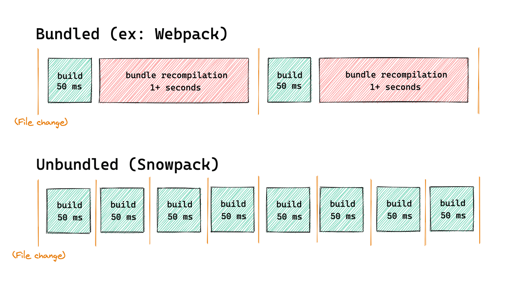
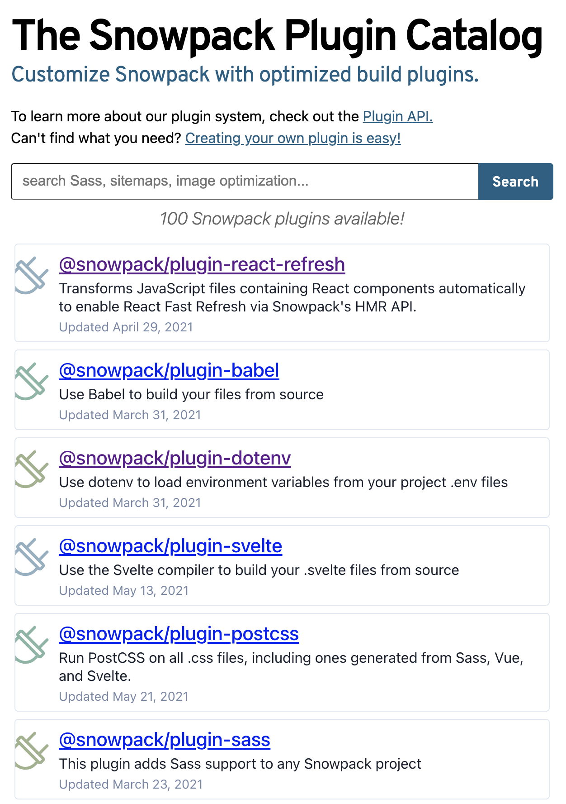

Après [webpack](/posts/hunting-webpack-performances/), [esbuild](/posts/esbuild-bundler-incroyablement-rapide-et-prometteur/) et [vitejs](/posts/vitejs-concurrent-performant-webpack-pour-react/), prenons le temps d'étudier le cas de snowpack.
Ce dernier semble se faire un petit nom dans l'écosystème des bundlers depuis quelques années maintenant.
Je vous propose donc qu'on étudie ses fonctionnalités, ses points forts mais également ses points faibles.

## Snowpack

Snowpack c'est quoi ? C'est un packager d'application web qui propose :

- une expérience de développement riche et performante
- un mode _production_ qui propose les features nécessaires à l'optimisation des assets du site.

```shell
# npm:
npm install --save-dev snowpack
# yarn:
yarn add --dev snowpack
```

### ESModule dans le navigateur

Les packagers comme webpack et rollup se reposent sur la construction d'un arbre de dépendances qui sont analysées et packagées à chaque modification.
L'étape de build des fichiers modifiés reste nécessaire, cependant l'opération de packaging (fusion des différents modules sous la forme de bundle qu'on envoie au navigateur) n'est plus nécessaire.
[Nos navigateurs savent maintenant gérer les ESModules](https://caniuse.com/?search=esmodule), il n'est donc plus nécessaire de packager nos modules sources pour les fusionner.

> C'est la même idée qu'Evan You a repris dans [Vite](/posts/vitejs-concurrent-performant-webpack-pour-react/)

Avec ce principe, la modification d'un fichier ne déclenche que le build de ce fichier, et ce fichier uniquement.
Vous pourrez avoir un projet avec des milliers de modules javascript, le temps de build à chaque modification ne se retrouvera pas affecté.
Pour les dépendances (_vendors_), Snowpack les build une fois pour toutes et les mets en cache pour ne le refaire que si celles-ci ont changées.

Voici un schéma présent dans la doc de Snowpack montrant bien l'intérêt d'éviter le packaging en dev.



Si vous utilisez un projet _Create React App_, il vous suffit d'ajouter Snowpack en dépendance, vous n'avez rien à changer si vous n'avez pas étendu la config de webpack.
Je vous invite à tester snowpack grâce aux générateurs de templates:

```shell
npx create-snowpack-app react-snowpack --template @snowpack/app-template-react
```

Rassurez vous! Snowpack n'est pas compatible qu'avec React, vous pouvez utiliser Vue, Svelte ou bien juste du javascript.

### Une config riche (trop)

À la manière de webpack, snowpack propose de configurer son utilisation par un objet.
Je dois vous avouer qu'[après avoir joué avec vite](/posts/vitejs-concurrent-performant-webpack-pour-react/), je suis un peu déçu.
Je vois une maigre [page de documentation](https://www.snowpack.dev/reference/configuration) qui semble pourtant décrire de nombreuses clés paramètrables.

Si vous venez de webpack, vous ne serez pas perdu, c'est très ressemblant sans pour autant être exactement la même chose.

> Eviter de toucher la configuration par défaut peut être une excellente idée.

### Une belle collection de plugin

Snowpack n'est pas si récent que ça.
Une communauté a su se construire pour mettre en place [un écosystème de plugin riche](https://www.snowpack.dev/plugins).
Certains de ces plugins semblent "core" car sous le scope _@snowpack_ mais de nombreux packages sont portés par quelques personnes indépendantes du projet.
C'est rassurant sans l'être, j'ai personnellement connu des mises à jour de webpack bloquées/retardées en attendant la compatibilité de certains plugins qui n'étaient plus maintenus.



> Méfiez-vous des plugins que vous utilisez!

Contrairement à Vite qui propose nativement plein de fonctionnalités assez sympathiques, snowpack fonctionne lui comme webpack en se basant sur les plugins pour enrichir l'API.
C'est un pari, il peut être compliqué de garder cet écosystème de plugin à jour et performant pour continuer de garantir l'intérêt d'une migration sur snowpack.

### Du Server Side Rendering

Snowpack propose une solution pour implémenter vos applications avec du server-side rendering.
Force est de constater que le besoin du SSR se fait encore ressentir sur nos applications frontend pour des raisons SEO ou bien de performance de rendu.
Malheureusement, coté packager d'application, cela reste encore compliqué et il reste souvent nécessaire de faire deux builds:

- un build pour le client aka le Navigateur
- un build pour le server Node

> Double build, double peine !

La [technique proposée par Snowpack](<https://www.snowpack.dev/guides/server-side-render#option-3%3A-server-side-rendering-(ssr)>) reste limitée mais ça reste correct.
Je vous propose une légère amélioration de l'implémentation en ajoutant les mécaniques de rendu server bufferisé.

```javascript
const {readFileSync} = require('fs');
const {startServer} = require('snowpack');
const server = await startServer({ ... });
const runtime = server.getServerRuntime();

app.use(async (req, res, next) => {
  const importedComponent = await runtime.importModule('/dist/MyReactComponent.js');
  const MyReactComponent = importedComponent.exports.default;
  const html = ReactDOMServer.renderToNodeStream(React.createElement(MyReactComponent, null));
  // Directly write the head of page
  res.write(`
    <html>
    <head>
      <title>Hello 👋</title>
    </head>
    <body>
    <div id="app">
  `)
  // Render bufferized version of App
  html.pipe(res, { end: false });
  // When buffer end, we add the closing tags of page
  html.on('end', () => {
    res.write(`
      </div>
      </body>
      </html>
    `);
    res.end();
  });
});
```

## Webpack, esbuild, vite, snowpack, on part sur quoi ?

Clairement après cette série d'article où j'ai essayé d'étudier cette nouvelle génération d'outils pour bundler les applications, je dois avouer que je suis très surpris.
On voit clairement que le support des ES Modules dans le navigateur marque l'entrée dans une nouvelle ère.
Comme le rappelle Sindre Sorhus dans [son dernier article](https://blog.sindresorhus.com/hello-modules-d1010b4e777b), avec la fin du support de Node 10 et les capacitées de nos navigateurs actuels, il n'est maintenant plus nécessaire de cibler du CJS.

Les stratégies de cache et l'usage des modules CJS semblent aujourd'hui bien dépassées pour nos besoins en environnement de développement.
On voit bien que Vite et Snowpack proposent cette nouvelle mécanique qui semble être vraiment performante.
Faire un build _once for all_ des librairies et de chaque fichier source est une super idée pour ne pas souffrir d'un temps de démarrage trop lent de nos grosses applications web.

> Gardons à l'oeil Esbuild

Cependant, la performance de ces nouveaux outils repose aussi essentiellement sur Esbuild.
L'idée d'utiliser une stack plus optimisée pour lire, parser, combiner des modules JS ou TS avec des langages qui permettent une gestion IO et mémoire plus fine est vraiment la clé de voute de cette nouvelle génération d'outils.
Avant même de choisir s'il faut rester sur webpack, ou utiliser Vite et Snowpack, il est certain qu'il faudra suivre de près Esbuild.
Cette lib n'a pas fini de nous surprendre.
Il faut également s'intéresser à un outil comme [SWC](https://swc.rs/) qui est un concurrent direct d'Esbuild.
Il y a certainement d'autres outils en cours de création dans le même genre.

### J'utilise webpack et je l'ai beaucoup configuré

Si vous êtes dans cette situation, vous pouvez malheureusement être contraint de conserver webpack.
Ce n'est pas une mauvaise nouvelle, c'est un très bon outil qui est loin d'être obsolète.
Il y a fort à parier que la team de webpack va nous proposer encore de nouvelles améliorations de performances qui passeront peut-être par l'usage des ESModules.

Vous pouvez également tenter d'utiliser snowpack en environnement de développement.
Il existe d'ailleurs [un plugin pour utiliser webpack dans le build de prod de snowpack](https://www.npmjs.com/package/@snowpack/plugin-webpack).

### Je souhaite vraiment réduire la configuration du build de mon application

Si vous ne souhaitez plus conserver vos fichiers de configuration webpack qui peuvent être parfois difficilement maintenable, l'alternative proposée par Vite peut être une super option.
Gardez seulement à l'esprit que cette solution reste jeune.

Quitte à utiliser Vite, je vous conseille de minimiser la configuration que vous pourriez lui apporter.
Cela vous permettra plus facilement de suivre les nouvelles versions qui risquent d'arriver dans les mois qui viennent.

### J'utilise un CLI qui gère ma configuration de build pour moi

Vous utilisez VueCLI, CRA, ou autre et vous n'avez pas éjecté votre configuration.
Vous n'aimez pas trop toucher à la configuration de build de votre application car les outils sont complexes et vous ne souhaitez pas passer un temps monstre à les configurer.
Je vous recommande donc de rester un maximum avec la configuration par défaut de votre projet tant que les performances de celle-ci ne vous gènent pas.

Cependant, rien ne vous interdit de tester les outils comme Vite qui marchent directement sans configuration avec vos projets déjà générés.
Si le temps de démarrage de votre environnement de développement devient trop important, cela peut vraiment être une solution intéressante pour vous.

## Et c'est déjà la fin ?

Je pense avoir fait le tour des nouveaux outils proposés par la communauté pour packager nos applications web.
Si vous avez d'autres outils qu'il serait intéressant d'examiner, n'hésitez pas à me le proposer sur un réseau social comme Twitter.
À bientôt pour de nouvelles _pérégrinations javascriptesques_ !👋

Merci à Jérémie pour la review 🤗
