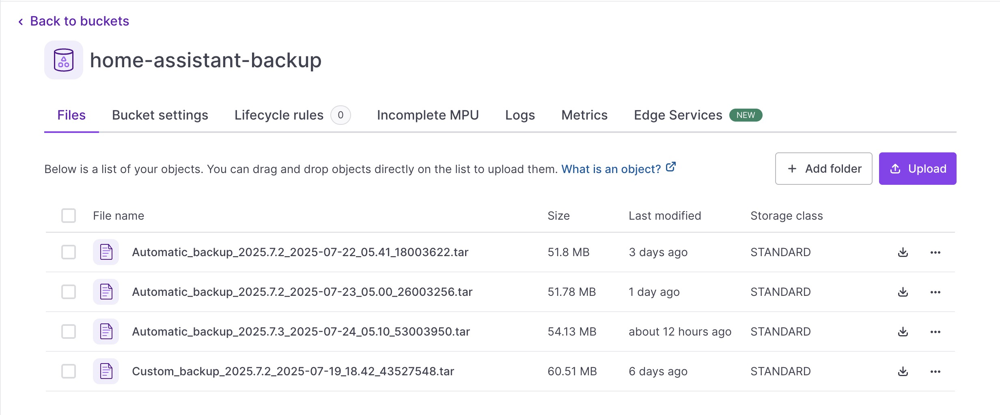

L’année dernière, j’ai acheté trois panneaux solaires de [Beem](https://beemenergy.fr/) pour mon appartement afin de produire ma propre électricité.
Comme je travaille majoritairement à domicile, la plupart de ma consommation électrique se fait pendant la journée.

J’ai obtenu d’excellents résultats, mais je voulais aller plus loin en intégrant davantage de domotique.
J’ai donc décidé de mettre en place [Home Assistant](https://www.home-assistant.io/) pour mieux utiliser mon énergie solaire — par exemple, allumer automatiquement ma machine à laver quand il y a du soleil.
Ou, plus important encore en été, activer la climatisation lorsque la production solaire est élevée.

La mise en place a été en partie simple, mais je me suis vite rendu compte que cela demandait du temps et des efforts pour une bonne configuration.
Toutes les configurations que j’ai ajoutées à mon instance Home Assistant représentent plusieurs heures de travail, et je ne veux absolument pas les perdre.
Les sauvegardes sont donc essentielles !
Je n’ai trouvé aucun tutoriel sur comment faire cela avec [Scaleway](https://www.scaleway.com/en/), alors j’ai décidé d’en écrire un.

## Comment configurer les sauvegardes sur Home Assistant ?

Pour commencer, vous devez être administrateur de votre instance Home Assistant.
Ensuite, allez dans **Paramètres > Système > Sauvegardes**.

Je recommande fortement de configurer une sauvegarde quotidienne de votre configuration Home Assistant.
Si jamais vous faites une erreur ou introduisez une mauvaise configuration, vous pouvez facilement restaurer une version fonctionnelle.
Par défaut, les sauvegardes sont stockées localement sur votre système Home Assistant.
Bien que pratique, cette approche manque de résilience — si votre appareil tombe en panne, vous risquez de perdre à la fois votre système et vos sauvegardes.

Pour garantir une meilleure fiabilité, configurons des sauvegardes automatiques vers Scaleway Object Storage, comme je l’ai fait.


[Si vous êtes bloqué à un moment donné, consultez le tutoriel officiel pour vous guider.](https://www.home-assistant.io/common-tasks/general/#setting-up-an-automatic-backup-process)

## Comment configurer les sauvegardes sur Scaleway ?

Assurez-vous d’avoir un compte valide sur la console Scaleway.

### Créer un bucket et des jetons d’accès

<details>
<summary>Ignorez cette partie si vous êtes déjà familier avec l’écosystème Scaleway</summary>

Dans le produit de stockage d’objets, créez un bucket dans votre projet afin qu’il contienne les copies de vos sauvegardes.
La région que vous utilisez n’a pas vraiment d’importance, les sauvegardes ne sont pas lourdes donc vous pouvez les héberger où vous voulez.

Voici un exemple de mon bucket



Vous pouvez voir que mon bucket n’est pas vide, toutes mes sauvegardes y sont stockées en toute sécurité.

Vous devrez ensuite créer un jeton API avec les droits appropriés pour permettre à votre Home Assistant d’y envoyer du contenu.
Consultez [la documentation Scaleway à ce sujet.](https://www.scaleway.com/en/docs/iam/how-to/create-policy/)
Ce que je recommande, c’est de créer une politique spécifique donnant les droits d’accès en lecture / écriture / suppression à votre bucket.
Vous pouvez le faire via l’interface web ou avec [terraform](https://developer.hashicorp.com/terraform) si vous préférez.

Vous devrez obtenir votre jeton d’accès ainsi que votre jeton secret


<details>
<summary>Code pour terraform</summary>

```terraform
provider "scaleway" {
  region  = "fr-par" # ou "nl-ams", "pl-waw"
  zone    = "fr-par-1"
}

# Crée une application IAM Scaleway (nécessaire pour générer un jeton API)
resource "scaleway_iam_application" "bucket_app" {
  name        = "bucket-access-app"
  description = "Application IAM pour accéder au bucket de stockage d’objets"
}

# Crée le jeton API pour l’application IAM
resource "scaleway_iam_api_token" "bucket_token" {
  application_id = scaleway_iam_application.bucket_app.id
  description    = "Jeton avec accès lecture/écriture à un bucket spécifique"
  expires_at     = "2030-01-01T00:00:00Z" # Optionnel : définir une date d’expiration
}

# Crée le bucket de stockage d’objets
resource "scaleway_object_bucket" "my_bucket" {
  name   = "my-secure-bucket" # doit être unique globalement
  region = "fr-par"
}

# Définit une politique accordant l’accès lecture/écriture au bucket spécifique
data "scaleway_iam_policy_document" "bucket_rw_policy" {
  version = "2022-10-01"

  statement {
    effect    = "allow"
    action    = [
      "object:read",
      "object:write",
      "object:list",
      "object:delete"
    ]
    resource = [
      "rn:scw:object:fr-par::bucket:${scaleway_object_bucket.my_bucket.name}",
      "rn:scw:object:fr-par::object:${scaleway_object_bucket.my_bucket.name}/*"
    ]
  }
}

# Attache la politique à l’application IAM
resource "scaleway_iam_policy" "bucket_rw_policy" {
  name           = "bucket-read-write-policy"
  description    = "Accès lecture et écriture à un bucket spécifique"
  policy_document = data.scaleway_iam_policy_document.bucket_rw_policy.json
  application_id = scaleway_iam_application.bucket_app.id
}
```

</details>

</details>

### Configurer le module dans votre Home Assistant

Pour synchroniser vos sauvegardes locales Home Assistant avec votre bucket Scaleway, je recommande d’utiliser l’add-on Rclone Backup.
Il permet de téléverser facilement vos sauvegardes vers votre bucket chaque jour avec un minimum de configuration.
Il prend également en charge de nombreux autres fournisseurs.

Ajoutez l’URL du dépôt dans `Supervisor → Add-on store → ⋮ → Gérer les dépôts d’add-ons`

https://github.com/jcwillox/hassio-rclone-backup

Une fois installé, dans l’onglet configuration, vous devrez ajouter un YAML comme celui-ci.
Ici, mon bucket s’appelle `home-assistant-backup`

```yaml
- name: Sync Daily Backups
  schedule: 10 4 * * *
  command: sync
  sources:
    - /backup
  destination: scaleway:home-assistant-backup/
```

Ensuite, dans le dossier `homeassistant` de votre système, créez un fichier `rclone.conf`.
Il contiendra vos identifiants secrets.

```toml
[scaleway]
type = s3
provider = Scaleway
access_key_id = XXXXXXXXXXXXXXXXXXXX
secret_access_key = XXXXXXXXXXXXXXXXXXXXXXXXXXXXXXXX
region = fr-par
endpoint = s3.fr-par.scw.cloud
acl = private
```
