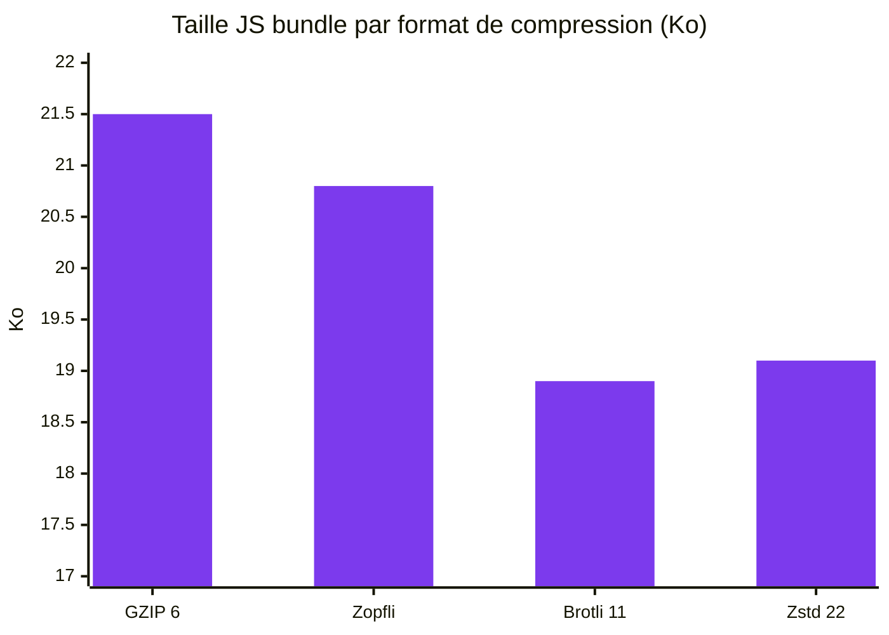
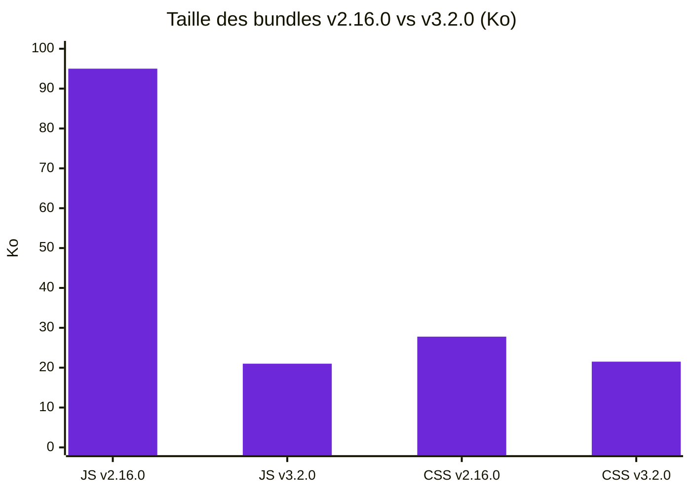

J'ai développé une petite application open source de poker planning : [poker.slashgear.dev](https://poker.slashgear.dev/).
Le code source est disponible sur [GitHub](https://github.com/Slashgear/poker-planning).

La stack initiale était composée de **React 19**, TypeScript, TanStack Router, TanStack Query et **Tailwind 4**, le tout servi par **HonoJS**.
Un jour, en regardant le poids de l'application, je me suis dit que c'était beaucoup trop pour une simple app de poker planning.

## Un repère qui m'a marqué

> "Quand j'ai commencé le web, une bonne page web devait faire 100 Ko maximum"
> — [Pascal Martin](https://blog.pascal-martin.fr/)

Cette phrase m'a marqué.
Une application de poker planning, c'est un écran avec des cartes et un bouton.
Est-ce qu'on a vraiment besoin de plus de 100 Ko pour ça ?

Spoiler : la v2.16.0 dépassait largement ce seuil.

## L'état initial : v2.16.0

En analysant le bundle avec [rollup-plugin-visualizer](https://github.com/btd/rollup-plugin-visualizer), le constat était clair :

- **React 19** + **ReactDOM** représentaient une part importante du bundle
- **TanStack Router** et **TanStack Query** ajoutaient du poids significatif
- Le JS bundle pesait environ **~95 Ko gzippé**
- Le CSS bundle pesait environ **~27.78 Ko**
- La compression était du **GZIP niveau 6 à la volée** par HonoJS

Pour une app qui affiche des cartes de poker et synchronise un état simple, c'était beaucoup trop.

## Étape 1 : Drop React pour Preact

La première question à se poser : **ai-je vraiment besoin de React ?**

[Preact](https://preactjs.com/) est un drop-in replacement de React qui pèse une fraction du poids original.
Rien dans l'application ne justifiait les fonctionnalités spécifiques à React 19.

J'en ai profité pour :

- Remplacer **TanStack Router** par **[preact-iso](https://github.com/preactjs/preact-iso)**, le routeur minimaliste de Preact
- Supprimer **TanStack Query** qui n'était pas indispensable pour les besoins de l'app

> Commit de référence : [`0f29c59`](https://github.com/Slashgear/poker-planning/commit/0f29c59)

**Résultat :**

- JS bundle : ~95 Ko → **~21 Ko gzip** (**-78%**)
- Build time : ~2.1s → **~0.6s**

## Étape 2 : Compression au build time

L'application est une **SPA full statique**.
Les fichiers ne changent jamais entre deux déploiements.
Alors pourquoi les compresser à chaque requête ?

Comme le rappelle l'[almanac HTTP Archive](https://almanac.httparchive.org/en/2024/compression), la compression au build time permet d'utiliser les niveaux de compression les plus élevés sans impact sur le temps de réponse.

J'ai mis en place **3 formats de pré-compression** :

- **Brotli** (qualité 11) — le meilleur ratio pour les navigateurs modernes
- **Zstd** (ultra 22) — de plus en plus supporté
- **Zopfli** — compression GZIP optimale, compatible partout

Voici l'extrait du `Dockerfile` :

```dockerfile
RUN find /app/dist/client -type f \( -name "*.js" -o -name "*.css" -o -name "*.html" -o -name "*.svg" \) \
    -exec brotli --best {} \; \
    -exec zstd --ultra -22 {} \; \
    -exec zopfli --i100 {} \;
```

Côté HonoJS, il suffit d'activer l'option `precompressed: true` pour servir les fichiers pré-compressés.
**Zéro CPU runtime** pour la compression.

| Format                 | Niveau       | JS bundle |
| ---------------------- | ------------ | --------- |
| GZIP 6 (à la volée)    | Standard     | ~21.5 Ko  |
| Zopfli (build time)    | Optimal GZIP | ~20.8 Ko  |
| Brotli 11 (build time) | Optimal      | ~18.9 Ko  |
| Zstd 22 (build time)   | Ultra        | ~19.1 Ko  |



## Étape 3 : Optimisation Tailwind CSS

Tailwind 4 utilise par défaut des **CSS custom properties** pour les couleurs.
En ajoutant `theme(inline)` dans l'import, les couleurs sont directement inlinées dans les classes utilitaires :

```css
@import "tailwindcss" theme(inline);
```

J'ai aussi supprimé une classe `.sr-only` qui était dupliquée (déjà fournie par Tailwind).

**Résultat :** CSS ~27.78 Ko → **~21.51 Ko** (**-22%**)

## Récapitulatif : v2.16.0 vs v3.2.0

| Métrique         | v2.16.0   | v3.2.0    | Gain     |
| ---------------- | --------- | --------- | -------- |
| JS bundle (gzip) | ~95 Ko    | ~21 Ko    | **-78%** |
| CSS bundle       | ~27.78 Ko | ~21.51 Ko | **-22%** |
| Build time       | ~2.1s     | ~0.6s     | **-72%** |



## Pour aller plus loin

La conférence d'[Hubert Sablonnière](https://www.hsablonniere.com/) sur la compression web est une mine d'or sur le sujet :

<iframe width="560" height="315" src="https://www.youtube-nocookie.com/embed/AF99cb1SCqMgra" title="Hubert Sablonnière - Compression web" frameborder="0" allow="accelerometer; autoplay; clipboard-write; encrypted-media; gyroscope; picture-in-picture" allowfullscreen></iframe>

L'article [24 jours de web 2024](https://www.24joursdeweb.fr/2024/compresser-les-donnees-http) détaille aussi les mécanismes de compression HTTP.

## Ce qu'il faut retenir

- **Pré-compressez au build time** (Brotli, Zstd, Zopfli) plutôt qu'à la volée : c'est gratuit en CPU et le ratio est bien meilleur
- **Questionnez vos dépendances** : avez-vous vraiment besoin de React pour votre projet ?
- Utilisez **`theme(inline)`** avec Tailwind 4 pour réduire le CSS généré
- **Mesurez** avec des outils comme `rollup-plugin-visualizer` ou Lighthouse
- Gardez en tête le seuil de **100 Ko** comme objectif : si une page dépasse ce poids, c'est un signal pour investiguer
