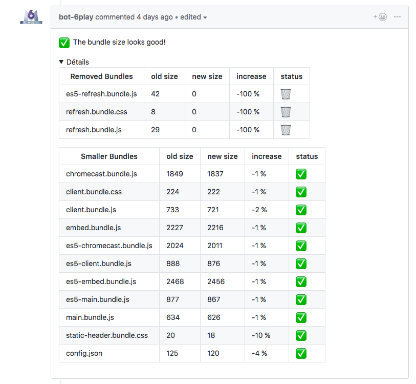

### Webpack : an unexpected journey

_In an open space worked a frontend developper. Not a nasty or a dirty app maker. He had been doing HTML, CSS and JS for many years. He had known dark ages when all those word meant danger and trouble. Many years after the golden age of One day One JS webapp framework, he did not know a new initiation quest was coming to him: Web app performances._


### What is Webpack ?

> “It’s main purpose is to bundle JS files for use in a browser application” — Burke Holland (with [Sean T. Larkin](https://medium.com/u/393110b0b9e4) on **Five things about webpack** )

Webpack builds one or many JS output by resolving JS modules dependencies from one or many entries. Entry could be for example the file responsible of bootstrapping your favourite JS UI library. Outputs are mainly JS files called bundles, they gather all the modules loaded by Webpack when it creates the dependency tree. It can also handle other file types like assets (images/html/…) thanks to _loader_.

If you don’t feel familiar enough with core concepts like Loaders, Plugins, Modules, I encourage you to watch this short video where [Sean T. Larkin](https://medium.com/u/393110b0b9e4) explains in a few sentences what mysteries are hidden behind these words.

<iframe width="560" height="315" src="https://www.youtube-nocookie.com/embed/WI6OTVXT6k8" frameborder="0" allow="accelerometer; autoplay; encrypted-media; gyroscope; picture-in-picture" allowfullscreen></iframe>

### Why is it often considered as a burden in the project ?

#### Unreachable best practices

Thanks to a huge community and an open API, Webpack is clearly a trendy project on NPM. Released for the first time in 2012, Webpack has seen a lot of changes since then.

Like any new concept, Webpack needs time to mature: Its use has evolved. To do pretty much the same thing, there were sometimes 3 loaders / plugins. It was difficult to understand how to use it correctly when every article or example shows us a different way of doing things.


In addition, we must remain objective, Webpack has never been the best documented tool in history. We can still note that a lot of efforts have been put in past few years.

In addition, migrating to new versions of Webpack is still painful. You will always have a plugin or a loader not supporting the last version.

Personally, version migrations in which I was able to participate were very often a source of regressions on our applications (loss of performances, memory leak, …)

#### The multiple environnement trap

Our modern uses push us to create environments to test our applications before our users.

We usually have a very different environment:

- minification / uglyfication of the code is avoided.
- we replace our modules in the browser (HMR).


In order to avoid configuration duplication, we are tempted to set up conditions based on variables from environment passed to the build.

By fear of duplicating our code, we often split our configuration in/between many files.

We then find ourselves with a configuration that is often difficult to read and difficult to understand as whole.

#### _Light of [Eärendil](http://lotr.wikia.com/wiki/E%C3%A4rendil)_


A good practice to avoid this trap is to use a tool like [webpack-merge](https://github.com/survivejs/webpack-merge) to build a basic configuration that can be extended if necessary (add a plugin, change the configuration of a loader, etc.)

Another solution for functionnal aficionados is to use [webpack-chain](https://github.com/neutrinojs/webpack-chain).

> Webpack’s core configuration is based on creating and modifying a potentially unwieldy JavaScript object. While this is OK for configurations on individual projects, trying to share these objects across projects and make subsequent modifications gets messy, as you need to have a deep understanding of the underlying object structure to make those changes.

> webpack-chain attempts to improve this process by providing a chainable or fluent API for creating and modifying webpack configurations. Key portions of the API can be referenced by user-specified names, which helps to standardize how to modify a configuration across projects.

> **— Webpack-chain self description**

If you find your webpack configuration too complex, I can only recommend that you test these two tools. Many tools have taken the plunge this year. I would mention in particular Vue-cli 3 which is based on an ad hoc dynamic Webpack configuration. I refer you to [Evan You](https://medium.com/u/4f198f5f1f12)‘s [article on the subject.](https://medium.com/the-vue-point/vue-cli-3-0-is-here-c42bebe28fbb)

### Why Webpack is a great tool for making your web app performant ?

This lib allows us to optimize our application in different ways, I will not make the complete list here. However, we can generalize by saying that Webpack can bring performance to your web application by reducing the amount of code in it.

#### Code splitting

Webpack does not only merge modules into a large file by solving dependencies. It can also split your applications into multiple batches. These smaller batches can help you avoid to load less code on your application’s home page and reduce its time to interactive.

You can achieve this in many ways:

[**Entry points:**](https://webpack.js.org/guides/code-splitting/#entry-points) You could define all the different entries to generate many output. It is great to control exactly the generated bundles by viewing it directly in your entry definition.

[**Dynamic import decoration:**](https://webpack.js.org/guides/code-splitting/#dynamic-imports) Importing code in ES code is pretty simple, but it requires all your code to already be loaded. A TC39 proposal introduced a dynamic way to import code in your Javascript.

```js
async function getComponent() {
  var element = document.createElement("div");
  const { default: _ } = await import(/* webpackChunkName: "lodash" */ "lodash");

  element.innerHTML = _.join(["Hello", "webpack"], " ");

  return element;
}

getComponent().then((component) => {
  document.body.appendChild(component);
});
```

With this simple trick, you can generate a second bundle containing _lodash_ which will be requested in a second time.

Note that you can tell Webpack that this async module should be [prefetched during browser idle time.](https://webpack.js.org/guides/code-splitting/#prefetching-preloading-modules)

With a component based framework like React, the second approach is the one you should consider. In a Single Page App, using _dynamic import_ in your router configuration will reduce the amount of code loaded drastically.

Tricky parts with code splitting are mainly:

- handling case where some modules are necessary in many bundles.
- Serving code needed for the page your user is on.

#### Tree shaking

Ok now you know how to avoid loading all your code app in your first page. But you may still load part of modules you don’t really need. That is called, _dead code_.

```js
export function square(x) {
  return x * x;
}

export function cube(x) {
  return x * x * x;
}
```

If you load this module in your app for just the square function, by default, Webpack will still load _cube_ function and put it in the bundle.


Now think about all the _dead code_ you are loading in your application. To avoid that, you have to tell Webpack that your modules don’t have side effects by following [this documentation](https://webpack.js.org/guides/tree-shaking/#mark-the-file-as-side-effect-free).

Let’s take another example, I’m pretty sure you have already used _lodash_ in one of your apps. However, you likely never used more than 30% of it . Here the _side effects_ trick will not do the job : lodash doesn’t use exports and defines all his functions in one big file.

To avoid that huge _lodash_ in your app, you should consider using this [babel-plugin-lodash](https://github.com/lodash/babel-plugin-lodash) or importing every time the module which is only exporting the function you need:

```js
import \_merge from 'lodash/merge'
```

### Case study: 6play a white mark VOD platform


Since June 2017, I work with M6web team in Lyon (France) on the 6play platform. If you don’t know it, 6play is a french VOD service created for M6 group content replay. Based on React with SSR mode, this app is still evolving through years thanks to an amazing team. You can find more about what we are doing on the [Tech M6Web blog](https://tech.m6web.fr/).

**You will tell me, what is the relationship here with Webpack?**

6play quickly used Webpack to pack code efficiently. Going from version to version (sometimes in tears and blood) we tried to configure our build to ensure a fast loading application.

In 2018, 6play knew a big revolution, it became a white mark platform for other customers.

[The 6play platform goes international](https://tech.m6web.fr/6play/6play-goes-international/)

The big challenge for the front app was not only to create the translating part but also not to duplicate the code base. To be more precise, we only have one repository for all our customers (our name for a specific client app). The risk with this choice would have been to mix customer code into 6play code.

Platforms looks very similar visually but under the hood hide many differences (ad engine, user tracking, and so on …). Just imagine the quantity of assets differences!

We clearly wanted to avoid:

1. Mixing customers code in bundles (JS and assets)
2. Duplicating code

That’s where Webpack became really useful.

#### “Customers override”

In a white mark app, you often find the pattern of overriding a component or an asset to handle the difference in design you want to introduce. This overloading has been implemented foolishly this way for every module we want to override.

```
...somewhere in our directory structure
/customer/
 a/
 MyComponent.js
 b/
 MyComponent.js
 c/
 MyComponent.js
RootMyComponent.js
```

```js
const Component = require(`./customer/${process.env.CUSTOMER_CODE}/MyComponent.js`);

export default Component;
```

This code works well for the customer overriding part but it has major issues. Issues that are not only due to the noise in our code structure but also by this heavy directory structure.

#### The dynamic require trap

To understand the Big issue, we have to focus on this specific part.

```js
require(`./customer/${process.env.CUSTOMER_CODE}/MyComponent.js`);
```

I said before that Wepack is packing our module based on the dependency graph it is building. Here, the dependency is dynamic. So it does not know which module he will have to load. To avoid forgetting one, it will load all the modules that match the pattern below in his **_Context_**.

```
/^\.\/customer\/.\*\/MyComponent\.js
```

It means that all the different variants will be present in the resulting bundle. That’s exactly what we wanted to avoid.


#### ContextReplacementPlugin trick

You have probably already heard about the Webpack _context_. This famous time where you wanted to get rid of all the [moment](https://momentjs.com/) locales you do not need.

If you don’t know it, MomentJS (the time most used JS lib) is loading all the locals by default with a dynamic require like you just saw.


The common solution you will see in Github issue/StackOverflow will look like this one:

```js
const webpackConfig = {
  plugins: [new webpack.ContextReplacementPlugin(/moment[/\\]locale$/, /fr/)],
};
```

This simple trick is essential to understand what is coming. Here, we are using a core Webpack plugin that magically reduces our bundle size. But what is it doing ?

ContextReplacementPlugin will act like a hook triggered after Webpack failed to resolve modules for all the files in the context. It will just keep in the bundle all the Context files matching the first Regex and the second.

```
/moment/locale/fr.js // will stay

/moment/locale/en.js // will be removed
```

If you are curious this [plugin’s code](https://github.com/webpack/webpack/blob/master/lib/ContextReplacementPlugin.js) is pretty simple.


Nice, now we just have to use this plugin and select only the files matching the current customer code !!

… Sadly that is still not good enough.

The part we missed is the fact that we have to define the same component for each customer…each time. That’s pretty verbose No ?

Of course it is !


**Our hand made CustomerReplacementPlugin**

We have many cases where we just want to override a part of the application just for one customer. So the target structure to avoid duplication looks more like this.

```
...somewhere in our directory structure
/customer/
 default/
 MyComponent.js
 b/
 MyComponent.js
RootMyComponent.js
```

```js
import Component from "./customer/default/MyComponent.js";

export default Component;
```

Ok now, there is no duplication left, but the ContextReplacementPlugin doesn’t seem to do the job here. Fortunately another plugin made it: **NormalReplacementPlugin.**

In the target structure above, there is no `require` left. Customer override won’t be loaded in the Context. Happily **NormalReplacementPlugin** will be our savior here.

It really looks like the other plugin but this time the plugin can affect modules that have been normally resolved by Webpack and change their path just before the packing.

So based on NormalReplacementPlugin implementation, I built a CustomerReplacementPlugin to do the trick (with a really foolish implementation for now)

```js
const fs = require("fs");

class CustomerReplacementPlugin {
  // To pass the current customer
  constructor(customerName) {
    this.customerName = customerName;
  }

  apply(compiler) {
    compiler.hooks.normalModuleFactory.tap("CustomerReplacementPlugin", (nmf) => {
      // just before thos normal modules have be resolved
      nmf.hooks.afterResolve.tap("CustomerReplacementPlugin", (result) => {
        if (!result) return;

        // if the variant exists for the current customer
        if (/customer\/default/.test(result.resource)) {
          const customerResource = result.resource.replace(/\/default\//, `/${this.customerName}/`);
          if (fs.existsSync(customerResource)) {
            // I replace the resolved path by the customer path
            result.resource = customerResource;
          }
        }

        return result;
      });
    });
  }
}

module.exports.CustomerReplacementPlugin = CustomerReplacementPlugin;
```

I hope this solution will at least help you understand those plugins or even help you enhance your application performances.

### Some tips I found useful when using Webpack

This long article is still not finished. I still have some tips for you about Webpack. In recent years I have gathered some good practices to guarantee performances of your applications when using Webpack. Here is a non-exhaustive list.

#### Know your weakness


You have to check your bundle size regularly, if possible, even in your build chain. At @M6web , we developed our own tool to check that on each new development.

- It warns you if your bundles suddenly became too fat
- It compliments you when you make a bundle thinner

Coupled with [Webpack Bundle Analyser](https://www.npmjs.com/package/webpack-bundle-analyzer), you should be able to reduce your bundle drastically and thus improve your app performances.



Unfortunately this tool is not yet ready to be open sourced. However, there are similar tools like this.

https://github.com/paularmstrong/build-tracker

#### ES2015+ bundles

You must know that some of our browsers can now use much more recent Javascript. Why then should we target only ES5?

That’s why for the past few months we have been generating two versions of our bundles with two different _babel_ targets on 6play.

You should do the same and it is not [@AddyOsman](http://twitter.com/AddyOsmani)i that will contradict me.

<blockquote class="twitter-tweet"><p lang="en" dir="ltr">JavaScript Tip: Serve smaller ES2015+ bundles to modern browsers &amp; transpiled ES5 to older ones with <a href="https://twitter.com/babeljs?ref_src=twsrc%5Etfw">@babeljs</a> and preset-env:<a href="https://t.co/5FN7h23gow">https://t.co/5FN7h23gow</a> <a href="https://t.co/wEq9xAFf3G">https://t.co/wEq9xAFf3G</a><a href="https://t.co/fC1H9Grw6H">https://t.co/fC1H9Grw6H</a> <a href="https://t.co/8Fez6dzsPf">pic.twitter.com/8Fez6dzsPf</a></p>&mdash; Addy Osmani (@addyosmani) <a href="https://twitter.com/addyosmani/status/1082902291328360448?ref_src=twsrc%5Etfw">January 9, 2019</a></blockquote> <script async src="https://platform.twitter.com/widgets.js" charset="utf-8"></script>

### Compress your bundle with Webpack

Few months ago, I gave [a talk at @LyonJS about compression in web](https://docs.google.com/presentation/d/17w__X9JKrdlqZdSgIXfvlP2-TitxVCuYnkNBAZztSPk/edit?usp=sharing). I won’t explain why it’s required to deliver your file compressed, but you have to know that Webpack could do the job for you with Gzip.

https://github.com/webpack-contrib/compression-webpack-plugin

And soon with [Brotli](https://github.com/google/brotli), thanks to this pull request.

[zlib: add Brotli support by addaleax · Pull Request #24938 · nodejs/node](https://github.com/nodejs/node/pull/24938)

### To go even further

- [Webpack 5 is coming !](https://github.com/webpack/webpack/issues/8537)
- [Webpack official guide](https://webpack.js.org/guides/)
- [Server side Webpack](https://jlongster.com/Backend-Apps-with-Webpack--Part-I)
- [Dev server with Webpack](https://webpack.js.org/guides/hot-module-replacement/)
- Follow [Tobias Koppers](https://medium.com/u/cccc522e775a), [Sean T. Larkin](https://medium.com/u/393110b0b9e4) and [Addy Osmani](https://medium.com/u/2508e4c7a8ec) on twitter :)


