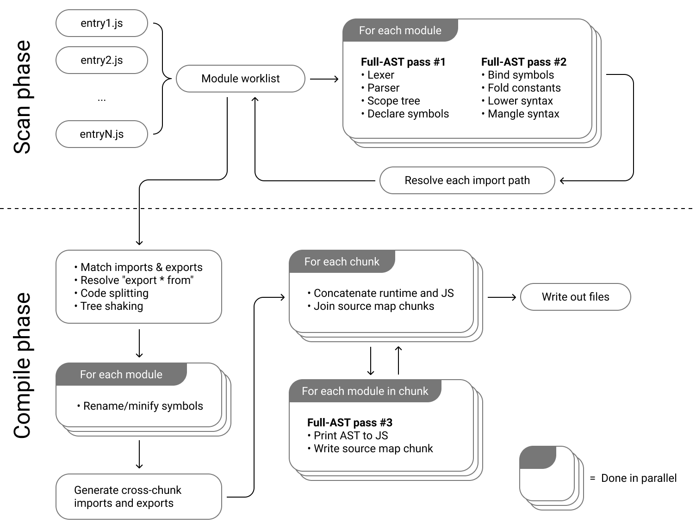

I've been playing with JS bundlers for several years.
Still convinced of the necessity of using these tools (don't let me believe that you don't package your JS modules in production 😅), I played a lot with [webpack](/en/webpack/).
Especially for performance, optimization and custom plugins usage issues.

I still think that in 2021, webpack is the most industrial and successful solution to _bundle_ my web applications.
I hear that tools like _parcel_ and _rollup_ are still good alternatives.
However, webpack probably has the biggest community and is used by many projects.

But let's face it, today we are satisfied with these _bundling_ tools despite their poor performance.
I work every day on a project with several thousands of "modules" solved by webpack and it is sometimes a pain 🥱.

> Despite an intensive use of cache and workers, webpack shows some limitations to package large applications.

## Why does esbuild look interesting ?

I can't think of an easier way to express it than to explain it to you simply:

> The first time I ran `esbuild` on my test web app, I thought it crashed when in fact it ran at an absolutely insane speed.

To install it, it's not complicated:

```shell
yarn add -D esbuild
```

```shell
npm install -D esbuild
```

Or even with [NPX](https://www.npmjs.com/package/npx)

```
npx esbuild --version
```

Being written in Go, a WASM version and binaries for the main architectures are available.
`esbuild` bets on native Go to take advantage of a maximum of parallelization solutions and a better memory management.

### A lean API by design

Globally the API of `esbuild` is really simple, in 30 minutes you have read all the docs of possible settings.
This is far from the 3-4 hours needed to read the whole documentation of a webpack for example.
In spite of a configuration that might seem limited, I am still pleasantly surprised.
I have the impression that we are really close to having the _"right grammar"_ that we need to do bundling.

`esbuild` offers 3 consumption modes:

#### CLI

```shell
esbuild app.jsx --bundle --minify --sourcemap --target=chrome58,firefox57,safari11,edge16
```

#### GO

```go
package main

import "github.com/evanw/esbuild/pkg/api"
import "os"

func main() {
  result := api.Build(api.BuildOptions{
    EntryPoints:       []string{"app.jsx"},
    Bundle:            true,
    MinifyWhitespace:  true,
    MinifyIdentifiers: true,
    MinifySyntax:      true,
    Engines: []api.Engine{
      {api.EngineChrome, "58"},
      {api.EngineFirefox, "57"},
      {api.EngineSafari, "11"},
      {api.EngineEdge, "16"},
    },
    Write: true,
  })

  if len(result.Errors) > 0 {
    os.Exit(1)
  }
}
```

#### JS

```javascript
require('esbuild').buildSync({
  entryPoints: ['app.jsx'],
  bundle: true,
  minify: true,
  sourcemap: true,
  target: ['chrome58', 'firefox57', 'safari11', 'edge16'],
  outfile: 'out.js',
})
```

In my opinion, the CLI is still very practical for testing things, but in a more "industrial" use, we still prefer the JS or GO format.

### Plugin mechanics

[Evan Wallace](https://github.com/evanw) the creator and core maintainer of `esbuild` makes no secret of the fact that he doesn't want his tool to meet 100% of the needs that one can have in the web world.
However, this doesn't mean that we can't use this tool in specific cases.

As we can see with other bundlers, `esbuild` offers the mechanics of plugins that allow you to do many things.
To avoid maintaining all these specific needs, the creator relies on the community to create all the plugins you could want.
And clearly, the community is there, I let you see [this page that lists some plugins](https://github.com/esbuild/community-plugins).

### The most interesting features

I'm not going to list here the features that seem to me the heart of a Web bundler like code splitting, injection, minification.
However, I was surprised by some features that are not found elsewhere.

#### An easy to understand architecture

Clearly, what makes the strength of `esbuild` compared to its competitors is its architecture which can be summarized simply.
It is easy to understand that by combining the parallelization of the build steps and the reduction of the number of readings of the AST.
I invite you to read [more explanations in the doc](https://esbuild.github.io/faq/#why-is-esbuild-fast).



#### Browser targets

By default `esbuild` allows you to define the target of _your_ build.
What _level_ of javascript do you want to achieve?

Usually we use a suite of tools like `@babel/preset-env` and a `browserlist` to make sure we generate the JS compatible with our targeting.
Babel is great, I use it every day, but piling up different tools for _bundling_ is clearly not a good solution in my eyes.
It adds a lot of complexity:

- instead of learning to use a simple bundler tool, I have to learn a targeted transpilation tool on top of that
- I have to maintain two dependencies
- going through a third party librairy can reduce performances (this is a bit the bet of `esbuild`)

#### The server mode

`esbuild` is so fast that it can afford to expose you an HTTP server on a folder that contains the result of your compilation on each request.
Other tools usually rely on a _watch_ mode that watches for files that change to start a build.

The _watch_ mode also exists with `esbuild`, but the `serve` mode seems to me even nicer because you just have to refresh your browser to have the latest version of your application locally.

```javascript
require('esbuild')
  .serve(
    {
      servedir: 'www',
    },
    {
      entryPoints: ['src/app.js'],
      outdir: 'www/js',
      bundle: true,
    }
  )
  .then((server) => {
    // Call "stop" on the web server when you're done
    server.stop()
  })
```

## But then we stop everything and go on it?

> Let's save time, the answer for me is clearly no.

As the creator says in the [FAQ of the doc](https://esbuild.github.io/faq/#production-readiness) in all honesty, the project is not to be considered as being in alpha.
However, the tool itself does not yet have all the features that would make it a good replacement for the previous generation bundlers.
I'm thinking in particular of the absence of native HMR, or of a perfectible splitting code.

However, one should not remain closed on this question.
Clearly `esbuild` has very strong points that are missing in the current ecosystem.
The community, still in its infancy, is rather active and the exchanges in the Issues and PR of the repo are very interesting.

What I really appreciate in this project are the parts taken: a focus on performance, an API that remains simple.
Finally, for once a bundler doesn't have 1000 dependencies and add 100Mb in my `node_modules` folder, it's nice enough to note.

I'll finish by saying that `esbuild` is not the only alternative that is offered to us in this new generation of _bundler_.
I intend to do this kind of analysis on tools like [Vite](https://vitejs.dev/) or [Snowpack](https://www.snowpack.dev/).
