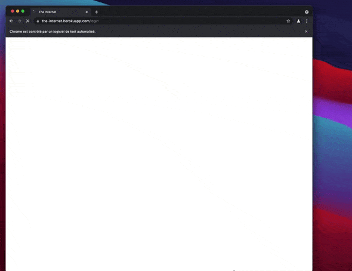

J'ai récemment mis en place une pile de tests de bout en bout pour m'assurer que je n'allais pas introduire de régressions fonctionnelles sur mon blog.
Avec plusieurs années d'expérience dans l'utilisation des technologies de test E2E (End to End), j'ai tout de même rencontré quelques difficultés dans sa mise en place.

Afin de vous faire gagner du temps, je vous propose un tutoriel pas à pas de l'installation des outils nécessaires pour avoir une pile de test efficace en quelques minutes.

## On le fait tourner d'abord localement

Vous devez d'abord installer quelques dépendances à votre projet.
Pour moi le projet était un site Gatsby assez simple, mais vous pouvez l'installer sur n'importe quel site web que vous développez qui a un fichier `package.json`.
Dans ce cas, je vais commencer par un paquet `npm` qui vient d'être initialisé.
**Assurez-vous que vous avez un navigateur Chromium ou Chrome installé localement.**
Nous avons beaucoup de chance car les équipes de [WebdriverIo](https://webdriver.io/) ont développé un sujet CLI qui fait ce travail pour vous.

```shell
yarn add -D @wdio/cli
```

Il ne vous reste plus qu'à déclencher l'initialisation d'une nouvelle configuration.
Le CLI vous proposera un genre de formulaire que vous devrez suivre.

```shell
yarn wdio config
```


Voici ce que vous devez faire pour chaque question :

1. Sélectionnez d'abord "Sur ma machine locale".
2. Vous devez absolument utiliser `cucumber`, le langage Gherkin est tellement génial pour [déclarer des comportements d'utilisateurs humainement lisibles] (https://en.wikipedia.org/wiki/Behavior-driven_development).
3. Choisissez le compilateur dont vous avez besoin, j'utilise personnellement `No`. Vous pouvez décider si vous voulez utiliser Babel ou Typescript en fonction de vos habitudes.
4. Pour la question "Où sont situés vos fichiers de fonctionnalités ?", j'aime utiliser la valeur par défaut.
5. Même chose pour les définitions d'étapes, utilisez la valeur par défaut.
6. Voyons quels tests WebdriverIo va générer automatiquement.
7. `Voulez-vous utiliser les objets de la page ?` Je ne l'utiliserais pas si c'est la première fois que vous configurez ce genre de pile de tests, dites `n`.
8. Vous devriez sélectionner le rapporteur `spec` ici.
9. Veuillez sélectionner le service `chromedriver` uniquement.
10. Remplacez l'url de base par votre contexte local (par exemple, ajoutez le port sur lequel vous exposez votre application localement).

Normalement, le CLI génère quelques fichiers pour vous et ajoute les dépendances manquantes dont vous avez besoin.

Voici mon `package.json'.

```json
{
  "name": "example-wdio",
  "version": "1.0.0",
  "main": "index.js",
  "license": "MIT",
  "devDependencies": {
    "@wdio/cli": "^7.9.1",
    "@wdio/cucumber-framework": "^7.9.1",
    "@wdio/local-runner": "^7.9.1",
    "@wdio/spec-reporter": "^7.9.0",
    "chromedriver": "^92.0.1",
    "wdio-chromedriver-service": "^7.2.0"
  }
}
```

Vous devriez voir un fichier `login.feature` dans le dossier `./features/`.

```gherkin
Feature: The Internet Guinea Pig Website

  Scenario Outline: As a user, I can log into the secure area

    Given I am on the login page
    When I login with <username> and <password>
    Then I should see a flash message saying <message>

    Examples:
      | username | password             | message                        |
      | tomsmith | SuperSecretPassword! | You logged into a secure area! |
      | foobar   | barfoo               | Your username is invalid!      |
```

Avec les définitions des _steps_ dans `./step-definitions/steps.js`.

```js
const { Given, When, Then } = require('@cucumber/cucumber')

Given(/^I am on the (\w+) page$/, async (page) => {
  await browser.url(`https://the-internet.herokuapp.com/${page}`)
})

When(/^I login with (\w+) and (.+)$/, async (username, password) => {
  await $('#username').setValue(username)
  await $('#password').setValue(password)
  await $('button[type="submit"]').click()
})

Then(/^I should see a flash message saying (.*)$/, async (message) => {
  await expect($('#flash')).toBeExisting()
  await expect($('#flash')).toHaveTextContaining(message)
})
```

Voyons ce que font ces exemples de tests par défaut !
Pour cela, il vous suffit de lancer ceci dans votre terminal et tada 🎉

```shell
yarn wdio run wdio.conf.js
```



Voici le log qu'il va générer grâce au rapporteur `spec` !

```text
------------------------------------------------------------------
[chrome 92.0.4515.131 mac os x #0-0] Running: chrome (v92.0.4515.131) on mac os x
[chrome 92.0.4515.131 mac os x #0-0] Session ID: edd73da800a210e7c677c69cd064004f
[chrome 92.0.4515.131 mac os x #0-0]
[chrome 92.0.4515.131 mac os x #0-0] » /features/login.feature
[chrome 92.0.4515.131 mac os x #0-0] The Internet Guinea Pig Website
[chrome 92.0.4515.131 mac os x #0-0] As a user, I can log into the secure area
[chrome 92.0.4515.131 mac os x #0-0]    ✓ Given I am on the login page
[chrome 92.0.4515.131 mac os x #0-0]    ✓ When I login with tomsmith and SuperSecretPassword!
[chrome 92.0.4515.131 mac os x #0-0]    ✓ Then I should see a flash message saying You logged into a secure area!
[chrome 92.0.4515.131 mac os x #0-0]
[chrome 92.0.4515.131 mac os x #0-0] As a user, I can log into the secure area
[chrome 92.0.4515.131 mac os x #0-0]    ✓ Given I am on the login page
[chrome 92.0.4515.131 mac os x #0-0]    ✓ When I login with foobar and barfoo
[chrome 92.0.4515.131 mac os x #0-0]    ✓ Then I should see a flash message saying Your username is invalid!
[chrome 92.0.4515.131 mac os x #0-0]
[chrome 92.0.4515.131 mac os x #0-0] 6 passing (3s)
```

Pour l'instant, les tests ne testent pas du tout votre application.
Vous trouverez de nombreuses ressources sur la façon d'utiliser [Cucumber JS] (https://cucumber.io/docs/installation/javascript/) pour écrire de bons tests pour décrire et tester les fonctionnalités de votre application.

## Configurer le workflow d'action Github

Maintenant que nous avons réussi à faire tourner les tests E2E sur notre machine, il nous reste à mettre en place un workflow d'intégration continue qui vérifiera automatiquement sur votre Pull Request et sur votre branche `main` que tous les tests sont ok.

J'utilise pour la plupart de mes projets Github Action et j'en suis satisfait, donc l'exemple suivant utilisera cet outil.
Cependant, le principe fonctionne aussi avec un pipeline Gitlab, Jenkins ou autre.

Avec Github Action vous devez configurer un fichier Yaml pour décrire votre workflow.
Créons le fichier `./.github/workflows/continuous-integration.yml` dans votre projet !

```yaml
name: Continuous Integration

on:
  push:
    branches:
      - '**'

jobs:
  build:
    runs-on: ubuntu-latest
    steps:
      # D'abord on install un chromium dans le runner
      - name: Install Chromium
        run: sudo apt-get install chromium-browser

      # fetch du repo
      - uses: actions/checkout@v2

      # Usage de NodeJS > 14.x
      - name: Use Node.js
        uses: actions/setup-node@v1
        with:
          node-version: 16.x

      # Installer ses dépendances
      - run: yarn install
        name: Install dependencies

      # C'est ici que vous devez _build_ votre application
      # Vous pouvez vous inspiré de ce que j'ai fait sur mon blog https://github.com/Slashgear/slashgear.github.io/blob/source/.github/workflows/continuous-integration.yml

      # On lance les tests avec la même commande que locallement
      - run: yarn wdio run wdio.conf.js
        name: Running E2E tests
```

Essayons cela ! 🚀

😭 Malheureusement, vous devriez être confronté à une erreur très courante lors des tests E2E avec chrome.

```text
[0-0] 2021-08-12T20:34:12.293Z ERROR webdriver: Request failed with status 500 due to unknown error: unknown error: Chrome failed to start: exited abnormally.
[0-0]   (unknown error: DevToolsActivePort file doesn't exist)
[0-0]   (The process started from chrome location /usr/bin/google-chrome is no longer running, so ChromeDriver is assuming that Chrome has crashed.)
[0-0] 2021-08-12T20:34:12.293Z ERROR webdriver: #0 0x5631c488ba63 <unknown>
```

`DevToolsActivePort file doesn't exist` signifie essentiellement que votre navigateur n'a pas réussi à démarrer.
La raison principale de ce problème est le fait que vous demandez à WebdriverIo de démarrer le navigateur Chrome avec une interface utilisateur graphique sur un runner ubuntu qui n'a pas d'écran du tout 😅.

Nous devons créer une nouvelle configuration de Webdriver spécifique à l'action github qui étend notre configuration de base.
Créons `wdio-github.conf.js` à côté de `wdio.conf.js` !

```js
const basicConfig = require('./wdio.conf')

exports.config = {
  ...basicConfig.config,
  // We only need to override the Chrome configuration of capabilities
  capabilities: [
    {
      maxInstances: 5,
      browserName: 'chrome',
      acceptInsecureCerts: true,
      // We need to extends some Chrome flags in order to tell Chrome to run headless
      'goog:chromeOptions': {
        args: ['--headless', '--disable-gpu', '--disable-dev-shm-usage'],
      },
    },
  ],
}
```

Il ne nous reste plus qu'à modifier la commande `yarn wdio run` dans notre fichier YAML de Workflow Github.
Vous n'avez plus qu'à le pousser et Github le lancera pour vous !


## Configurer le multi navigateur !

Chrome n'est pas le seul navigateur, et j'espère qu'il ne le sera jamais !

**WebdriverIo est une excellente solution pour exécuter des tests sur plusieurs navigateurs**.
Et je ne vous montrerai pas ici les excellentes fonctionnalités que vous pourriez utiliser avec des solutions d'exécution à distance comme [BrowserStack](https://www.browserstack.com/) ou [Saucelabs](https://saucelabs.com/) directement avec WebdriverIo.

Configurons un Firefox en local !

1. Assurez-vous d'installer un Java JDK 8 sur votre machine.
   Petite astuce pour les utilisateurs de Macos comme moi : lancez `brew install adoptopenjdk/openjdk/adoptopenjdk8` fait le travail !
2. Lancez `yarn add -D @wdio/selenium-standalone-service` pour installer les services selenium fonctionnant avec WebdriverIo.
3. Assurez-vous que vous avez Firefox installé localement.
4. Maintenant, la dernière chose que nous devons faire est de mettre à jour notre configuration pour ajouter les capacités de Firefox.

Dans `wdio.conf.js`, remplacez simplement les tableaux _capabilities_ et _services_ par ceci.

```shell
{
  capabilites: [
    {
        maxInstances: 5,
        browserName: 'chrome',
        acceptInsecureCerts: true,
    },
    {
        maxInstances: 5,
        browserName: 'firefox',
        acceptInsecureCerts: true,
    }
  ],
  services: ['chromedriver', 'selenium-standalone'],
}
```

Si vous exécutez la commande `yarn wdio run wdio.conf.js` maintenant, cela va déclencher les deux tests sur Firefox et Chrome et c'est complètement génial !

La dernière chose que nous devons faire est de mettre à jour notre configuration spécifique à Github afin qu'elle fonctionne également dans votre intégration continue.
Vous devez aussi mettre à jour les _capabilites_, afin d'ajouter Firefox et de le faire démarrer _Headless_.

Dans `wdio-github.conf.js`

```js
const basicConfig = require('./wdio.conf')

exports.config = {
  ...basicConfig.config,
  capabilities: [
    {
      maxInstances: 5,
      browserName: 'chrome',
      acceptInsecureCerts: true,
      'goog:chromeOptions': {
        args: ['--headless', '--disable-gpu', '--disable-dev-shm-usage'],
      },
    },
    {
      maxInstances: 5,
      browserName: 'firefox',
      acceptInsecureCerts: true,
      'moz:firefoxOptions': {
        args: ['-headless'],
      },
    },
  ],
}
```

> Et c'est tout !

Amusez-vous bien à couvrir votre application avec des tests E2E !
N'hésitez pas à me @ sur twitter si ce _How to_ vous a aidé.

Si vous voulez voir l'exemple d'application que j'ai utilisé dans ce tutoriel, jetez un coup d'oeil à [cet exemple de dépôt Github](https://github.com/Slashgear/example-wdio).
