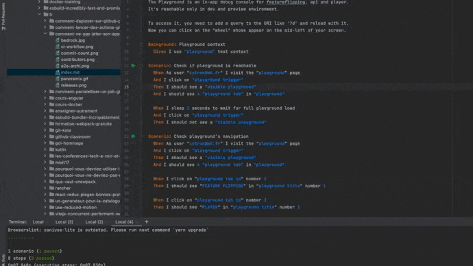

> Comment ne pas jeter son application tous les deux ans ?

_Retour d'expérience basés sur les bonnes pratiques appliquées à la plateforme web développée chez [Bedrock Streaming](https://www.bedrockstreaming.com/)_

## Un peu de contexte

À Bedrock Streaming de nombreuses équipes développent et maintiennent différentes applications frontend pour nos clients et utilisateurs.
Certaines de ces applications ne sont pas toute jeune.
En effet, si on prend l'exemple de l'application sur laquelle je travaille principalement, il s'agit d'un site web dont les développements ont commencé en 2014.
J'ai d'ailleurs déjà évoqué celle-ci dans différents articles de ce blog.


Vous pourriez vous dire: _"Oh les pauvres maintenir une application vieille de presque 10 ans ça doit être un enfer !"_

Rassurez-vous, ce n'est pas le cas !
J'ai par le passé travaillé sur des projets frontend bien moins vieux mais sur lesquelles le développement de nouvelles fonctionnalités était bien plus pénible.

Aujourd'hui le projet reste à jour techniquement, on doit être sur la dernière version de React alors que celui-ci avait commencé sur une version _0.x.x_.
Dans ce monde des technologies web souvent décrié (ex: les nombreux sur la _Javascript Fatigue_) dont les outils et les pratiques évoluent constamment, conserver un projet "à jour" reste un vrai challenge.


De plus, dans le contexte de ce projet spécifique, en presque 10 ans, nous avons connu une centaine de contributeurs différents.
Certains contributeurs ne sont restés que quelques mois/années, comment ne pas perdre des infos ?
Comment fait-on pour garder au maximum la connaissance sur "Comment on fait les choses et comment ça marche ?".


C'est ce que je vous propose de vous présenter dans cet article.
Avec l'aide de mes collègues, j'ai rassemblé la liste des bonnes pratiques qui nous permettent encore aujourd'hui de maintenir ce projet en état.
Avec [Florent Dubost](https://twitter.com/fooragnak), on s'est souvent dit qu'il serait intéressant de les lister.
Ne serait-ce que pour le partager en interne à Bedrock.
Quitte à en faire la liste, autant vous le partager également, en espérant que cela vous soit utile.

## S'imposer des règles et les automatiser

Un projet qui résiste c'est tout d'abord un ensemble de connaissances qu'on empile les unes sur les autres.
C'est en quelque sorte la tour de Kapla que vous assembliez petit en essayant d'aller le plus haut possible.
On essaye alors de construire des bases solides dès le début sinon on est certain qu'on ira pas très haut.

Dès le début d'un projet on est donc amené à prendre de décisions importantes sur "Comment on souhaite faire les choses ?".
On pense par exemple à "Quel format pour nos fichiers ? Comment on nomme telle ou telle chose ?"
Écrire une documentation précise de "Comment on fait les choses" pourrait paraitre une bonne idée.

Cependant la documentation c'est cool, mais ça a tendance à périmer très vite.
Nos décisions évoluent mais pas la documentation.

> "Les temps changent mais pas les README."
>
> [_Olivier Mansour (deputy CTO à Bedrock)_](https://twitter.com/omansour)

On trouve qu'automatiser la vérification de chacune des règles qu'on s'impose sur notre codebase ou nos process est bien plus pérenne.
En plus de ça, coté JS on est vraiment bien équipé avec des outils comme Eslint qui nous permettent d'implémenter nos propres règles.

Le réflexe qu'on essaie donc d'adopter est donc le suivant:

- "On devrait essayer de faire comme cela à présent !"
- "Ok c'est intéressant, mais comment peut-on s'assurer qu'on le fasse comme cela automatiquement avec notre CI ?"

Il n'y a rien de mieux que l'intégration continue d'un projet pour ne rien louper sur chacune des _Pull Request_ qu'on est amené à proposer.
Les reviews n'en sont que plus simple car vous n'avez plus à vous soucier de l'ensemble des règles qui sont déjà automatisées.
Dans ce modèle, la review sert donc plus au partage de connaissance qu'au flicage de typo et autre non respect des conventions du projet.

Dans ce principe, il faut donc essayer de bannir les règles orales.
Le temps des druides est terminé, si il faut transmettre oralement toutes les bonnes pratiques d'un projet, l'accompagnement de nouveaux développeurs dans votre équipe n'en sera que plus long.


Étant donné qu'un projet n'est pas quelque chose de figé, ces règles vont évoluer avec le temps.
On préfèrera alors l'ajout de règles qui possèdent un script qui _autofixera_ toute la codebase intelligemment.
De nombreuses règles Eslint le propose, et cela est vraiment un critère de sélection très important dans nos choix de nouvelles conventions.
Un règle très stricte qui vous obligera à modifier votre code manuellement avant chaque push est pénible à la longue et énervera vos équipes.
Alors qu'une règle (même très stricte) qui peut s'autofixer automatiquement au moment du commit ne sera pas perçu comme gênante.

**Comment décider d'ajouter de nouvelles règles ?**

Cette question peut paraitre épineuse, prenons par exemple le cas des `<tab>` / `<space>` dans les fichiers.
Pour cela, on essaye d'éviter des débats sempiternel et on se plie à la tendance et aux règles de la communauté.
Par exemple, notre base de configuration Eslint est basée sur celle d'Airbnb qui semble avoir un certain succès dans la communauté JS.

### La liste _presque_ exhaustive 🤞

<details>
<summary style='font-weight: bold; font-style: italic'>Étant donné que cet article est déjà suffisamment long, voici la liste des règles qu'on s'impose sur le projet et qui pourraient vous servir d'exemple (clique sur ce texte pour les faires apparaitre)</summary>


- Le format des fichiers est suivi géré par editorconfig, prettier et eslint.
  Nous avons opensourcé [notre propre configuration](https://github.com/M6Web/eslint-tools), si jamais celle-ci peut vous être utile.
- On utilise un [nommage de commit bien spécifique](https://www.conventionalcommits.org/en/v1.0.0/) pour générer nos changelog.
  Pour s'assurer que les devs le respectent, une simple étape de notre CI le vérifie.
- On ne souhaite pas qu'un dev fasse grossir énormément nos bundle en production, c'est pourquoi nous suivont et mesuront leur taille dans la CI.
- La couverture de tests n'est pas un indicateur pour nous, toutes les lignes n'ont pas la même nécessité pour nous d'être testée.
- Nos tests unitaires tournent bien évidemment sur la CI, ceux-ci doivent passer.
- Nos tests fonctionnels (E2E) tournent sur Chrome Headless, ils doivent être au vert.
- Les logs de nos tests fonctionnels sont récupérés est parsés afin d'éviter l'introduction d'erreur ou de react warning (Le script de parsing est cependant compliqué à maintenir)
- Les tests fonctionnels fonctionnent dans une sandbox ou tout le réseau est proxyfié.
  Nous surveillons que nos tests ne dépendent pas d'une API non moquée qui pourrait ralentir leur execution.
- On vérifie quelques règles sur le CSS avec [Stylelint](https://stylelint.io/) et [bemlinter](https://github.com/M6Web/bemlinter) (on utilise plus BEM aujourd'hui mais il reste encore un peu de style géré en SCSS qu'on migre petit à petit)
- Le projet est un monorepo sur lequel nous essayons de maintenir les mêmes version de dépendances pour chaque package.
  Pour cela nous avons développé un outil qui permet de faire cette vérification _[monorepo-dependencies-check](https://www.npmjs.com/package/monorepo-dependencies-check)_
- On vérifie que le notre fichier `yarn.lock` n'a pas été modifié par inadvertance ou bien qu'il a été bien mis à jour par rapport aux modifications du `package.json`.
- Terraform est utilisé pour la gestion de nos ressources cloud, nous vérifions que le format des fichiers est correct.
- Durant les tests e2e nous vérifions qu'aucune requête d'image n'a généré une 404.
- On réalise quelques [vérifications d'accessibilité avec Axe](https://www.deque.com/axe/) durant nos tests e2e.

</details>

## Tester, tester et tester

J'espère qu'en 2021 il n'est plus nécessaire d'expliquer pourquoi tester automatiquement son application est indispensable pour la rendre pérenne.
En JS on est plutôt bien équipé pour tester aujourd'hui.
Il reste cependant l'éternelle question:

> "Qu'est-ce qu'on veut tester ?"

Globalement si on recherche sur internet cette question, on voit que des besoins différents font émerger des pratiques et des outils de testing bien différents.
Ce serait très présomptueux de penser qu'il y a une bonne manière de tester automatiquement son application.
C'est pourquoi il est préférable de définir une ou plusieurs stratégies de test qui répondent à nos besoins.

Nos stratégies de tests reposent sur deux volontés bien distinctes:

- Automatiser la vérification des fonctionnalités proposées aux utilisateurs de la manière la plus fidèle à ce qu'il peut se passer en production
- Nous fournir des solutions efficace pour specifier la manière dont nous implémentons nos solutions techniques pour nous permettre de les faire évoluer plus facilement.

Pour cela, nous réalisons deux "types de tests" que je propose de vous présenter ici.

### Nos tests E2E

On les appelle "tests fonctionels", ce sont des tests End-to-end (E2E) sur une stack technique très efficace composée de [CucumberJS](https://cucumber.io/docs/installation/javascript/), [WebdriverIO](https://webdriver.io/) avec [ChromeHeadless](https://developers.google.com/web/updates/2017/04/headless-chrome)
Il s'agit d'une stack technique mise en place au début du projet (à l'époque avec [PhantomJS](https://phantomjs.org/) pour les plus anciens d'entre-vous)

Cette stack nous permet d'automatiser le pilotage de tests qui contrôlent un navigateur.
Ce navigateur va réaliser des actions qui se rapprochent le plus de celles que nos vrais utilisateurs peuvent réaliser tout en vérifiant comment le site réagit.

Il y a quelques années, cette stack technique était plutôt compliquée à mettre en place, mais aujourd'hui il est plutôt simple de le faire.
[Le site qui héberge cet article de blog](https://github.com/Slashgear/slashgear.github.io) en est lui-même la preuve.
Il ne m'a fallu qu'une dizaine de minutes pour mettre en place cette stack avec [le WebdriverIo CLI](https://webdriver.io/docs/gettingstarted) pour vérifier que mon blog fonctionne comme prévu.

Voici donc un exemple de fichier de test E2E pour vous donner une idée:

```gherkin
Feature: Playground

  Background: Playground context
    Given I use "playground" test context

  Scenario: Check if playground is reachable
    When As user "cytron@m6.fr" I visit the "playground" page
    And I click on "playground trigger"
    Then I should see a "visible playground"
    And I should see 4 "playground tab" in "playground"

    When I sleep 1 seconds to wait for full playground load
    And I click on "playground trigger"
    Then I should not see a "visible playground"

    # ...
```

Et ça donne ça en local !



Voilà un petit schéma qui explique un peu comment cette stack fonctionne:


Aujourd'hui, l'application web de Bedrock possède plus de 800 scénarios de tests E2E qui tournent sur chacune de nos _Pull Request_ et sur la branche `master`.
Ils nous assurent que nous n'introduisons pas de régression fonctionnelle et c'est juste génial !

👍 Les points positifs

- WebdriverIO nous permet également de lancer de manière journalière ces mêmes tests sur des vrais device en passant par le service [Browserstack](https://www.browserstack.com/).
  On a donc tous les jours un job qui s'assure que notre site fonctionne correctement sur un Chrome dernière version sur Windows 10 et Safari Macos.
- Ces tests nous permettent de facilement documenter les fonctionnalités de l'application.
- Ils nous permettent de reproduire des cas qui sont loin d'être nominaux.
  Dans une logique TDD, ils permettent d'avancer sur le développement sans avoir à cliquer pendant des heures.
- Ces tests nous ont permis de ne pas casser l'ancienne version du site qui est toujours en production pour quelques clients alors que nos efforts se concentrent sur la nouvelle.
- Ils nous apportent une vraie confiance
- Grâce notre libraire [_superagent-mock_](https://www.npmjs.com/package/superagent-mock), nous pouvons _fixturer_ (bouchonner, mocker) toutes les API dont on dépend et ainsi même vérifier les cas d'erreurs.
  De plus, mocker la couche XHR du navigateur permet une amélioration siginificative du temps d'exécution des tests. 🚀
- Ils nous donne accès à des usages étendus comme :
  - vérification de règles d'accessibilité
  - check les logs de la console navigateur (pour ne pas introduire d'erreur ou de React Warning par exemple)
  - surveiller tous les appels réseaux du site grâce à un proxy
  - et j'en passe...

👎 Les complications

- Maintenir cette stack est compliqué et coûteux.
  Étant donné que peu de ressources sont publiées sur ce domaine, on se retrouve parfois à devoir creuser pendant plusieurs jours pour les réparer 😅.
  Il nous arrive de nous sentir parfois bien seul à avoir ces soucis.
- Il est très facile de coder un test E2E dit _flaky_ (ie: un test qui peut échouer aléatoirement), ils font perdre du temps.
  Ils nous font croire que quelque chose est cassé.
  Ils nous prennent parfois du temps à les stabiliser.
  Il reste cependant **bien meilleur de ne pas conserver un test qui ne vous donnera pas un résultat stable.**
- Faire tourner tous les tests prend un temps important sur notre intégration continue.
  Il faut régulièrement travailler sur leur optimisation pour que le feedback qu'ils vous apportent soit le plus rapide possible.
  Ces temps importants coutent également de l'argent, il faut en effet bien faire tourner ces tests sur des machines.
  Pour information, l'infrastructure du site web (à lui seul, juste l'hébergement de nos servers Node + fichiers statiques + CDN) coutent bien moins cher que notre intégration continue.
  Cela fait bien évidemment sourire nos Ops ! 😊
- Les nouvelles recrues de nos équipes ont souvent jamais réalisés ce genre de tests, il y a donc une phase ~~de galère~~ d'apprentissage..
- Certaines fonctionnalités sont parfois trop compliquées à tester avec notre stack E2E (par exemple, les parcours de paiement qui dépendent de tiers).
  Il nous arrive alors de nous rabattre sur d'autres techniques avec Jest notamment en ayant un scope moins unitaire.

### Nos tests "unitaires"

Pour compléter nos tests fonctionnels nous avons également une stack de tests écris avec [Jest].
On qualifie ces tests d'unitaires car nous avons comme principe d'essayer de toujours tester nos modules JS en indépendance des autres.

_Ne débattons pas ici sur "Est-ce que ce sont des vrais tests unitaires ?", suffisamment d'articles sur internet traitent de ce sempiternel débat._

On utilise ces tests pour différentes raisons qui couvrent des besoins que nos tests fonctionnels ne couvrent pas:

- nous aider à développer nos modules JS avec des pratiques TDD.
- documenter et décrire comment fonctionne un module JS.
- tester des cas limites qui sont très/trop compliqués à tester avec nos tests E2E.
- faciliter le refactoring de notre application en nous montrant les impactes techniques de nos modifications.

Avec ces tests, on se met au niveau d'une fonction utilitaire, d'une action Redux, d'un reducer,d'un composant React et on s'assure que les comportements qu'on a souhaité implémenter locallement font ce qu'il est souhaiter.
On se base essentiellement sur [la fonctionnalité d'`automock` de Jest](https://slashgear.github.io/discover-jest-hidden-feature-automock/) qui nous propose d'isoler nos modules JS lorsqu'on teste.


L'image précédente représente la métaphore qui nous permet d'expliquer notre stratégie de tests unitaires aux nouveaux arrivant.

> "Il faut s'imaginer que l'application est un mur composé de briques unitaires (nos modules), nos testes unitraires doivent tester une à une les briques en indépendance totale des autres.
> Nos tests fonctionels sont la pour tester le ciment entre les briques."

**Pour résumer, on pourrait dire que nos tests E2E testent _ce que notre application doit faire_, et nos tests unitaire s'assurent eux de vérifier _comment ça marche._**

Aujourd'hui ce sont plus de 6000 test unitaires qui couvrent notre application et nous permettent de limiter les régressions.

```js
// EXEMPLE DE TEST UNITAIRE DE L'APPLICATION
```

👍

- [Jest] est vraiment une librairie géniale, rapide, complète, bien documentée.
- Les tests unitaires nous aident beaucoup à comprendre plusieurs années après comment tout cela fonctionne.
- On arrive toujours à tester unitairement notre code, et cela complète bien nos tests E2E.
- L'`automock` est vraiment pratique pour découpage de tests par modules.

👎

- Parfois, nous nous sommes trouvés limités par notre stack de tests fonctionnels et nous ne pouvions pas uniquement nous baser sur les tests unitaires.
  Il nous manquait quelque chose pour pouvoir s'assurer que le _ciment entre les briques_ fonctionnait comme on le souhaitait.
  Pour cela, nous avons mis en place une deuxième stack de tests [Jest] nommé "test d'intégration" ou l'`automock` est désactivé.
- L'abus de [_Snapshot_](https://jestjs.io/docs/snapshot-testing) est dangereux pour la santé.
  L'usage du _"Snapshot testing"_ peut faire gagner du temps sur l'implémentation de vos tests mais peuvent en réduire la qualité.
  Avec un object de 50 lignes en _Snapshot_ n'est pas forcément lisible à la review
- Avec la déprécitation d'[EnzymeJS], nous sommes contraints de migrer sur [React Testing Library].
  Il est bien évidemment possible de tester unitairement des composants avec cette nouvelle librairie.
  Malheureusement, ce n'est pas vraiment l'esprit et la façon de faire.
  [React Testing Library] nous pousse [à ne pas jouer avec le _shallow rendering_](https://kentcdodds.com/blog/why-i-never-use-shallow-rendering).

### Nos principes

Nous essayons de toujours respecter les règles suivantes lors qu'on se pose la question "Dois-je ajouter des tests ?".

1. Si notre _Pull Request_ introduit des nouvelles fonctionnalités utilisateurs, il faut intégrer des scenari de test E2E.
   Des tests unitaires avec Jest peuvent les compléter / remplacer en fonction.
2. Si notre _Pull Request_ a pour but de corriger un bug, cela signifie qu'il nous manque un cas de test.
   On doit donc essayer de rajouter un test E2E ou à défaut un test unitaire.

_C'est en écrivant ces lignes que je me dis que ces principes pourraient très bien faire l'objet d'une automatisation._ 🤣

## Le projet reste, les fonctionnalités non

> "La seconde évolution d'une fonctionnalité est très souvent sa suppression."

Par principe, nous souhaitons faire en sorte que chaque nouvelle fonctionnalitée de l'application ne base pas son activation sur le simple fait d'être dans la codebase.
Classiquement, le cycle de vie d'une "feature" dans un projet peut être le suivant (dans un [Github Flow](https://guides.github.com/introduction/flow/)):

- une personne implémente sur une branche
- la fonctionnalité est _mergée_ sur master
- elle est déployée en production
- vie sa vie de fonctionnalité (avec parfois des bugs et des correctifs)
- la fonctionnalité n'est plus nécessaire
- une personne détricote le code et l'enlève
- nouveau déploiement

Pour simplifier certaines étapes, nous avons mis en place du _feature flipping_ sur le projet.

**Comment ça marche ?**

Dans notre config nous avons une map clé/valeur qui liste toutes les fonctionnalités de l'application associée à leur status d'activation.

```js
const featureFlipping = {
  myAwesomeFeature: false,
  anotherOne: true,
}
```

Dans notre code, nous avons donc implémenter des traitements conditionnels qui disent "Si cette feature est activée alors...".
Cela peut changer le rendu d'un composant, changer l'implémentation d'une action Redux ou bien désactivé un route de notre React-router.

**Mais à quoi ça nous sert ?**

- On peut développer des nouvelles évolutions progressivement en les cachant derrière une clé de configuration.
  On livre des fonctionnalités en production sans les activer.
- En evironnement de test, on peut surcharger cette config pour tester des features qui ne sont pas encore activées en production.
- Dans le cas d'un site en marque blanche, on peut proposer ces fonctionnalités à nos clients comme des options possibles.
- Avant de supprimer le code d'une feature, on la désactive puis on fait le ménage sans risque.
- Grâce à un outil maison nommé l'_Applaunch_, cette config de feature flipping est surchargeable dans une interface graphique à chaud sans déploiement de l'application.
  Cela nous permet d'activer des fonctionnalités sans faire de mise en production du code.
  En cas d'incident, on peut désactiver des fonctionnalités qui sont dégradées.

Pour vous donner un exemple plus concrèt, entre 2018 et 2020 nous avons complètement refondu l'interface de l'application.
C'est évolution graphique n'était qu'une clé de featureFlipping.
La refonte graphique n'a donc pas été la remise à zéro du projet, on continue encore aujourd'hui de vivre avec les deux versions (tant que la bascule de tous nos clients n'est pas terminés).


### L'A/B testing

Grâce au super travail de nos équipes backend et data, nous avons pu même étendre l'usage du _feature flipping_ en rendant cette configuration modifiable pour des sous groupes de nos utilsateurs.
Cela nous permet de déployer nos nouvelles fonctionnalités sur une portion plus réduite de nos utilisateurs afin de comparer nos [KPI].

Prise de décision, amélioration des performances techniques ou produit, expérimentations, les possibilités sont nombreuses et nous les exploitons de plus en plus.

### Le _futur flipping_

> Sur une idée originale de [Florent Lepretre](https://twitter.com/SuperFlaw).

Nous avions régulièrement le besoin d'activer des feature à des heures ~~très~~ trop matinales dans le futur.
Pour cela nous devions être connecté à une heure précise sur notre poste pour modifier la configuration à chaud.

Afin d'éviter d'oublier de le faire, ou de le faire en retard, nous avons fait en sorte qu'une clé de configuration puisse être activée à partir d'une certaines date.
Pour cela, nous avons fait évoluer notre _selector redux_ qui indiquait si une feature était activée pour qu'il puisse gérer des format de date et les comparer à l'heure courante.

```js
// Ajouter un exemple
```

> De nombreux cafés ☕️ à 9h ont été sauvés grâce au _futur flipping_

## Monitorer, Mesurer, Alerter

- le monitoring et l'alerting est très important pout suivre les fonctionnalité, s'assurer qu'elles marchent en prod et décider si on peut les enlever.
- aucune feature ne marche tant qu'elle n'est pas suivie mesurable
- quand on a des mesures solides, on peut mettre en place de l'alerting
- les mesures peuvent nous permettre de prendre de décisions
- les alertes doivent être actionnable pour ne pas faire du bruit inutile
- de l'importance de la data dans les décisions

## Limiter, surveiller et mettre à jour ses dépendances

- sans même toucher à votre projet, il périme de lui-même avec ses dépendances
- il faut mieux parfois éviter de dependre de lib non maintenues
- les libs de composants graphique peuvent vous aider au début, mais elle créeent des interdépendances
- yarn audit task
- yarn outdated et dependabot

## Partager, présenter, documenter

- Review, et chorum important
- Mob Review
- Démo
- LFT
- Documentation et ADR

## Accepter sa dette technique

Un projet accumulera toujours de la dette technique.
C'est un fait.
Que ce soit de la dette volontaire ou involontaire, un projet qui résiste aux années va forcément accumuler de la dette.
D'autant plus, si pendant toutes ces années vous continuez d'ajouter des fonctionnalités.

Depuis 2014, nos bonnes pratiques, nos façons de faire ont bien évolué.
Parfois nous avons décidé ces changements mais parfois nous les avons subi (un exemple, l'arrivée des composants fonctionnels avec React et l'api des Hooks).

**Notre projet n'est pas _"state of art"_ et on l'assume.**


Nous essayons de prioriser nos sujets de _refactoring_ sur les parties de l'application sur lequel on a le plus de souci, le plus de peine.
On considère qu'une partie de l'application qui nous plaît pas mais sur laquelle on n'a pas besoin de travailler (apporter des évolution) ne mérite pas qu'on la refactor.

Je pourrais vous citer de nombreuses fonctionnalités de notre application qui n'ont pas évolué fonctionnellement depuis plusieurs années.
Mais comme nous avons couvert ces fonctionnalités de tests E2E depuis le début, nous n'avons pas vraiment eu à y retoucher.

Comme dit plus haut, la prochaine évolution d'un bon de code est parfois sa désactivation.
Alors pourquoi passez son temps à ré-écrire toute l'application ?

- Le code devient dans tous les cas du "legacy".
- Tant que les fonctionnalités sont testées, rien ne nous oblige à tout refactorer en permanence pour que toute notre codebase soit _state of art_.
- On se focus sur nos pain point, on refactor ce qu'on a vraiment besoin de faire évoluer.

## Pour résumer

Les bonnes pratiques présentées ici restent bien évidemment subjectives et ne s'appliqueront pas parfaitement/directement dans vos contextes.
Je suis cependant convaincu qu'elles peuvent probablement vous aider à identifier ce qui peut faire passer votre projet de fun à périmé.
À Bedrock nous avons mis en place d'autres pratiques que je n'ai pas listées ici mais ce sera l'occasion de faire un nouvel article un jour.

Enfin, si vous souhaitez que je revienne plus en détail sur certains chapitres présentés ici, n'hésitez pas à me le dire, je pourrais essayer d'y dédier un article spécifique.

[jest]: https://jestjs.io/fr/
[enzymejs]: https://enzymejs.github.io/enzyme/
[react testing library]: https://testing-library.com/docs/react-testing-library/intro/
[kpi]: https://www.journaldunet.fr/business/dictionnaire-du-marketing/1198189-kpi-key-performance-indicator-marketing-definition-exemples-okr/
