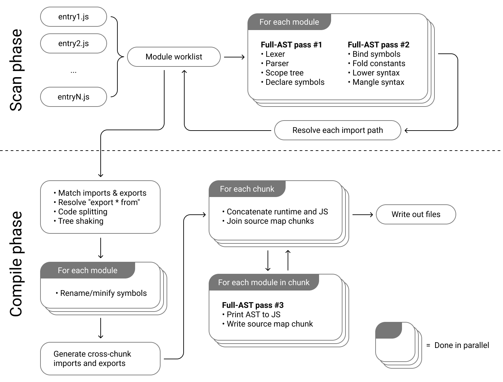

Cela fait plusieurs années que je joue avec les bundlers JS.
Restant convaincu de la nécessité de l'usage de ces outils (ne me laissez pas croire que vous ne packagez pas vos module JS en prod 😅), j'ai beaucoup joué avec [webpack](/fr/webpack/).
Notamment pour des sujets de performance, d'optimisation et d'usage de plugins custom.

Je pense encore qu'en 2021, webpack reste la solution la plus industrielle et aboutie pour _bundler_ mes applications web.
J'entends que les outils comme _parcel_ et _rollup_ restent de bonnes alternatives.
Cependant, webpack a probablement la plus grosse communauté et est utilisé par de nombreux projets.

Mais ne nous voilons pas la face, aujourd'hui on se satisfait de ces outils de _bundling_ malgré des performances qui restent assez pauvres.
Je travaille tous les jours sur un projet de plusieurs milliers de "modules" résolus par webpack et c'est parfois une souffrance 🥱.

> Malgrés une utilisation intensive de cache et de workers, webpack montre certaines limitations pour packager des larges applications.

## En quoi esbuild parait intéressant ?

Je ne vois pas de façon plus simple de l'exprimer que de vous expliquer simplement:

> La première fois où j'ai lancé `esbuild` sur mon app web de test, j'ai cru qu'il avait planté alors qu'en fait il s'était exécuté à une vitesse absoluement dingue.

Pour l'installer c'est pas compliqué :

```shell
yarn add -D esbuild
```

```shell
npm install -D esbuild
```

Ou bien même avec [NPX](https://www.npmjs.com/package/npx)

```
npx esbuild --version
```

Étant écrit en Go, sachez qu'une version WASM et des binaires pour les principales architectures sont disponible.
`esbuild` fait le pari du natif de Go pour profiter un maximum de solutions de parallélisation et une meilleure gestion de la mémoire.

### Un API pauvre by design

Globalement l'API d'`esbuild` est vraiment simple, en 30 minutes vous avez lu toute la doc des paramétrages possibles.
On est bien loin des 3-4 heures nécessaires pour lire l'ensemble de la doc d'un webpack par exemple.
Malgré une configuration qui pourrait paraitre limitée, je reste agréablement surpris.
J'ai l'impression qu'on est vraiment pas loin d'avoir la _"juste grammaire"_ dont on a besoin pour faire du bundling.

`esbuild` propose 3 modes de consommation :

#### CLI

```shell
esbuild app.jsx --bundle --minify --sourcemap --target=chrome58,firefox57,safari11,edge16
```

#### GO

```go
package main

import "github.com/evanw/esbuild/pkg/api"
import "os"

func main() {
  result := api.Build(api.BuildOptions{
    EntryPoints:       []string{"app.jsx"},
    Bundle:            true,
    MinifyWhitespace:  true,
    MinifyIdentifiers: true,
    MinifySyntax:      true,
    Engines: []api.Engine{
      {api.EngineChrome, "58"},
      {api.EngineFirefox, "57"},
      {api.EngineSafari, "11"},
      {api.EngineEdge, "16"},
    },
    Write: true,
  })

  if len(result.Errors) > 0 {
    os.Exit(1)
  }
}
```

#### JS

```javascript
require('esbuild').buildSync({
  entryPoints: ['app.jsx'],
  bundle: true,
  minify: true,
  sourcemap: true,
  target: ['chrome58', 'firefox57', 'safari11', 'edge16'],
  outfile: 'out.js',
})
```

À mes yeux le CLI reste hyper pratique pour tester des choses, mais dans un usage plus _"industriel"_ on préfèrera quand même le format JS ou GO.

### Des mécaniques de plugins

[Evan Wallace](https://github.com/evanw) le créateur et core mainteneur d'`esbuild` ne s'en cache pas, il ne souhaite pas que son outil réponde à 100% des besoins qu'on peut avoir dans le monde du web.
Cependant, cela ne signifie pas qu'on ne peut pas se servir de cette outil dans des cas spécifiques.

Comme on peut le voir avec les autres bundler, `esbuild` propose la mécanique de plugins qui vous permettent beaucoup de choses.
Pour éviter de maintenir tous ces besoins spécifiques, le créateur compte donc sur la communauté pour créer tous les plugins qu'on peut souhaiter.
Et clairement, la communauté est la, je vous laisse voir [cette page qui liste quelques plugins](https://github.com/esbuild/community-plugins).

### Les features les plus intéressantes

Je ne vais pas ici citer les features qui me semblent le coeur d'un bundler Web comme le code splitting, l'injection, la minification.
Cependant, j'ai été étonné par quelques features qu'on ne retrouve pas ailleurs.

#### Une architecture simple à comprendre

Clairement, ce qui fait la force d'`esbuild` par rapport à ses concurrents est son architecture qui peut se résumer simplement.
On comprend bien qu'en alliant parallélisation des étapes du build et reduction du nombre de lecture de l'AST.
Je vous invite à lire [plus d'explications dans la doc](https://esbuild.github.io/faq/#why-is-esbuild-fast).



#### Browser targets

Par defaut `esbuild` vous permet de définir la cible de _votre compilation_.
Quel _niveau_ de javascript vous souhaitez atteindre ?

Habituellement on utilise une suite d'outils comme `@babel/preset-env` et une `browserlist` pour faire en sorte de générer le JS compatible avec notre ciblage.
Babel c'est génial, je l'utilise tous les jours mais l'amoncellement d'outils différents pour le _bundling_ n'est clairement pas une bonne solution à mes yeux.
Cela ajoute beaucoup de complexité :

- au lieu d'apprendre a utiliser un simple outil de bundler, je dois apprendre en plus un outil de transpilation ciblé
- j'ai à maintenir deux dépendances
- passer par une librairy tierse peut réduire les performances (c'est un peu le pari d'`esbuild`)

#### Le mode server

`esbuild` est tellement rapide qu'il peut se permettre de vous exposer un server HTTP sur un dossier qui contient le résultat de votre compilation à chaque requête.
Les autres outils se basent en général sur un mode _watch_ qui surveille les fichiers qui changent pour lancer un build.

Le mode _watch_ existe aussi avec `esbuild`, mais le mode `serve` me parait encore plus sympa car il vous suffit de refresh votre browser pour avoir la dernière version de votre application en local.

```javascript
require('esbuild')
  .serve(
    {
      servedir: 'www',
    },
    {
      entryPoints: ['src/app.js'],
      outdir: 'www/js',
      bundle: true,
    }
  )
  .then(server => {
    // Call "stop" on the web server when you're done
    server.stop()
  })
```

## Mais du coup on arrête tout et on part la dessus ?

> Gagnons du temps, la réponse pour moi est clairement non.

Comme le dit le créateur dans la [FAQ de la doc](https://esbuild.github.io/faq/#production-readiness) en toute honnêteté, le projet n'est pas à considérer comme étant en alpha.
Cependant, l'outil en lui-même ne possède pas encore toutes les features qui ferait de lui un bon remplacant des bundler de la génération précédente.
Je pense notamment à l'absence de HMR natif, ou bien encore un code splitting perfectible.

Il faut cependant ne pas rester fermé sur cette question.
Clairement `esbuild` a de très gros points forts qui manquent à l'écosystème actuel.
La communauté, encore naissante, est plutôt active et les échanges dans les Issues et les PR du repo sont hyper intéressants.

Ce que j'apprécie vraiment dans ce projet, ce sont les parties pris : un focus sur les performances, une api qui reste simple.
Enfin, pour une fois qu'un bundler n'a pas 1000 dépendances et me rajoute 100Mo dans mon dossier `node_modules`, c'est assez beau pour le noter.

Je finirais en vous disant qu' `esbuild` n'est pas la seule alternative qui nous est proposé dans cette nouvelle génération de _bundler_.
Je compte justement faire ce genre d'analyse sur les outils comme [Vite](https://vitejs.dev/) ou bien [Snowpack](https://www.snowpack.dev/).
