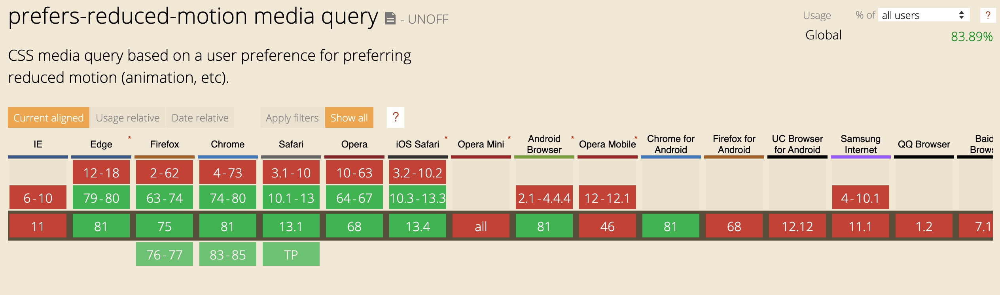

## Tout part toujours d'une idée

La semaine dernière, alors que je mettais en place le mode sombre sur [mon site perso](https://slashgear.github.io/fr/), je me suis motivé à travailler sur un nouveau package pour la communauté React.

> "Tiens, quelqu'un a partagé un hook pour gérer la feature `prefers-color-scheme` des navigateurs, c'est super pratique."

En quelques minutes, j'ai pu intégrer cette super feature sans me prendre la tête.
C'est alors que j'ai repensé à cet [article de blog génial sur une nouvelle feature pour l'accessibilité](https://web.dev/prefers-reduced-motion/).

A l'époque, en lisant cet article, j'ai pris conscience que certains utilisateurs peuvent avoir de la gêne à consulter des pages web qui "gigottent".
En effet, des élements d'une page qui bougent, qui zoom ou changent de couleurs peuvent énormément troubler l'usage et la compréhension du contenu de nos pages.
Ce n'est peut-être pas votre cas, mais beaucoup d'utilisateurs sont dans cette situation.

Afin de vous permettre de mieux comprendre le problème, je vous propose une petite expérience avec une très courte vidéo.
Concentrez-vous sur les personnes habillées de blanc et essayer de compter le nombre de passes.

<iframe width="560" height="315" src="https://www.youtube-nocookie.com/embed/Ahg6qcgoay4" frameborder="0" allow="accelerometer; autoplay; encrypted-media; gyroscope; picture-in-picture" allowfullscreen></iframe>

Vous comprenez maintenant ?

La _"superbe animation d'onboarding"_ est peut-être très belle, mais elle perturbe énormément certains de vos utilisateurs.
Ils se retrouvent dans la même situation que vous avec cette vidéo.
Les éléments en mouvements amènent des difficultés à saisir l'intégralité des informations que vous souhaitez transmettre.

Heureusement, les OS et les navigateurs ont pris conscience des sujets d'accessibilité et fournissent aujourd'hui des outils.

**Il est donc aujourd'hui de notre responsabilité d'intégrer ces solutions pour éviter de mettre certains de nos utilisateurs dans une situation de handicap.**

Une _media query_ vous permets donc de stopper vos animations pour les utilisateurs qui le souhaitent.

```css
@media (prefers-reduced-motion: reduce) {
  button {
    animation: none;
  }
}
```

Le [support de cette fonctionnalité](https://caniuse.com/#feat=prefers-reduced-motion) est même très correct.



Voici une démo en vidéo du fonctionnement de cette fonctionnalité extraite de [l'article cité plus haut](https://web.dev/prefers-reduced-motion/).

<div style="position:relative;height:0;padding-bottom:56.25%">
<video muted="" playsinline="" controls="" style=" position: absolute; top: 0; left: 0; width: 100%; height: 100%; ">
    <source src="https://storage.googleapis.com/web-dev-assets/prefers-reduced-motion/prefers-reduced-motion.mp4" type="video/mp4">
</video>
</div>

## Le package et comment l'utiliser

Elle est très sympa cette _media query_ mais dans certains cas, les animations que j'utilise sur mes sites sont gérées par du JavaScript.
Heureusement, on a des solutions pour surveiller l'usage des _media query_ dans le navigateur.

Pour faciliter leur usage avec _React_, je l'ai donc intégré dans un _Hook_ à la manière de `use-dark-mode`.

Le voici: https://www.npmjs.com/package/use-reduced-motion

Pour l'installer dans votre projet, rien de plus simple:

```shell
npm install use-reduced-motion
# or
yarn add use-reduced-motion
```

Ensuite il vous reste à l'utiliser dans l'un de vos composants:

```jsx
import React from 'react'
import { useReducedMotion } from 'use-reduced-motion'
import { AnimatedDiv } from '../somewhere'

export const MyExampleComponent = () => {
  const prefersReducedMotion = useReducedMotion()
  return <AnimatedDiv pause={prefersReducedMotion} />
}
```

Je vous invite à tester ici avec votre navigateur/OS, l'animation suivante va s'arrêter automatiquement.

<iframe
 src="https://codesandbox.io/embed/use-reduced-motion-pi966?fontsize=14&hidenavigation=1&theme=dark&view=preview"
 style="width:100%; height:500px; border:0; border-radius: 4px; overflow:hidden;"
 title="use-reduced-motion"
 allow="accelerometer; ambient-light-sensor; camera; encrypted-media; geolocation; gyroscope; hid; microphone; midi; payment; usb; vr"
 sandbox="allow-forms allow-modals allow-popups allow-presentation allow-same-origin allow-scripts"></iframe>

N'hésitez pas à partager cet article s'il vous a plu, toute contribution au package est la bienvenue.

- [Documentation sur les Hook React](https://fr.reactjs.org/docs/hooks-intro.html)
- [Code source du Hook `use-reduced-motion`](https://github.com/Slashgear/use-reduced-motion)
- [Le Hook `use-dark-mode`](https://github.com/donavon/use-dark-mode)

_Crédit image [unDraw](https://undraw.co/)_
