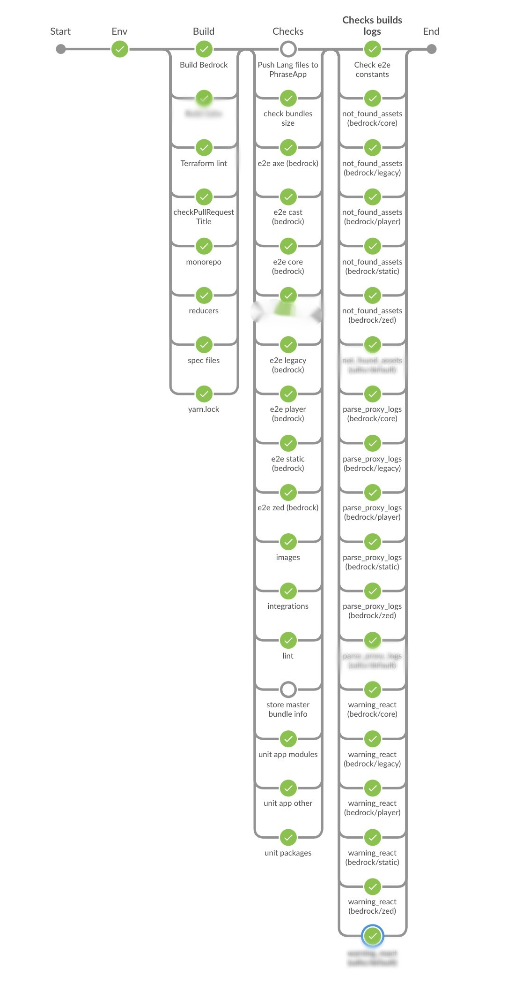

For some time now I've been playing with github actions to see if I can easily reproduce behaviors I apply in my current CI tool.
I wanted to parallelize tasks on each label of a pull request.
In this article, I will show you a possible way to do it!

In my work at [Bedrock](https://www.bedrockstreaming.com/), we currently use Jenkins to manage our ongoing application integration and deployment.
Beyond the various concerns of using groovy with pipeline syntax 😅, we have to admit that we manage to do some pretty complex workflows.



Deciding to see if it would be easy for me to reproduce the steps of these pipelines with github action, I decided to try its features.
Among other things by publishing [a Github Action to check the title of a PR according to a regexp.](https://github.com/Slashgear/action-check-pr-title)

## Solution

First you need to create a workflow based on `pull_request` events and you can even specify the types of events.

```yaml
name: Example workflow
on:
  pull_request:
    types: [opened, labeled, unlabeled, synchronize]
```

Now add a job that will set up a parallelization strategy based on the labels of the github event.

```yaml
jobs:
  build:
    strategy:
      matrix:
        label: ${{github.event.pull_request.labels.*.name}}
    runs-on: ubuntu-latest
    steps:
      - uses: actions/checkout@v2
      - name: Run a one-line script
        run: echo Hello, world from "${{matrix.label}}"!
```

This will automatically run the steps in parallel on all the labels of each Pull Request. 🎉
However, `strategy.matrix.label` does not accept an empty array as a value.😢

The job should therefore be conditional so that it is only run if `${{github.event.pull_request.labels.*.name}}` is not empty.
There is an `if` parameter in the jobs that allows to do this, but unfortunately it is interpreted after checking the value of `strategy.matrix.label`.

The solution I found is to do this check in a previous job.
This is an example of a workflow that dynamically launches actions on all the labels of each PR.

```yaml
name: Example workflow

on:
  pull_request:
    types: [opened, labeled, unlabeled, synchronize]

jobs:
  checkLabels:
    runs-on: ubuntu-latest
    if: ${{github.event.pull_request.labels.*.name[0]}}
    steps:
      - run: echo Check labels is not empty
  build:
    needs: [checkLabels]
    strategy:
      matrix:
        label: ${{github.event.pull_request.labels.*.name}}
    runs-on: ubuntu-latest
    steps:
      - uses: actions/checkout@v2
      - name: Run a one-line script
        run: echo Hello, world from "${{matrix.label}}"!
```

It's up to you to adapt it to your needs!
