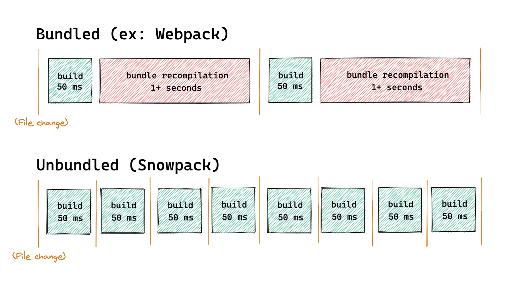
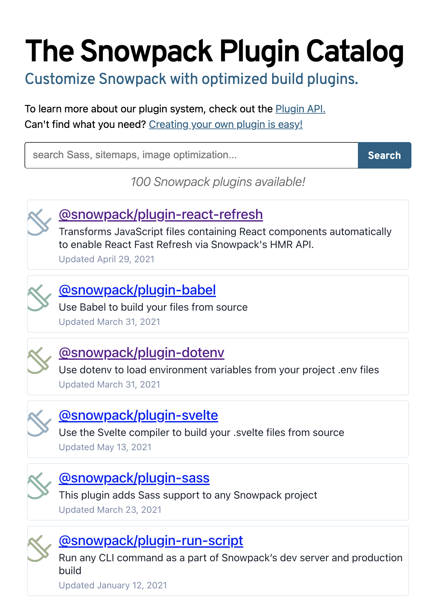

After [webpack](/webpack), [esbuild](/esbuild) and [vitejs](/vitejs), let's take a look at [snowpack](/snowpack).
The latter seems to be making a name for itself in the bundler ecosystem for a few years now.
So I suggest that we study its functionalities, its strong points but also its weak points.

## Snowpack

What is Snowpack? It is a web application packager that offers :

- a rich and powerful development experience
- a _production_ mode that offers the features necessary to optimize the assets of the site.

```shell
# npm:
npm install --save-dev snowpack
# yarn:
yarn add --dev snowpack
```

### ESModule in the browser

Packagers such as webpack and rollup rely on the construction of a dependency tree that is analyzed and packaged at each modification.
The build step of the modified files is still necessary, but the packaging operation (merging the different modules in the form of a bundle that is sent to the browser) is no longer necessary.
Our browsers now know how to manage ESModules](https://caniuse.com/?search=esmodule), so it is no longer necessary to package our source modules to merge them.

> This is the same idea that Evan You has taken up in [Vite](/vite-webpack-killer)

With this principle, the modification of a file triggers only the build of this file, and this file only.
You can have a project with thousands of javascript modules, the build time for each modification will not be affected.
For dependencies (_vendors_), Snowpack builds them once and caches them to do it again only if they have changed.

Here is a diagram in the Snowpack doc showing the interest to avoid packaging in dev.



If you use a _Create React App_ project, you just have to add Snowpack as a dependency, you don't have to change anything if you didn't extend the webpack config.
I invite you to test snowpack with the template generators:

```shell
npx create-snowpack-app react-snowpack --template @snowpack/app-template-react
```

Don't worry! Snowpack is not only compatible with React, you can use Vue, Svelte or just javascript.

### A rich configuration (maybe too much)

Like webpack, snowpack proposes to configure its use by an object.
I must admit that [after playing with it quickly](/vitejs-concurrent-performant-webpack-for-react/), I am a bit disappointed.
I see a meager [documentation page](https://www.snowpack.dev/reference/configuration) that seems to describe many parameterizable keys.

If you come from webpack, you won't be lost, it's very similar without being exactly the same.

> Not touching the default configuration can be an excellent idea.

### A nice collection of plugins

Snowpack is not that new.
A community has built up to create [a rich plugin ecosystem](https://www.snowpack.dev/plugins).
Some of these plugins seem "core" because they are under the _@snowpack_ scope but many packages are ported by a few people independent of the project.
It's reassuring without being reassuring, I've personally experienced webpack updates being blocked/delayed while waiting for compatibility of some plugins that were no longer maintained.



> Beware of the plugins you use!

Contrary to Vite which natively offers a lot of nice features, snowpack works like webpack by relying on plugins to enrich the API.
It's a gamble, it can be complicated to keep this ecosystem of plugins up to date and efficient to continue to guarantee the interest of a migration to snowpack.

### Server Side Rendering

Snowpack offers a solution to implement your applications with server-side rendering.
It is clear that the need for SSR is still felt on our frontend applications for SEO or rendering performance reasons.
Unfortunately, on the application packaging side, it is still complicated and it is often necessary to make two builds:

- a build for the client aka the Browser
- a build for the Node server

> Double build, double punishment!

The [technique proposed by Snowpack](<https://www.snowpack.dev/guides/server-side-render#option-3%3A-server-side-rendering-(ssr)>) remains limited but it's still correct.
I propose a slight improvement of the implementation by adding the buffered server rendering mechanics.

```javascript
const {readFileSync} = require('fs');
const {startServer} = require('snowpack');
const server = await startServer({ ... });
const runtime = server.getServerRuntime();

app.use(async (req, res, next) => {
  const importedComponent = await runtime.importModule('/dist/MyReactComponent.js');
  const MyReactComponent = importedComponent.exports.default;
  const html = ReactDOMServer.renderToNodeStream(React.createElement(MyReactComponent, null));
  // Directly write the head of page
  res.write(`
    <html>
    <head>
      <title>Hello 👋</title>
    </head>
    <body>
    <div id="app">
  `)
  // Render bufferized version of App
  html.pipe(res, { end: false });
  // When buffer end, we add the closing tags of page
  html.on('end', () => {
    res.write(`
      </div>
      </body>
      </html>
    `);
    res.end();
  });
});
```

## Webpack, esbuild, quick, or snowpack ?

Clearly after this series of articles where I tried to study this new generation of tools to bundle applications, I must admit that I am very surprised.
We can clearly see that the support of ES Modules in the browser marks the entry into a new era.
As Sindre Sorhus reminds us in [his latest article](https://blog.sindresorhus.com/hello-modules-d1010b4e777b), with the end of Node 10 support and the capabilities of our current browsers, it is no longer necessary to target CJS.

Caching strategies and the use of CJS modules seem to be outdated for our needs in development environments.
We can see that Vite and Snowpack offer this new mechanism which seems to be really efficient.
Doing a _once for all_ build of the libraries and of each source file is a great idea to not suffer from a too slow startup time of our big web applications.

> Keep an eye on Esbuild

However, the performance of these new tools also relies heavily on Esbuild.
The idea of using a more optimized stack to read, parse, combine JS or TS modules with languages that allow for finer IO and memory management is really the keystone of this new generation of tools.
Even before choosing whether to stay with webpack, or use Vite and Snowpack, it is certain that Esbuild will have to be followed closely.
This lib has not finished surprising us.
You should also look at a tool like [SWC](https://swc.rs/) which is a direct competitor of Esbuild.
There are certainly other tools being created at the moment.

### I use webpack and have configured it a lot

If you are in this situation, you may unfortunately be forced to keep webpack.
This is not bad news, it is a very good tool that is far from being obsolete.
It is likely that the webpack team will come up with new performance improvements, perhaps through the use of ESModules.

You can also try to use snowpack in a development environment.
There is [a plugin to use webpack in the snowpack prod build](https://www.npmjs.com/package/@snowpack/plugin-webpack).

### I really want to reduce the configuration of my application build

If you don't want to keep your webpack configuration files anymore, which can be sometimes difficult to maintain, the alternative proposed by Vite can be a great option.
Just keep in mind that this solution is still young.

If you are going to use Vite, I suggest that you minimize the configuration you can do to it.
This will make it easier for you to keep up with the new versions that are likely to arrive in the coming months.

### I use a CLI that manages my build configuration for me

You are using VueCLI, CRA, or other and you have not ejected your configuration.
You don't like to touch the build configuration of your application because the tools are complex and you don't want to spend a lot of time configuring them.
So I recommend you to stay as much as possible with the default configuration of your project as long as its performance does not bother you.

However, nothing prevents you from testing tools like Vite that work directly without configuration with your already generated projects.
If the startup time of your development environment becomes too important, this can really be an interesting solution for you.

## And it's already the end?

I think I've covered the new tools proposed by the community to package our web applications.
If you have other tools that would be interesting to look at, don't hesitate to suggest them to me on a social network like Twitter.
See you soon for new _javascript peregrinations_ !👋

Thanks to Jérémie for the review 🤗
