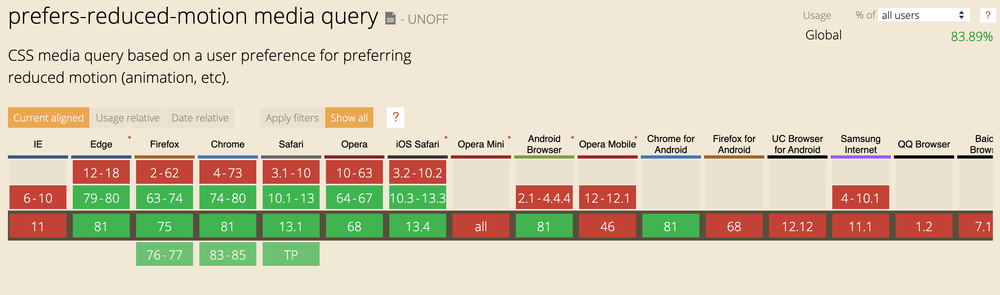

## Everything always starts with an idea

Last week, as I was setting up the dark mode on [my personal website](https://blog.slashgear.dev/), I got motivated to work on a new package for the React community.

> " Well, somebody shared a hook to handle the `prefers-color-scheme' feature in browsers, that's super handy."

In just a few minutes, I was able to integrate this great feature without getting in my head.
That's when I thought of that [awesome blog post about a new feature for accessibility](https://web.dev/prefers-reduced-motion/).

At the time, while reading this article, I found out that some users may feel uncomfortable consulting web pages that "wiggle".
Indeed, elements of a page that move, zoom or change colors can greatly disturb the use and understanding of the content of our pages.
This may not be the case for you, but many users are in this situation.

In order to allow you to better understand the problem, I suggest a small experiment with a very short video.
Focus on the people dressed in white and try to count the number of passes.

<iframe width="560" height="315" src="https://www.youtube-nocookie.com/embed/Ahg6qcgoay4" frameborder="0" allow="accelerometer; autoplay; encrypted-media; gyroscope; picture-in-picture" allowfullscreen></iframe>

Do you understand now?

The _"superb onboarding animation"_ may be very beautiful, but it is very disturbing for some of your users.
They find themselves in the same situation as you do with this video.
The moving elements make it difficult to capture all the information you want to convey.

Fortunately, OS and browsers have become aware of accessibility issues and now provide tools.

**It is therefore our responsibility today to integrate these solutions to avoid putting some of our users in a situation of handicap.**

A _media query_ allows you to stop your animations for users who wish to do so.

```css
/*
  If the user has expressed their preference for
  reduced motion, then don't use animations on buttons.
*/
@media (prefers-reduced-motion: reduce) {
  button {
    animation: none;
  }
}
```

The [support for this feature](https://caniuse.com/#feat=prefers-reduced-motion) is even very correct.



Here is a video demo of how this feature works, taken from [the article quoted above](https://web.dev/prefers-reduced-motion/).

<div style="position:relative;height:0;padding-bottom:56.25%">
<video muted="" playsinline="" controls="" style=" position: absolute; top: 0; left: 0; width: 100%; height: 100%; ">
    <source src="https://storage.googleapis.com/web-dev-assets/prefers-reduced-motion/prefers-reduced-motion.mp4" type="video/mp4">
</video>
</div>

## Where is the package and how to use it?

It's very nice this _media query_ but in some cases, the animations I use on my sites are managed by JavaScript.
Fortunately, we have solutions to track the use of the _media query_ in the browser.

To make them easier to use with _React_, I've integrated them into a _Hook_ in the way of `use-dark-mode`.

https://www.npmjs.com/package/use-reduced-motion

To install it in your project, nothing could be simpler:

```shell
npm install use-reduced-motion
# or
yarn add use-reduced-motion
```

Then you just have to use it in one of your components:

```jsx
import React from 'react'
import { useReducedMotion } from 'use-reduced-motion'
import { AnimatedDiv } from '../somewhere'

export const MyExampleComponent = () => {
  const prefersReducedMotion = useReducedMotion()
  return <AnimatedDiv pause={prefersReducedMotion} />
}
```

I invite you to test here with your browser/OS, the following animation will stop automatically.

<iframe
 src="https://codesandbox.io/embed/use-reduced-motion-pi966?fontsize=14&hidenavigation=1&theme=dark&view=preview"
 style="width:100%; height:500px; border:0; border-radius: 4px; overflow:hidden;"
 title="use-reduced-motion"
 allow="accelerometer; ambient-light-sensor; camera; encrypted-media; geolocation; gyroscope; hid; microphone; midi; payment; usb; vr"
 sandbox="allow-forms allow-modals allow-popups allow-presentation allow-same-origin allow-scripts"></iframe>

Feel free to share this article if you liked it, any contribution to the package is welcome.

- [React Hook Documentation](https://en.reactjs.org/docs/hooks-intro.html)
- [Source code of `use-reduced-motion`](https://github.com/Slashgear/use-reduced-motion)
- [`use-dark-mode`](https://github.com/donavon/use-dark-mode)

_Image credit [unDraw](https://undraw.co/)_
